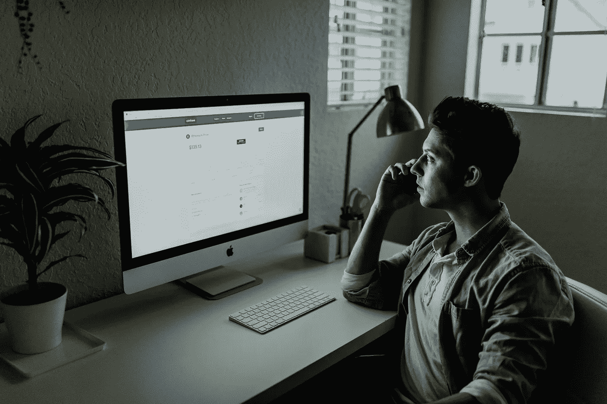

# 用这个简单的方法驯服你的收件箱

> 原文：<https://medium.com/swlh/tame-your-inbox-with-this-easy-hack-faf2c1914fbf>

如何不把你的“空闲时间”花在阅读邮件上。

Photo by [Austin Distel](https://unsplash.com/@austindistel?utm_source=unsplash&utm_medium=referral&utm_content=creditCopyText) on [Unsplash](https://unsplash.com/search/photos/emails?utm_source=unsplash&utm_medium=referral&utm_content=creditCopyText)

我们都在努力应对每天收到的所有数字内容。无论你是一名高管、为高管工作的人，还是一家小型家庭企业，通过电子邮件向你发送的数字通信量都是势不可挡的。我想出了一种快速减少或消除收件箱中电子邮件数量的方法。