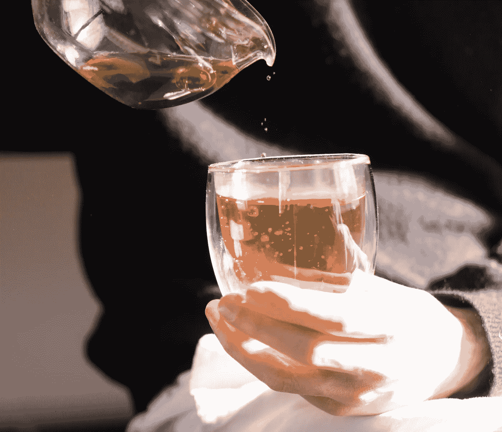

# 茶和无所事事的价值

> 原文：<https://medium.com/swlh/tea-and-the-value-of-doing-nothing-514f111309d3>

我强迫自己努力工作。太难了。我想变得更擅长什么都不做。所以我建立了一个公司，它什么也不帮我做。我是它的第一个顾客。

That’s me. Drinking tea and doing nothing.

具有讽刺意味的是，我努力创建这家公司是因为——作为一名客户——它让我真正擅长于无所事事。我只是坐在那里，喝着茶，欣赏升起和逝去的思绪，看着窗外，深深地从…