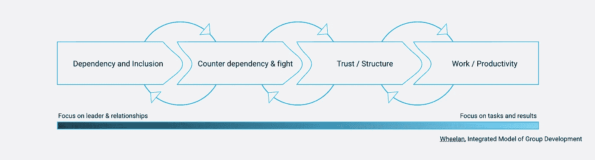
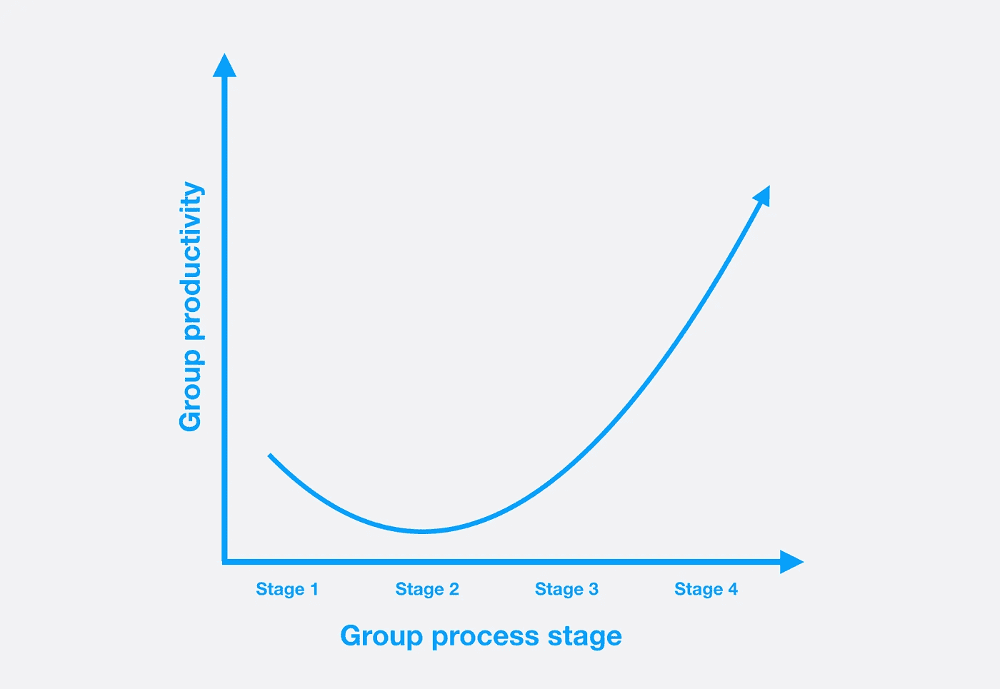

# 团队是团队——一个起点

> 原文：<https://medium.com/swlh/teams-as-groups-a-starting-point-b48a48ea950e>

# **关于团队流程和国际团队的说明**

将来自不同文化(国家、团体、甚至公司)的人聚集在一起可能是一项艰巨的领导挑战。把团队变成一股平稳的生产力浪潮，绕过问题，完成任务，不管有多难。对于任何团队来说，没有一个解决方案或答案是永远正确的。但是总的趋势和陷阱经常重复出现，理解团队过程是应对它们的一种方式。

# **通用集团动力**

一个很好的地方是从了解人群如何互动开始，收集对群体发展的模块化模型之一的基本理解(如 IMGD [ [维基百科](https://en.wikipedia.org/wiki/Group_development#Wheelan's_integrated_model_of_group_development) ]，塔克曼或塔布斯，还有其他人)。我建议你开始熟悉一个。我更喜欢 IMGD，因为它的清晰和对研究的重大支持，所以这篇文章将把它作为它的基础之一，但如果你以前知道任何其他的见解，那么这种见解可以相对更好地传播。

简而言之，组织开发人员和组织心理学家发现，将任何群体的生命周期分成若干阶段都是有用的，不管是哪一个群体，每个阶段都有一般的优势、劣势和挑战。早期阶段有更多的挑战，后期阶段有更多的优势，这就是为什么尽快通过早期阶段培养一个团队会有很大的价值(对业务和福祉而言)，并且通常被认为是可取的。

其中的深刻见解是，所有群体都注定要犯类似的错误，面临同样的挑战。好的一面是，我们可以成功地向他人学习，作为领导者，我们要为即将到来的事情做好准备。

在管理和组织发展中有一个普遍的观点，即迈向第四阶段，生产力，是我们的目标。我不同意这种观点，想提出一个更现实的观点。让我们首先提出一个对你的领导工作非常重要的问题:

在可预见的未来，你有机会在团队中与同样的人一起工作，并且让他们(大部分)在同样的时间一起工作吗？

## **否**

如果随着时间的推移，你没有机会将你的团队发展成一个拥有稳定、固定成员的团队，我的最佳选择是找到一种领导和管理策略，这种策略能够保持团队的*依赖性和包容性*(第一阶段)*。*这可能很好地服务于组织的目的，因为人们倾向于在第一阶段保持礼貌，避免冲突，无论是彼此之间还是与客户之间。然后，你会很好地发展一种文化和领导风格，在这种文化和领导风格中，人们非常信任你(或他们的团队领导)这个领导者，并认为这是工作场所中的主要关系。

这可能意味着，除其他事项外，明确的任务分工，明确的角色描述，容易，单独，可衡量的目标。帮助团队制定明确的分工规则，并成为日常运营的重要组成部分。没有一个积极的领导者，不要期望团队工作完美，甚至可能特别好。

**是的** 如果你真的有机会将你的团队作为一个长期单位来运作，你会有更多的选择来带领你的团队走向伟大的、较少依赖领导的*工作&生产力*阶段。这将要求你调整你的领导力以适应每个阶段，如果你希望雄心勃勃，这将提供一个机会来设计一个过程，通过这个过程，你的团队可以尽快度过困难时期。

早期行为取决于成员背景
人们越相似，你就越能认为他们已经是相似子群的一部分。这使得在第一阶段摩擦更小，对准更快。群体越多样化，在没有任何重要领导或干预的情况下，第一阶段可能持续的时间就越长。积极参与练习和活动，让你的团队有机会(并被期望)互相了解，这将加快进度。当考虑选择什么活动或锻炼时，你应该密切注意你的群体的文化构成，以避免任何不必要的疏远。

**提供反馈——单独开始** 领导任何团队的一个重要部分就是提供行为和表现方面的反馈。离开反馈会议时，团队成员不知道你想要传达的信息是否被理解，这种经历并不少见，尤其是在领导多元化团队时。不同国家、不同行业的工作场所文化差异很大，管理角色或许更是如此。有些人可能认为经理会对他们大喊大叫，在他们开始意识到事情不对劲之前就明显感到愤怒，而对其他人来说，一句中性的话或缺乏积极的热情可能足以让他们对自己在经理眼中的表现感到不确定。

*调整你对接收者的反馈* 作为一个多元化团队的管理者，这显然是一个挑战。为了管理这种情况，你需要发展一系列的行为，以符合每个团队成员的习惯和经验。至少短期如此。从长远来看，你很可能能够培养一种更统一的团队文化和工作经验，让你的领导范围更小，但仍能影响整个团队。

理想情况下，这一过程在招聘过程中开始，你有机会问一些问题，比如“你能给出一个具体的例子，说明你何时从经理那里得到了对你有影响的反馈？”并利用他们的反应来判断他们习惯了什么。为了与现有的(以及新加入的)团队成员保持一致，我建议与他们单独坐下来谈谈反馈，包括积极的和发展中的反馈。

*   当我认为你做得非常好时，我该如何以一种你真正欣赏的方式奖励你呢？
*   如果我认为有些事情不太对或者没有达到我期望的标准，我有什么好的方法来告诉你，帮助你从中吸取教训？
*   我如何以一种真正吸引你的方式激励你？什么样的目标或过程真的让你很想去实现？

获得这些问题的真正答案有时可能比乍看起来更具挑战性。你需要与你的团队成员建立信任关系，好的一面是这样做可以成为这个过程的一部分。

一旦你开始收集方法和工具来处理给你的团队成员的反馈，一定要尝试一下，然后循环回去看看结果如何。当你按照与团队成员会面时达成的共识行事时，他们对你的信任可能会增加。当你接着问“我试着根据我们上周达成的共识给你更多的反馈。你觉得怎么样？我传达的信息有用吗？”，你可能会得到一个更真诚的回应，帮助你在迭代中前进。

*如何同时管理整个团队* 一旦你与你的团队成员建立了个人关系，并开始了解他们如何看待奖励和反馈，收获是双倍的。不仅你知道如何管理他们，他们也知道。允许他们用相同的术语来表达和思考这些问题，也让他们在反馈和奖励方面有了共同的思维模式。有了这些，你就可以立刻召集整个团队，作为一个小组询问他们想要努力实现什么样的目标，集体奖励应该是多少。

# **冲突——没有你想象的那么糟糕**

就组织发展而言，人们通常对冲突感兴趣，而不是感到恐惧。这并不意味着一切都在灾难性地进行，也不意味着你作为领导者做得很糟糕。这意味着事情正在团队中发生，并且团队有可能从第一阶段进入第二阶段(在上面提到的模型中)。要发生冲突，至少有两个团队成员必须同时感到足够舒服，能够坚持对他们来说重要的事情，并且对团队足够忠诚，不会轻易离开。处理冲突是任何一个团队领导者的主要任务之一，你决定如何处理冲突为团队指明了方向。

如果你把这个团体视为第一阶段的团体:进入冲突，用一个决定来解决问题，并清楚地陈述你期望每一方做些什么来维持和平。这个群体有可能会倒退到第一阶段，或者在第一阶段停留更长时间。如果你有一个让团队保持在这个阶段的策略，这是一个不可避免的时候，你需要开始做一些改变(换班，融合团队，混合事情)来使之工作。

另一方面，如果你选择将团队视为第二阶段团队:促使双方真正解决冲突。这可以通过多种方式实现，通常包括帮助双方澄清让他们心烦的事情和原因。帮助他们了解另一方的观点，并要求所有相关人员尝试讨论。确保他们找到共同点，并就可接受的解决方案达成一致。这可能很费力，而且肯定需要时间、注意力和精力才能实现，这就是为什么一个团队的生产力可以用以下模式来说明:

在充满冲突的第二阶段停留太久，无论是对组织还是团队都是一种消耗。作为经理，你需要为此承担责任，理解团队还没有做好自我管理的准备，并积极工作，通过调解或直接决策来规避冲突。如果你不这样做，很有可能要么另一个人会成为非正式的领导者，开始解决问题，要么人们开始离开，因为留下来太乱太不舒服了。

从这个意义上说，一个更加多样化的群体可能更容易产生深刻的、个人的、重大的冲突，而不是非常同质的群体之间更表面的、容易达成一致的问题。这增加了领导力的风险，使得成功解决分歧变得更加困难，也更加重要。接受可能需要更长的时间，也更难实现。在第一阶段，通过积极地将团队团结在一起，并在团队成员之间建立信任，可以打下良好的基础，让自己有能力处理这种情况。如果你采取措施确保团队成员相互了解，而不仅仅是角色，这将有助于你和他们进一步解决冲突。

# **复位**

另一个威胁你向最后阶段前进的团体发展的事实是，每当有人离开或进入团体，它就从第一阶段重新开始。然而，并不是所有的都丢失了，组中被替换的部分越小，它将管理得越快，并且希望恢复到中断前的状态。

让团队成员快速找到新角色或重建旧角色是快速回到之前绩效水平的关键。因此，一个人在人性和职业素质方面越相似，在替换的情况下，新加入群体的个人就越快。但是从长远来看，更快并不等于更好。随着一个相似的人进入团队，类似的好的和坏的模式很可能会再次出现，团队中有一个新的角色会有助于更强劲的增长。

# **最后的话**

透过团队过程的镜头来观察团队可能有助于理解某些动态，并澄清某些事件或冲突的原因。根据领导在过程中所处的位置，积极调整对团队的领导也是有帮助的，并解释为什么一些以前非常成功的领导行为突然遇到了挫折和阻力。

还要记住，这“只是”一个工具。它可以有意义地解释群体中发生的许多事情，但也有明显的局限性。并不是你观察或经历的一切都会遵循这个模式。