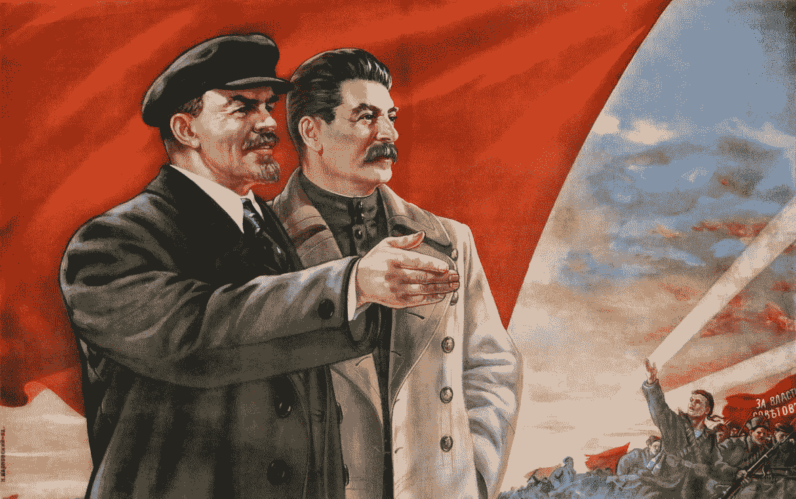

# 科技产业像苏联一样运转

> 原文：<https://medium.com/swlh/tech-industry-runs-itself-like-the-soviet-union-63474a15a09a>

## 为什么这么多本应促进自由创新的公司看起来像一个共产党。

这是 1922 年 12 月，弗拉基米尔·列宁刚刚在莫斯科升起共产主义旗帜，宣布苏联的形成。在接下来的 70 年里，它将把 11 个不同领域的近 3 亿人团结起来…