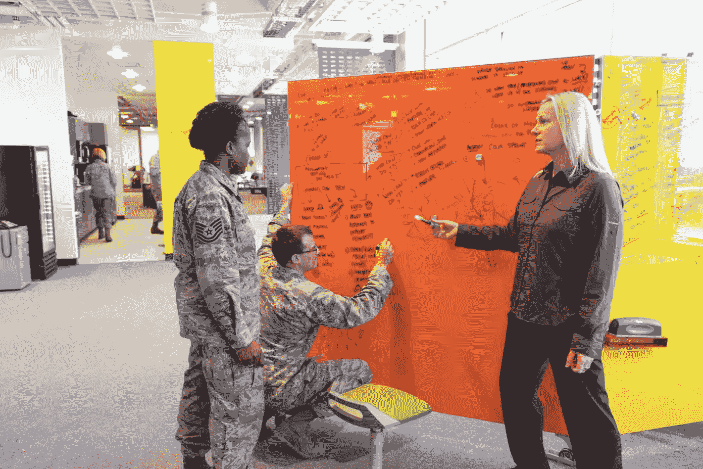

# 技术与国家安全:10 个重要问题(和一些想法)

> 原文：<https://medium.com/swlh/technology-and-national-security-10-important-questions-and-a-few-ideas-1063b142ffef>

Air Force CyberWorx courtesy of Colorado Springs Business Journal.

我的工作是提出关于国家安全的最引人注目的问题，并找到答案。在我与美国和海外的国家安全团体进行的讨论中，最常见和最相关的问题都与技术有关。由于公共部门和私营部门之间的技术差距和技术…