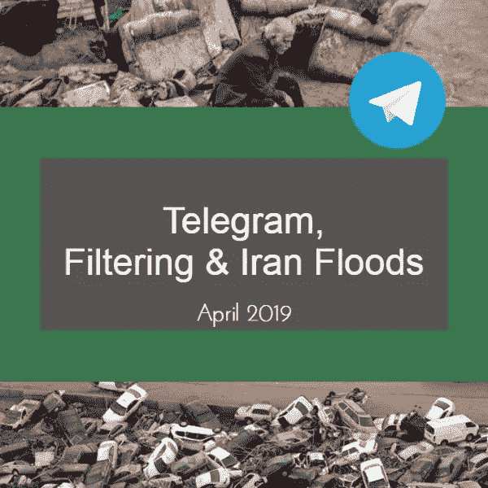
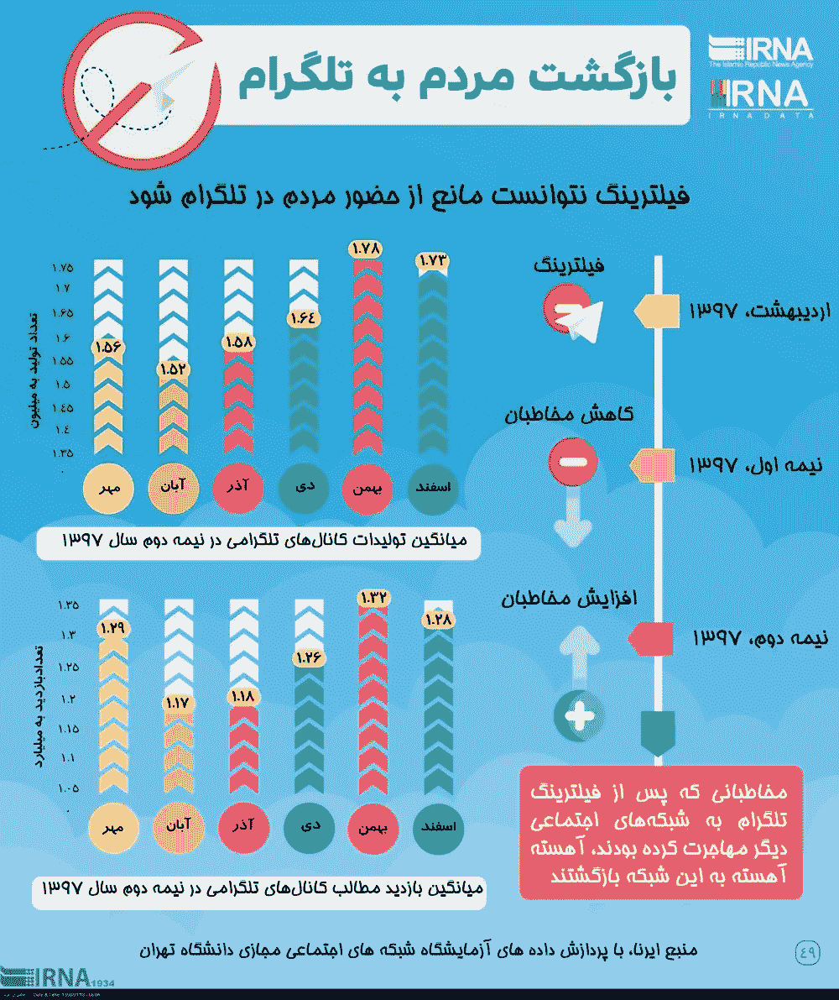
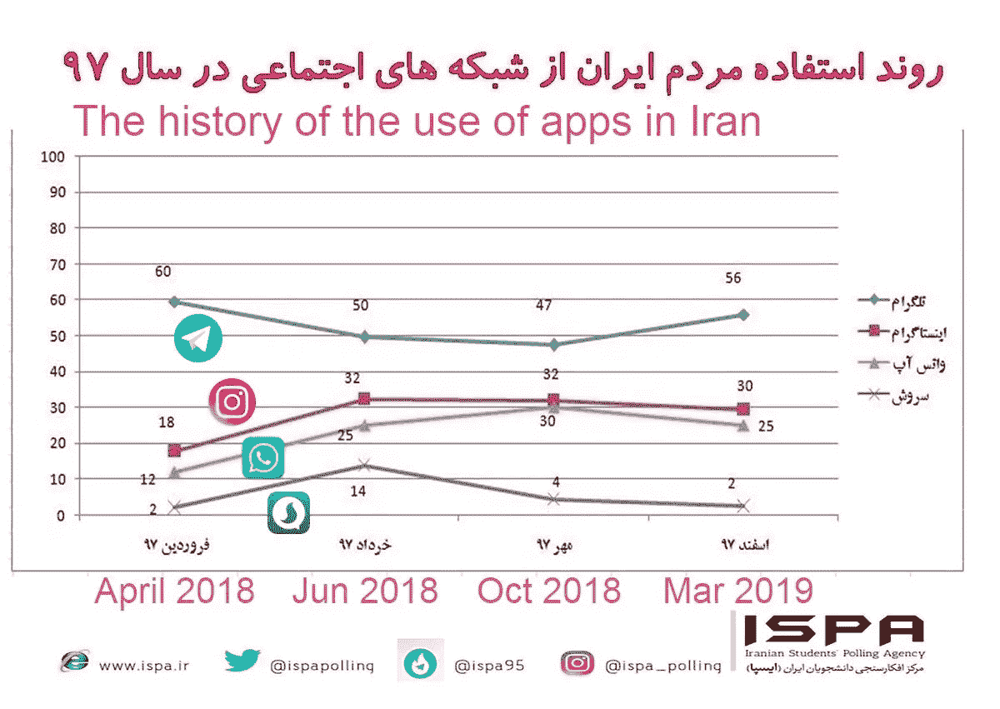
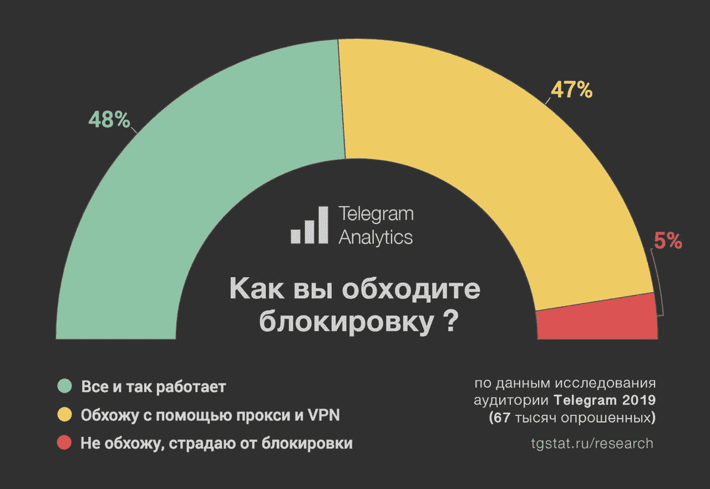

# 电报、过滤和伊朗洪水

> 原文：<https://medium.com/swlh/telegram-filtering-and-iran-floods-dafc8da01abe>

## 电报中数字记录的隐藏

伊朗的大部分地区已经被洪水淹没，但尽管电报在伊朗已经被过滤，但在伊朗用户中到达电报信使频道的内容(通过绕过电报过滤)并没有减少。当然，绕过洪水受害者和其他伊朗人的过滤并不容易，甚至会减慢伊朗的互联网连接，这已经很慢了。那么，为什么人们不使用像 WhatsApp 这样不过滤的其他信使呢？在这篇文章中，我们将讨论它，并证明电报不仅仅是伊朗人的信使，而是信使和一种特殊类型的社会网络的结合。电报的另一个流行之处是，人类行为的数字记录中的隐藏尽可能简单。

这篇文章的作者是索马耶赫·戈拉米女士和迈赫兰·卡泽米尼亚先生，文章于 2019 年 4 月以波斯语和英语写成。

[*波斯文*](https://www.soliset.com/telegram2)

大约一年前，这份电报在伊朗被过滤(做出这一决定的原因不是本文的主题)。与此同时，人们被要求离开电报，使用未经过滤的信使，特别是国内信使。此前，脸书等其他一些应用程序也出现过这种情况，逐渐地，大多数伊朗用户开始从这些过滤应用程序中迁移出来。但根据伊斯兰共和国通讯社 [***或 IRNA***](http://www.irna.ir/fa/PhotoNews/3679505) 最近的一份报告，尽管经过过滤，伊朗用户并没有离开电报，或者他们在离开几个月后重新激活了他们的电报账户。

显然，通过绕过过滤，伊朗缓慢的互联网将进一步降低速度，通常会中断连接。然而，即使在洪水灾区，人们也忍受着绕过过滤的困难，大部分洪水的照片、新闻和视频都将由他们自己在电报中发布。更令人惊讶的是，一些高层政府官员，以及一些政府机构，如电视台和官方新闻机构，已经恢复了他们在过滤电报中的活动，并在他们的电报频道中报道他们的洪水新闻和故事。

[***The Islamic Republic News Agency, or IRNA***](http://www.irna.ir/fa/PhotoNews/3679505)

伊朗一家名为[***【ISPA】(伊朗学生民调机构)***](http://www.ispa.ir/Default/Details/fa/2030/%D9%81%DB%8C%D9%84%D8%AA%D8%B1%DB%8C%D9%86%DA%AF-%DA%86%D9%87-%D8%A7%D8%AB%D8%B1%DB%8C-%D8%A8%D8%B1-%D8%A7%D8%B3%D8%AA%D9%81%D8%A7%D8%AF%D9%87-%D8%A7%D8%B2-%D8%AA%D9%84%DA%AF%D8%B1%D8%A7%D9%85-%D8%AF%D8%A7%D8%B4%D8%AA%D8%9F) 的民间民调机构通过展示其最新结果宣布，在过滤前，约 60%的伊朗人口使用电报，过滤半年后这一比例达到 47%，但现在，一年后，又有 56%的伊朗人口使用电报。

根据这些统计数据，大约 30%的伊朗人现在使用 Instagram，只有 25%的人使用 WhatsApp，只有 2%的人使用 Soroush Messenger(这是一种本地信使)。注意 Instagram，WhatsApp，和 Soroush 没有过滤，不存在绕过过滤的问题，但它们的用户仍然比 Telegram 少得多。

[***ISPA (Iranian Students Polling Agency)***](http://www.ispa.ir/Default/Details/fa/2030/%D9%81%DB%8C%D9%84%D8%AA%D8%B1%DB%8C%D9%86%DA%AF-%DA%86%D9%87-%D8%A7%D8%AB%D8%B1%DB%8C-%D8%A8%D8%B1-%D8%A7%D8%B3%D8%AA%D9%81%D8%A7%D8%AF%D9%87-%D8%A7%D8%B2-%D8%AA%D9%84%DA%AF%D8%B1%D8%A7%D9%85-%D8%AF%D8%A7%D8%B4%D8%AA%D8%9F)

一年前，这份电报在俄罗斯也被过滤，俄罗斯用户被迫绕过过滤。俄罗斯和伊朗绕过过滤的方法好像差不多。近日，[***Telegram Analytics***](https://vk.com/tg_analytics?w=wall-149096576_111)宣布，2019 年有 67000 名俄罗斯用户被问及绕过电报过滤的方法(使用绕过软件、VPN 等。)和研究结果。

[***Telegram Analytics***](https://vk.com/tg_analytics?w=wall-149096576_111)

在下文中，我们将探讨电报流行的原因，以及电报中的通信类型。然而，我们不要忘记，在 Telegram 平台上已经形成了一个专用的 messenger 社交网络，而对于一个社交网络来说，最基本的问题是网络连接的类型，这可能是网络问题的根源。谈论社交网络上的人与人之间的关系与现实世界事务中的人与人之间的联系一样重要，电报体验可以让每个人受益。

# 为什么伊朗人还在使用过滤后的电报？

过滤后，telegram 在速度和易用性方面无法与 WhatsApp 等未过滤的对手竞争。显然绕过过滤对一个 app 的上网速度和易用性有负面影响。此外，规避工具有时会降低应用程序的安全性。即使是最近，非官方版本的电报被标榜为反过滤，不幸的是，在下载和安装的时候，获得了许多用户的电话访问和控制。以至于下载后，在用户不知情的情况下，通过用户的智能手机向不同组别的电报发送广告！与此同时，通过控制用户的手机，其他事情可能会在用户不知情的情况下发生。所以过滤后的电报受欢迎的原因不可能是速度、方便或安全。

在我们看来，电报受欢迎的原因可以分为三部分:**第一部分**是除了可以创建群，还可以创建公共频道。诸如使用具有人工智能的机器人、同时使用 webTelegram、桌面应用程序和移动应用程序版本等可能性是 Telegram 的其他功能。所有这些特点都带来了一个由伊朗人组成的强大的社交网络，以及使用电报作为简单的信使。因此，电报的替代品不能只是一个简单的信使，但首要条件是，替代品应该是信使和人们所需的社交网络的结合。同时，我们已经在另一篇文章中考察了电报网络的性质和概念，甚至在那篇文章中，我们也提到了电报公共频道的内容对搜索引擎可访问性的必要性。下面是文章的链接:

 [## 电报信使和搜索引擎和解的必要性

### 成为电报社交网络的最后一步

medium.com](/swlh/the-necessity-of-reconciliation-between-telegram-messenger-and-search-engines-8faf495b0387) 

**第二部分**是关于用户的惰性。不管怎样，这份电报已经做了广告，它的用法已经在伊朗官方国家电视台上直接和间接解释了好几年，等等。几乎所有人都很熟悉它，并在手机上下载了 Telegram 应用程序。现在，选择另一个 messenger 应用程序将不再是个人决定，因为其余的人可能不会有相同的意见，她/他的连接将会中断。换句话说，在社会大多数人的眼中，一个新的应用程序应该比过滤电报更好，才能做出这种改变。当然，这种情况直到今天才出现。

**第三部分**涉及电报用户行为的数字记录。最初，电报的用户简档是基于简单信使的模式来设计和配置的。在用户简档中，通常除了一个或多个图像之外，没有其他用户信息。年龄，学历，婚姻状况，兴趣，订阅的渠道，订阅的群体，都不知道。此外，与其他信使(例如 WhatsApp)不同，用户的电话号码在 Telegram 中对群组或频道的其他成员隐藏。用户可以加入并活跃在不同的渠道，表达他们的意见和感受，而即使他们的电话号码是看不见的。他们甚至可以在不同的群体中发布相互矛盾的信息，但仍然保持匿名。例如，他们根据每个群体的共同信念来设定自己的信息，而不关心他们相互矛盾的观点和不匹配的感觉。因为每个消息只记录在所写的同一个组中，所以甚至不清楚该组成员在跟随哪个组或频道，并且没有人能够跟随其他人。

> 换句话说，电报中的人们可以很容易地向一些人隐瞒他们真实的政治、社会和道德信仰，并通过管理他们的数字记录来保护他们自己。**此外，我们不要忘记，电报是作为互联网黑暗部分的信使而设计的，现在，除了作为信使之外，还有一个广泛的社交网络，然而搜索引擎无法访问电报平台的任何部分**，因此用户即使出于保密，也不关心存储在搜索引擎中的信息。

这种秘密的不道德或道德本质不是我们的主题。然而，这份电报的一个具体的、可能是独一无二的特点，可能不是经过精心策划的，对这份电报的受欢迎程度有相当大的影响。应该注意的是，专家可以在其他网络上隐藏或管理他们的数字记录。但是对大多数人来说，很难做到哪一封电报使它变得容易。

未来社会网络的适当设计与现实社会的宪法法律的制定同样重要，并且应该基于今天所有的经验。当然，电报体验作为一种社会网络，包含许多积极和消极的方面，需要加以解决。这是文章的结尾，我们渴望收到您的评论。

## 2019 年 4 月
索马耶赫·戈拉米
迈赫兰·卡泽米尼亚

[网站](https://www.soliset.com/)
[推特](https://twitter.com/SetSoli)
[电报](https://t.me/soli_set)

## 这篇文章发表在 [The Startup](https://medium.com/swlh) 上，这是 Medium 最大的创业刊物，拥有+445，678 名读者。

## 订阅接收[我们的头条新闻](https://growthsupply.com/the-startup-newsletter/)。

