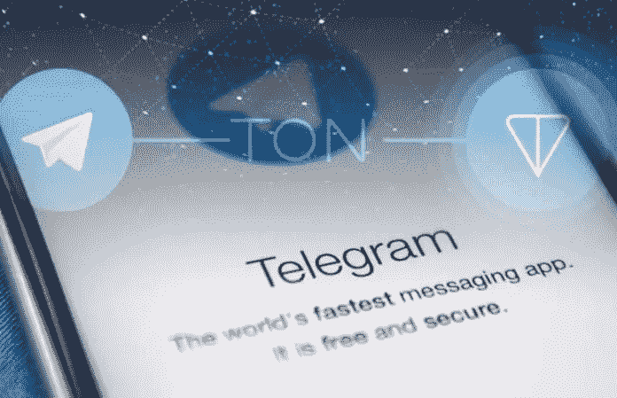
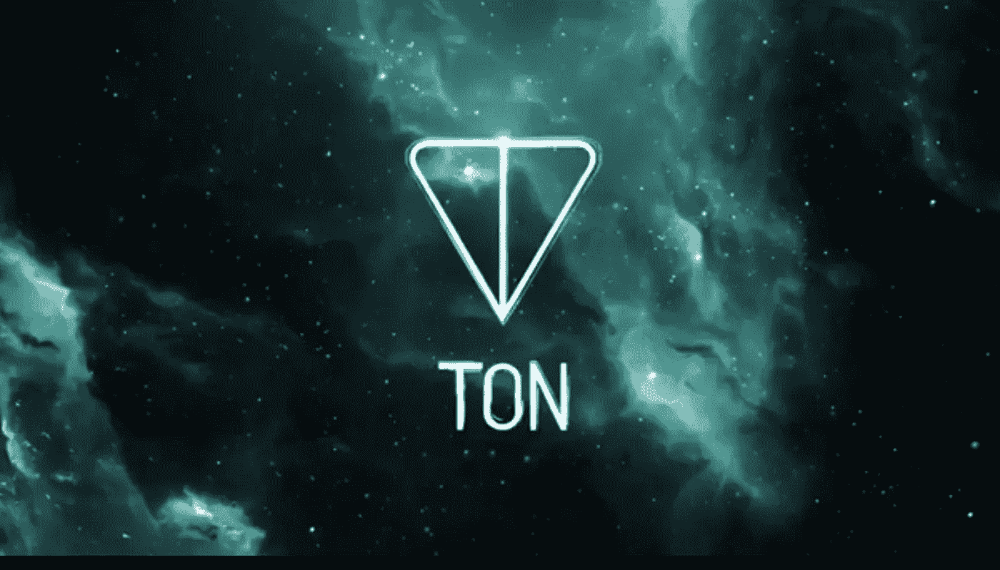

# Telegram 自己的加密货币 TON 即将推出。

> 原文：<https://medium.com/swlh/telegrams-own-cryptocurrency-ton-is-almost-ready-to-be-launched-6739d7b11347>

如今，几乎每个活跃在社交媒体上的人都熟悉 Telegram 应用程序，这是一个独特的聊天应用程序，允许我们访问各种不同的渠道和你感兴趣的主题的新的重要信息。你可以通过使用 Telegram 应用程序与世界上的任何人交谈，但该应用程序不仅仅提供聊天选项，它已经创建了自己的密码。

Telegram 一度远不如 Facebook Messenger 和 WhatsApp 等其他平台出名。然而，由于其安全性和集成加密，它受到了加密货币社区的大量关注，将其推向了通信替代方案的前沿。

根据投资者的最新消息，Telegram 的 17 亿美元加密货币已经完成了 70%。社交媒体巨头 Telegram 公司期待已久的加密货币项目已经完成了 70%。此外，该报告中最值得注意的内容是，虚拟机(与以太坊虚拟机非常相似)将在 TON 上执行智能合同，几乎可以随时部署。该报告是在 LinkedIn 平台上泄露的，此前没有公开发布。

Telegram 是由俄罗斯企业家帕维尔·杜罗夫和他的兄弟尼古拉创建的。在其加密社区内看到全球使用的安全消息服务在其私人 ICO 销售中筹集了超过 17 亿美元。电报开放网络将成为以太坊的竞争对手。这意味着它可能还会托管其他令牌。

BitMEX 的首席执行官亚瑟·海斯(Arthur Hayes)评论说，Telegram ICO tokens 尚未在任何二级交易平台上上市，他认为 ICO tokens 在不久的将来会进行“清算”，特别是在 2019 年。

据报道，除了 TVM 之外，该网络的一些元素已经完成。如覆盖网络和 ADNL，已经完成。到 9 月份为止，落后的部分，已经完成了不到 50%的工作，是验证软件栈和重要的块操作库。

开发者资源和智能合同也刚刚开始。

还没有具体说明 TON 的测试版本将于何时上线，但如果他们已经在大约 6 个月内完成了 70%的开发，那么我们预测这将很快实现，可能在几个月内。

**我们，** [Biditex](/@biditex) 团队，每天发布有关其新闻的加密相关文章、每周市场回顾和信息性文章。

*如果您想了解更多，请访问 BIDITEX 页面并提出您的问题，关注我们的* [*推特*](https://twitter.com/biditex_com) *，* [*脸书*](https://www.facebook.com/biditex/) *，* [*中型*](/@biditex) *，* [*电报*](https://t.me/biditex%20%28edited%29) *等。投标变更同***。**

**

## *这篇文章发表在 [The Startup](https://medium.com/swlh) 上，这是 Medium 最大的创业刊物，拥有+420，678 名读者。*

## *在这里订阅接收[我们的头条新闻](http://growthsupply.com/the-startup-newsletter/)。*

**