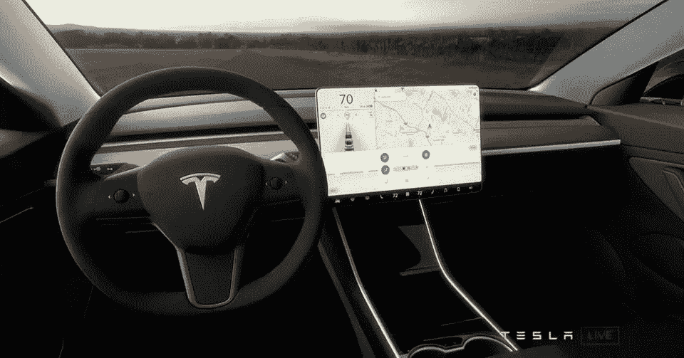

# 特斯拉的汽车比传统汽车有更大的盈利潜力

> 原文：<https://medium.com/swlh/teslas-cars-have-dramatically-more-profitability-potential-than-traditional-automakers-31375b395752>

## 为什么基于软件的汽车会极大地改变汽车行业和利润

[Source](https://www.forbes.com/sites/brookecrothers/2017/12/24/tesla-week-more-model-3-test-drives-no-1-in-norway-mars-roadster-rants-and-raves/#36b13a0333c3)

企业必须谨慎地为产品定价，但这可能相当困难。此外，使产品的每个单元都尽可能有利可图的策略…