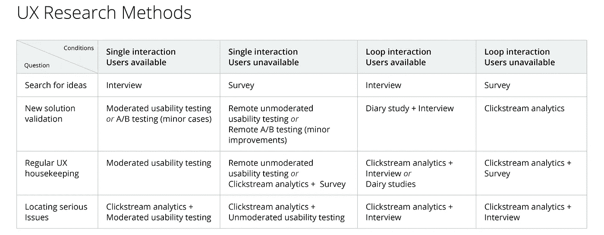

# 快速廉价的测试:UX 研究快速指南。第一部分。

> 原文：<https://medium.com/swlh/testing-fast-and-cheap-a-designers-guide-to-ux-research-part-1-a6b73d882136>

Photo by [Helloquence](https://unsplash.com/@helloquence?utm_source=unsplash&utm_medium=referral&utm_content=creditCopyText) on [Unsplash](https://unsplash.com/collections/6825451/research-article/0e5b8dfa07de07e909537994d150d505?utm_source=unsplash&utm_medium=referral&utm_content=creditCopyText)

## 简介:定义目标，选择正确的方法，计划实验。

我必须承认“研究”听起来确实有点令人印象深刻。比如一些昂贵、耗时、需要在权威杂志上发表同行评议的文章。这可不是你在午餐和乒乓球比赛之间能做的事。所以为什么要这么麻烦呢？

让我们从最开始说起:UX 研究的定义。
UX 研究是一种观察用户与相关对象互动的实践，旨在发现洞察力和薄弱环节。你可能会在网上找到一些更复杂的定义，但它们仍然没有提到电线、传感器和审讯室。观察没那么贵吧？

事实是，你可以学到很多东西，用简单的技术来彻底改进你的产品。结果并不总是与投入研究的努力相关。事实上，过多的数据可能会让你不知所措，这将使你难以处理结果并根据你的发现采取行动。长话短说:与其等到实验室为你建立起来，不如以走廊的方式进行研究。

# UX 研究方法

UX 研究，人们通常指的是在实验室里用单向镜子进行的可用性测试，或者是对最佳实践的研究。它们确实都是研究方法，但它们都是种类繁多的小部分。它们都分为两大类:定性的和定量的。

## 定性方法

他们专注于观察，而不是收集数字数据。这些方法非常适合回答关于导致问题的原因的问题。访谈、日记研究和可用性测试都是定性的方法。

## 定量方法

这些方法适用于衡量成功或找出薄弱环节。他们最好回答诸如“多少”、“多少”、“多久一次”等问题。点击流分析、A/B 测试和调查是定量方法。

# 研究目标

选择正确的方法是找到问题的全面答案的关键。但是，一些复杂的任务可能需要多种方法的组合才能获得最佳结果。

随着时间的推移，我想出了一个通用的方法:我把我的目标分成两组，并根据情况使用特定的方法。第一个条件是我是否能接触到我正在开发的产品的实际用户。第二个条件是特性本身:是单交互还是循环？反馈是即时的还是延迟的？

***举例:******单次交互*** *是照片裁剪、内容分享、创建一个项目——你看到一个动作的结果——并马上观察用户的反应。* ***循环和特性*** ***具有延迟反馈*** *是通知、推荐、个性化等自适应界面模式。您不能当场判断它是否工作良好——需要一些观察来评估这类功能的成功。*

我鼓励你尝试你的方法，并结合你认为合适的不同方法。这是我在这件事上的思路的通常轨迹。

*Research methods by goals and conditions*

***提示:*** *如果你和你的利益相关者不能就计划达成一致，那就按照你团队的建议去做。你将能够在旅途中进行调整，并节省一些无意义争吵的时间。*

# 不是 UX 的研究方法

有很多关于可用性测试和特定技术的争论，所以我想澄清一些术语不会有什么坏处。

## 走廊测试

这个想法是，你拿着你的原型，走到你的办公室外面，在走廊上招募回答者，现场测试。那些被称为“走廊”的测试是因为它们的进行方式:快速、便宜、无需太多准备。从技术上来说，这不是一种方法；这是一种方法。也就是说，我们可以运行任何测试走廊风格。这整个系列或多或少是关于走廊测试的。

## 小组讨论

焦点小组是随机召集的人，任务是讨论他们对品牌或产品的看法。它在市场营销中被广泛使用，通过了解人们对产品的看法来改善产品的形象。它可能与客户体验以及随后的用户体验有关，也可能无关，但它不是 UX 的研究工具。此外，我认为，与群体中的人一起工作是不切实际的，因为最“大声”的成员往往会影响群体中的其他人，从而损害实验的结果。

## 并行运行(也称为分割测试，也称为 A/B 测试)

这个实验的目标是比较该产品的一些成熟版本，以了解哪一个性能更好。团队同时向不同的随机形成的用户子集发布两个或更多版本。然后，他们检查所有选项的性能，并让获胜者进入这个世界。通常，稳定版本仍然为大多数用户运行，因此不成功的更新不会对公司产生重大影响。

# 战术手册

我坚信过程的力量。如果你遵循一个精心设计的计划，几乎不可能失败。这里有一些建议可以帮助你建立你的企业结构。

## 在开始研究之前，定义正确的问题

提出具体问题，获得准确答案。事实上，你得到的答案就是你以后要解决的问题。你的问题越清晰，你的目标就越现实。含糊不清的请求很难满足。
***坏问题:*** *我的 app 的 UX 对用户直观吗？* ***好问题:*** *用户了解如何使用价格计算器吗？*

## 从小处着手

你可能急于立刻收集所有可用的数据，然后从中寻找真知灼见。抵制诱惑，提前定义你在寻找什么；否则，数据集将变得不堪重负。明智地使用你的资源，在收集任何数据之前，决定你愿意在你的分析中投入多少努力。一次问自己不要超过 2-3 个问题。如果你有更多，优先处理它们，从重要的开始。

***例如:*** *你正在为一家专营家具和家居装饰的直运公司设计网站。你想知道用户在寻找合适的商品、比较不同商店的价格、选择尺寸和颜色时是否会有困难？结账流程是否最优？用户会信任你的客户交付玻璃和镜子吗？他们愿意提供信用卡数据吗？有很多问题，它们也是合法的。不过，这对于一个实验来说太多了。在这种情况下，在这里定义关键问题并继续进行。对于电子商务来说，它可能是搜索和结账流程，因为这些对企业的运作至关重要。*

## 提前计划

首先定义什么样的结果意味着成功，什么是成功的标志。定义衡量 UI 是否按计划运行的标准。确保它们能有效地回答你的问题。比较你的发现和你的期望。

***例如:*** *我们想知道直运公司的结账流程是否最优。在这种情况下，我们如何衡量成功？第一个指标是任务完成度:如果用户不能完成任务，我们的客户就不能销售。第二个是完成工作所需的时间。在实验环境中，人们通常会觉得无论如何都有义务完成任务，所以他们愿意花尽可能多的时间。但在现实生活中，他们的注意力持续时间要短得多。如果完成购买需要几分钟以上，他们可能会下降。测量你和你的团队花了多长时间来检验，并将这个时间与你的测试人员做同样的事情所花的时间进行比较。如果差别很大，寻找设计中的薄弱环节。*

## 成果交付

你在采访和观察中收集的材料可能会过多。包紧它，向你的团队展示。

*   **处理结果** 再次检查你的录音或笔记，找出规律。提炼胴体。
*   **让你的听众产生共鸣** 你的利益相关者应该了解你为之工作的人的当前工作流程。如果你认为引用或故事有助于你的团队更好地理解上下文，你可以使用它们。
*   **使用您的处理结果准备一副牌** 。如果可能的话，用图表展示你的发现，这样你的团队就不用阅读了。
*   **召集会议** 展示结果。你是拥有关于你的用户的有价值的信息的人。与您的团队分享，并准备好回答一些问题。会后把你的牌发出去。
*   **在整个开发周期中跟踪产品** 。即使前期研究做得很好，人们也倾向于被他们对产品最好的想法冲昏头脑。这使他们偏离了实际用户的需求。确保每个人都时刻牢记项目的最终目标。
    ***提示:*** *准备好资料，尽可能向你的团队展示你的工作成果。当你亲自交付结果时，你将有更好的机会被倾听和理解。不过，这不一定是 40 多张幻灯片和令人筋疲力尽的会议:几张幻灯片和 15 分钟的演示对于随意的研究来说就足够了。*

## 使用你的结果

得到结果是一回事；使用它们是另一回事。我已经看到许多进行得很好、充满真知灼见的实验在最下面的抽屉里放了很久。主要是因为利益相关者不愿意承认他们的第一个解决方案并不完美。其他任何人都可能犯错误:毕竟，我们只是人类。至于我？不，从来没有。这些用户肯定有问题，或者原型还没有准备好进行测试。让我们过会儿检查它。或者最好——从不。

没有放之四海而皆准的解决方案——其中一些会不时失败。你越快认识到并非你最初的每一个想法都是金子，你就越有可能成为一名专业人士。保持对自己足够的期望，并坚持下去。

***提示:*** *阅读科普书籍，提升自己的研究技能。作者写了大量的实验，并描述了研究人员用来获得结果的方法。他们也打破了解释错误测试方法的错误的神话。这会帮助你理解科学方法，避免偏见。*

# 倡导研究

UX 研究是一个很容易推销但很难实施的想法。这有几个原因。所有这些或多或少都是合法的:有些或它们与预算有关，有些是心理上的，所以我建议我们以不同的方式处理它们。

## 经理

**问题** 作为对整体结果负责的人，管理者关心项目的运行时间和总成本。他们通常不愿意花费资源来验证他们认为可以正常运行的解决方案。或者是客户已经同意的。他们在这里确实有一个观点:一些种类的研究需要实验室设备或专门的培训来完成。

**解决方案** 成果的质量并不直接取决于花在研究上的时间和金钱。事实上，你仍然可以有足够的洞察力快速而肮脏地运行你的测试。DYI 实验不会让你对你的用户有大量的了解，但也不会让你落后于最后期限。然而，它可以告诉你哪里出错了。在编码前修复逻辑错误将会为你节省一些高评价专业人员的付费时间。

## 设计师同仁

测试的常见陷阱是对结果的情绪反应。当事情没有按计划进行时，人会感到沮丧，而否认是对这种沮丧的自然反应。这就是为什么人们倾向于忽视这些发现，甚至否认研究本身的重要性的原因之一。

**解决方案** 这里的建议是指派从事其他项目的设计师和经理进行研究。做测试的人应该把对方当成客户，在提交报告时避免任何价值判断。事情是，随着我们技术的发展，复杂性也在增加。再也没有正确的答案了；唯一剩下的被放在“足够”和“有潜力”之间。模仿 Airbnb 或优步相对简单，但一旦你想要更多，冒险就开始了。尊重你的同事和他们的工作。没有人总是对的。

知道自己错了并不容易，但这是我们专业知识和业务发展的方式。成功实施这些技术的关键是相互尊重和支持。

在 [之后的](/@gkalugina/testing-fast-and-cheap-a-designers-guide-to-ux-research-part-3-509f2c29a8f0)[三篇](/@gkalugina/testing-fast-and-cheap-a-designers-guide-to-ux-research-part-2-484ac5e4fb8c) [文章](/@gkalugina/testing-fast-and-cheap-a-designers-guide-to-ux-research-part-4-6027ceffd809)中，我将分享我对如何选择正确的方法来回答您的问题，以及如何在预算内进行实验的想法。