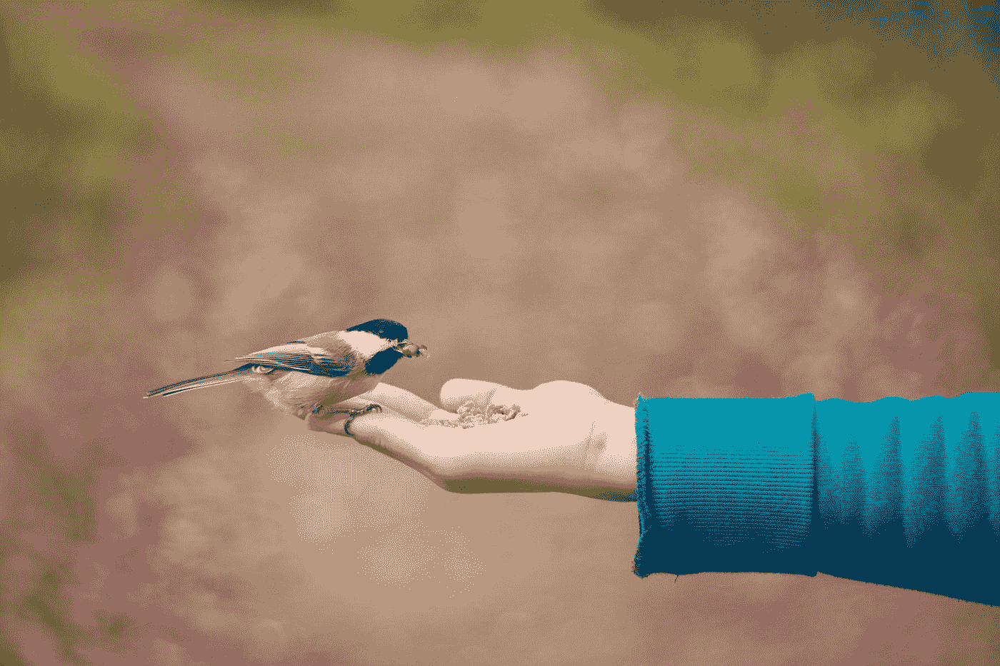

# 有一次你做了那个东西却没人在乎…

> 原文：<https://medium.com/swlh/that-one-time-you-made-that-thing-and-no-one-cared-72df709e901b>

**如何创造你的观众会喜欢的产品和服务*和*购买**

Photo by [Bonnie Kittle](https://unsplash.com/@bonniekdesign?utm_source=medium&utm_medium=referral) on [Unsplash](https://unsplash.com?utm_source=medium&utm_medium=referral)

作为创造者，我们花很多时间构思新的想法。其中一些想法我们付诸行动。我们把自己锁起来几个月——甚至几年。我们反对大众智慧。我们是创新者。我们比顾客更了解。我们听亨利·福特和史蒂夫·乔布斯的歌。我们得到了我们应该得到的所有资金。我们建立…