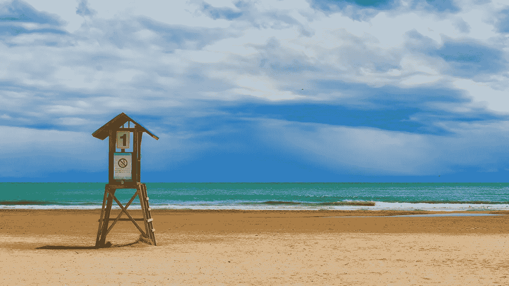

# 你必须遵守的第一条规则

> 原文：<https://medium.com/swlh/the-1-rule-you-have-to-live-by-958c20171638>

## …如果你想开始实现你的梦想

Photo by [Lukasz Szmigiel](https://unsplash.com/@szmigieldesign?utm_source=unsplash&utm_medium=referral&utm_content=creditCopyText) on [Unsplash](https://unsplash.com/search/photos/number-one?utm_source=unsplash&utm_medium=referral&utm_content=creditCopyText)

> 记住你的梦想，并为之奋斗。你必须知道你想从生活中得到什么。只有一件事让你的梦想变得不可能:害怕失败。
> 
> *保罗·柯艾略*

如果你想追逐并实现你的梦想，有一个重要的原则。遵循它并不简单，而且它…