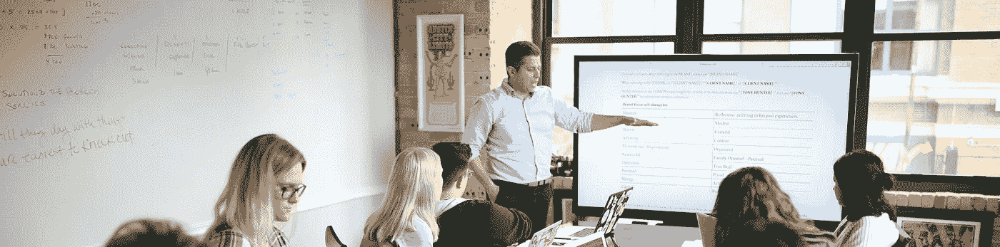

# 所有成功企业家的两个共同特征

> 原文：<https://medium.com/swlh/the-2-traits-all-successful-entrepreneurs-have-in-common-98744b5c34d9>

## 成为一名成功的企业家需要什么？从高估费用和低估收入开始。

指导我大部分创业旅程的一个原则是通过观察学习。

我是你可能称之为通过观察别人的专家。

像大多数企业家一样，我成为了职业生涯中一些常见陷阱的受害者。但是通过观察那些成功的人和那些失败的人，我已经能够更快地恢复和成功。这是我看到的一个普遍原则:一个成功的企业家不仅雄心勃勃，而且务实。他们总是计划多一倍。

我的意思是，一个成功的企业家会计划让企业走两倍的路，花两倍的钱。

# 高估和过度资本化

我现在可以告诉你，没有一个企业家知道当他们开始一项新业务时会期待什么。那些成功的人通过高估和过度资本化来预测意外。这些企业家超越了他们的投资者和团队的期望。

再多的计划或准备也不能给你所有问题的答案，但是你可以为大多数问题做好准备。

投资者是创业公司成功不可或缺的一部分，他们有一系列的期望。失败的企业家将这些期望视为起点，而不是终点线，是他们计划的限制，并让自己达不到期望。

精明的企业家希望加快这一进程。我们有一个想法，我们希望它明天就能实现。我们认为我们的想法会改变世界，任何质疑我们的计划或他们的愿景的人都不会理解。但聪明的投资者以前也遇到过这种情况，他们一遍又一遍地看到这种情况，这就是为什么他们会问这些困难的问题，为什么他们会要求详细的文件:他们知道典型的企业家过于雄心勃勃，试图简化过程，但最好的企业家总是准备两倍于他们认为自己需要的材料。

这是我学到的建议，我遵循了，现在我要传给你。

# 高估的艺术

你有时间表吗？加倍吧。你认为这要花多少钱？加倍吧。

这种计划的习惯有双重效果:你已经准备了真实的、可操作的计划，而不必因为耗尽时间或金钱而使资源负担过重。这也增强了管理团队中每个人的信心，更不用说投资者了。

高估，不要低估。不要做乐观主义者，做一个有乐观目标的现实主义者。许多企业家忘记了目标应该是可以实现的，挑战应该是现实的；你应该超出预期，而不是低于预期。

当他们估计那个月食品杂货的价格时，没有人会生气，然后意识到他们花得更少了。

同样的道理也适用于你的新企业:当你对不可预测的事情进行估计，然后意识到这比你预期的要容易时，没有人会抱怨。

相反的情况也是如此，它甚至可以在新企业开始之前就阻止它。

# 超出预期

如果花费的时间比你预期的要少，投资者会有多惊讶？他们会更愿意投资你的下一个想法吗？或者他们会告诉多少其他投资者一个“我找到的可靠投资？”如果你有机会提前完成，抓住它。但是它几乎不会像你第一次预期的那样长——它会花更长的时间。

没有一个企业家曾经“结束”他们的职业生涯，或者卖掉他们的公司时说:“哎呀，这比我想象的要容易！”但是通过高估一切，你至少可以让它看起来是这样的。

通过高估你的成本和低估你的承诺，你降低了投资者的风险，给自己留有余地来应对意想不到的障碍或费用的出现，并为自己取得惊人的成功做好准备。随着时间的推移，你的能力会说明一切，投资者将不再那么担心你完成艰难计划的能力。

这并不适用于刚成立的新公司，但任何项目、任何风险都会从过度规划和欠承诺中受益。最重要的是第一次就做对。不管你有多少问题，外面的每个人都会看到一帆风顺。

*本文原载于*[*Crunchbase*](https://about.crunchbase.com/blog/how-to-quit-a-job/)*。*

感谢阅读！:)如果你喜欢这个故事，请点击👏按钮并分享，帮助其他人找到它！欢迎在下方留言评论。

**说嘿开:**

[**Quora**](https://www.quora.com/profile/Ron-Gibori-1)**|**[**insta gram**](https://www.instagram.com/rgibori/)**|**[**LinkedIn**](https://www.linkedin.com/in/rongibori/)**|**[**Twitter**](https://twitter.com/rongibori)|[**Inc 杂志**](https://www.inc.com/author/ron-gibori)|[**网站**](http://www.idea-booth.com)

## 这篇文章发表在 [The Startup](https://medium.com/swlh) 上，这是 Medium 最大的创业刊物，拥有+409，714 名读者。

## 订阅接收[我们的头条](http://growthsupply.com/the-startup-newsletter/)。

