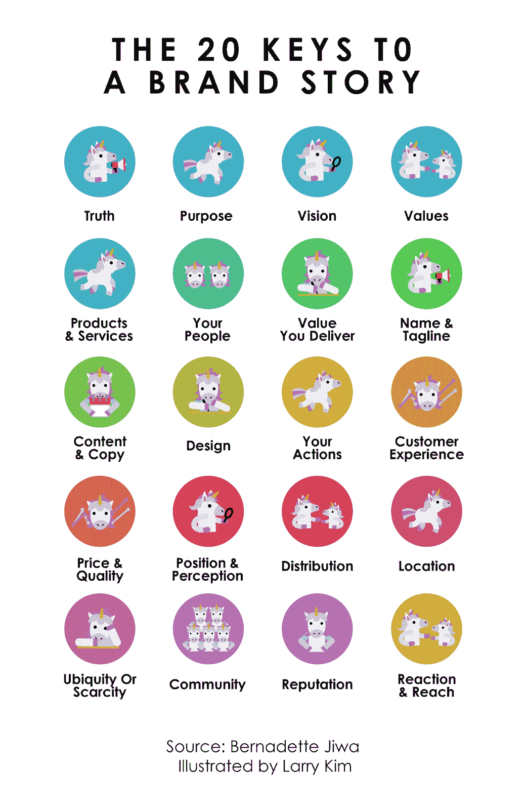

# 创造鼓舞人心的品牌故事的 20 个关键

> 原文：<https://medium.com/swlh/the-20-keys-to-creating-an-inspiring-brand-story-cd4b434bd002>

如果你想与顾客和客户建立联系，拥有一个伟大的品牌故事是关键。

[品牌](https://mobilemonkey.com/blog/2018/03/3-simple-tips-for-making-content-to-build-your-personal-brand)故事让人们认同你的品牌并且*关心*它。

品牌故事是对你的企业的鼓舞人心的叙述——它包括你的奋斗、成功和使命。

一个品牌故事不仅要呈现事实，还要唤起情感。

当你创造自己的品牌故事时，这里有 20 个关键来讲述一个[独角兽](http://www.inc.com/larry-kim/3-growth-marketing-principles-you-need-to-create-your-unicorn.html)的故事，这将与你的追随者产生共鸣，并帮助你的[业务增长](https://www.inc.com/larry-kim/5-things-to-know-about-venture-capitals-record-breaking-growth.html)！

# 1.真实性

真实性只能通过诚实和透明来实现。

你会惊讶地发现，如果你想愚弄他们，人们会很快发现。

顾客欣赏坦率说出自己意图的企业。

# 2.目的

一个企业仅仅为了盈利而存在是不够的。

让一个企业真正拥有品牌的是大局。

从长远来看，一个有目标的品牌会做得更好。

# 3.视力

你的愿景就是你希望你的品牌在世界上产生的影响。

从长远来看，你在企业中所做的一切都应该符合这个愿景。

# 4.价值观念

你的品牌所遵循的一套原则是让你执行你的愿景。

它塑造你的内部商业文化，并在日常运营中指导员工。

如果你的品牌和你的顾客有着相同的价值观，这也很好。

# 5.产品和服务

企业的命脉是你销售的产品和服务。

他们必须遵守你讲述的品牌故事和你做出的承诺。

# 6.你的人民

你和你的企业背后的人的任务是讲述品牌故事。

每个员工在讲述这个故事中都扮演着重要的角色。

你必须确保他们能够充分履行自己的职责。

# 7.您提供的价值

产品和服务本身可能不足以展示你的品牌所带来的价值。

能够用明确的术语表达出来，可以让你更好地让你的观众相信你有多好。

# 8.名称和标语

一个品牌永远不能没有它的名字和标语，这两者都代表了它的全部。

名称必须易于识别，标语必须简明扼要地说明你的品牌的一切。

# 9.内容和副本

你的内容和文案是你的品牌故事的核心。

他们填补空白，增加更多的细节，让你吸引你的客户。

内容和文案突出你的品牌声音，让你散发你的品牌个性。

# 10.设计

使一个品牌可识别的很大一部分是它的美学设计。

这大多是通过 logo 来完成的，logo 应该是客户最先能认出来的。

如果处理得当，与你的品牌相关的视觉效果可以帮助影响他们的判断。

# 11.你的行动

作为一家企业，没有什么比你的行为更能代表一个品牌。

每一个行动都很重要，从你如何经营你的企业到你如何与顾客互动。

# 12.客户体验

你的顾客在与你的品牌做生意时所经历的是故事的主要部分。

不管[你的营销有多好](https://www.inc.com/larry-kim/every-marketing-tool-you-need-in-2018.html)，如果你不能实现你的承诺，那就什么都不是。

# 13.价格和质量

你的产品和服务的价格以及它们的质量决定了你品牌的真正价值。

这也决定了你的品牌吸引什么样的客户。

你可能是一个廉价品牌，也可能是一个奢侈品牌，但质量总是被期待的。

# 14.位置和感知

俗话说，感知变成现实。

受众如何看待你决定了你的企业所处的位置。

更重要的是你如何赢得人心，而不是你如何操纵他们的思想。

# 15.分配

你如何把你的产品和服务提供给你的顾客和你卖的东西一样重要。

如果你的方法独特或者非常方便，它甚至可以给你带来竞争优势。

# 16.位置

从长远来看，你的企业所在地会极大地影响你成功的机会。

你的商业策略必须适合你的位置，反之亦然。

可见性和可访问性都决定了客户如何接触到你。

# 17.普遍性还是稀缺性

有些产品在其他任何地方都可以买到，有些产品可以是独家的。

对于您的企业和客户来说，每种方法都有其优点和缺点。

# 18.社区

你的顾客可以聚在一起分享他们关于你的品牌的故事。

随着时间的推移建立起来的忠诚顾客群体可能是品牌持续成功的一个因素。

# 19.名声

这是你的顾客讲述的关于你的品牌的故事，然后可以传播给更多的人。

一个品牌的口碑就是一切，单靠营销是无法扭转一个品牌的坏口碑的。

保持良好的声誉是长期成功的最重要因素。

# 20.反应和延伸

你接触客户的能力以及他们对你的品牌的反应是一个持续的故事。

他们可能不太关心你的生意，或者排着长队来买你的产品。

最初发表于 Inc.com 的

## 这篇文章发表在 [The Startup](https://medium.com/swlh) 上，这是 Medium 最大的创业刊物，拥有+445，678 名读者。

## 订阅接收[我们的头条](https://growthsupply.com/the-startup-newsletter/)。

