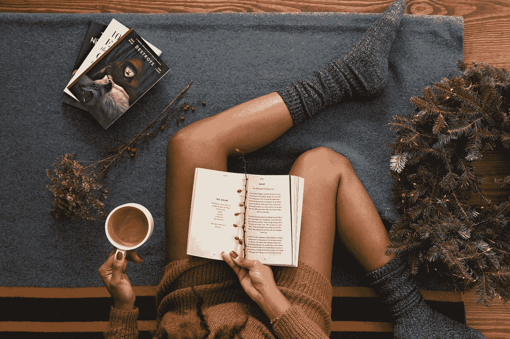

# 将你从自我中拯救出来的 20 句名言

> 原文：<https://medium.com/swlh/the-20-quotes-that-will-save-you-from-yourself-de23da0cd4a3>

## 从其他人那里…

Photo by [Thought Catalog](https://unsplash.com/@thoughtcatalog?utm_source=medium&utm_medium=referral) on [Unsplash](https://unsplash.com?utm_source=medium&utm_medium=referral)

作为人类，我们有微妙的能力成为我们最好的盟友和最坏的敌人。自我破坏是真实的，斗争…它们经常发生…并且保持我们作为有生产力的、满足的和快乐的智人有时会是一项艰巨的任务。

幸运的是，有一些方法可以侵入我们的大脑，以保持它和我们的大脑在同一个团队中…