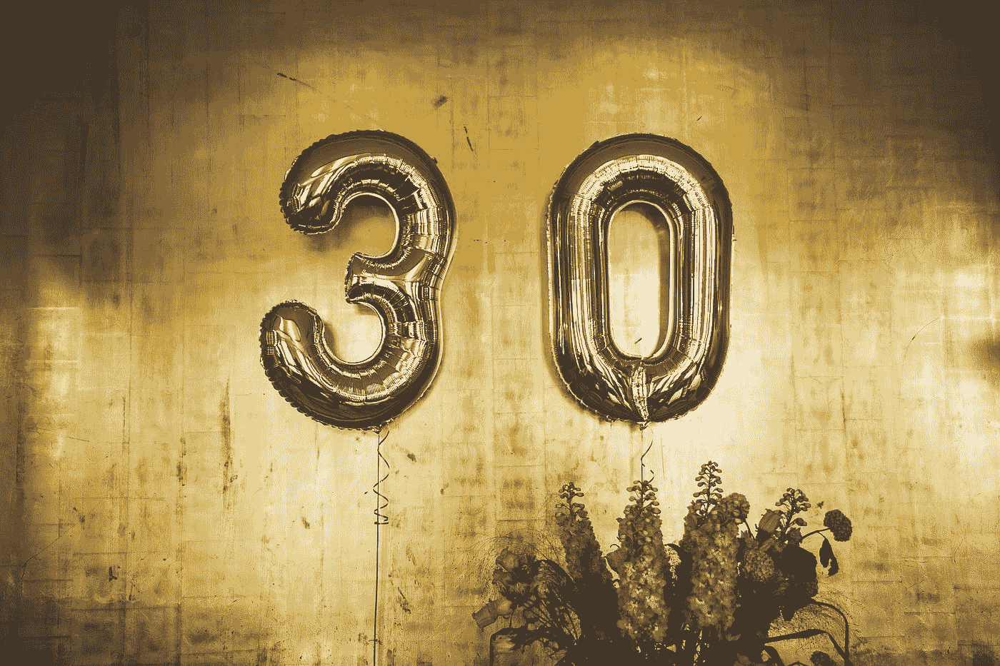

# 三十年来学到的三大教训

> 原文：<https://medium.com/swlh/the-3-biggest-lessons-learnt-in-3-decades-44a43c1ab8ea>

Photo by [Johannes W](https://unsplash.com/@johanneswre?utm_source=medium&utm_medium=referral) on [Unsplash](https://unsplash.com?utm_source=medium&utm_medium=referral)

我刚刚 30 岁，虽然我通常会反思刚刚结束的一年，但这是具有里程碑意义的一年，所以我必须评估过去的十年。

但后来我想，为什么不把它们都评估一下，看看我能从每一个中收集到什么？

**1。热爱生活**

如果生活有秘密的话，这就是了。我自信地说，因为每次我不这样做，我…