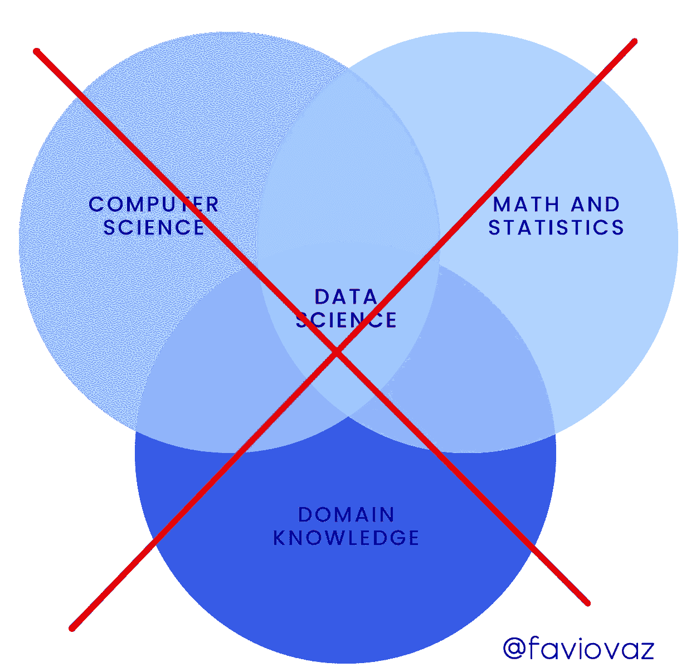
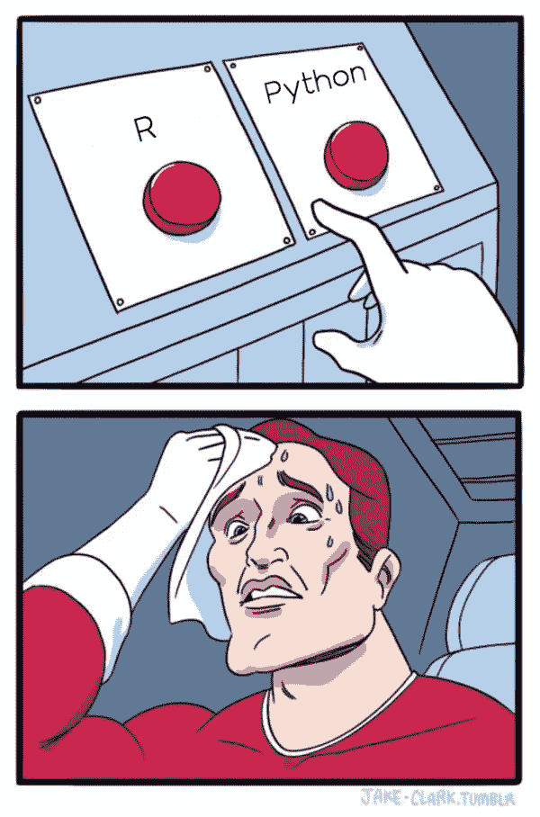
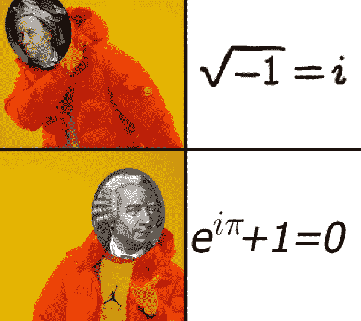
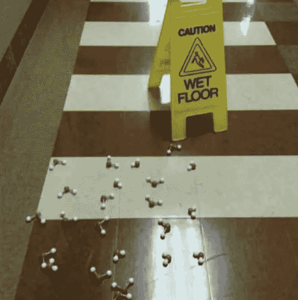
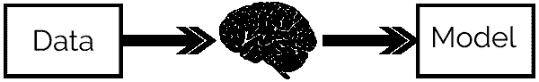
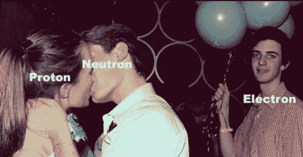
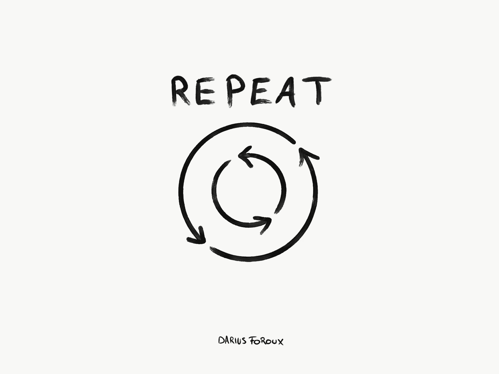

# 学习数据科学的 3 个最大错误

> 原文：<https://medium.com/swlh/the-3-biggest-mistakes-on-learning-data-science-f782e1a8abec>

## 数据科学或任何你想称之为它的东西不仅仅是知道一些编程语言、数学、统计学和“领域知识”,在这里我会告诉你为什么。



Image by [Héizel Vázquez](https://instagram.com/heizelvazquez)

你好！又是我。我已经在其他文章中讨论了我将在这里提到的部分内容，但现在我想就什么不是数据科学以及如何不学习它给出一些指导。

所以让我们从基础开始。

# 什么是数据科学？



Updated by [memes_and_science](https://www.instagram.com/memes_and_science/)

> 数据科学不仅仅是懂得一些编程语言、数学、统计学，还要有“领域知识”。

时候到了。我们创造了一个新的领域，或者类似的东西。在这个领域有很多东西要说和研究。名称并不重要，也许数据科学只是一个更大领域的临时名称，但对数据的科学研究，从中获得见解，然后能够预测一些事情**才是世界的现在和未来。**

我将重点关注数据科学的业务相关定义和建议，也许这些可以应用于整个领域，但本文中的想法是关于业务的数据科学。

我要提出三件事:

1.  数据科学是一门科学
2.  学习数据科学有很多糟糕的方法
3.  使用创建良好的备忘单可以帮助你以系统的方式进行数据科学研究

## 数据科学是一门科学



[memes_and_science](https://www.instagram.com/memes_and_science/)

我知道这可能会引起一些人的争议，但请坚持我的观点。在这里我想说的是，数据科学当然与业务相关联，但它最终是一门科学，或者说正在成为一门科学。

在之前，我将数据科学[定义为:](https://towardsdatascience.com/creating-intelligence-with-data-science-2fb9f697fc79)

> ****通过*数学*******编程*** *和* ***科学方法*** *即涉及创造* ***假说*******实验*** *和*它负责将**这些* ***问题转化为适定问题*** *，也就是说可以以一种* ***创造性的*** *方式回应初始假设。还必须包括* ***有效沟通*** *所获得的结果以及解决方案如何为企业/组织增加* ***价值*** *。****

**我在这里陈述了数据科学作为一门科学的描述和定义。我认为数据科学可以被描述为一门科学是非常有用的，因为如果是这样的话，这个领域的每个项目至少应该:**

*   ****可再现的**:使他人的工作和分析易于测试所必需的。**
*   ****易错**:数据科学和科学不寻找真理，他们寻找知识，所以每个项目在未来都可以被替代或改进，没有解决方案是最终的解决方案。**
*   ****协作**:数据科学家不是单独存在的，他们需要一个团队，这个团队将使开发智能解决方案成为可能。协作是科学的一大部分，数据科学也不应该例外。**
*   ****创造性**:数据科学家所做的大部分工作都是新的研究、新的方法或采用不同的解决方案，所以他们的环境应该非常有创造性，并且易于工作。创造力在科学中至关重要，是我们找到解决困难和复杂问题的唯一方法。**
*   ****遵守法规**:现在科学领域有很多法规，数据科学领域的法规不多，但将来会有更多。重要的是，我们正在构建的项目了解这些不同类型的法规，以便我们可以为问题创建一个干净且可接受的解决方案。**

**如果我们不遵循这些基本原则，将很难开展适当的数据科学实践。数据科学的实施方式应使决策遵循系统流程。但稍后会详细介绍。**

# **如何不学数据科学？三巨头。**

****

**[memes_and_science](https://www.instagram.com/memes_and_science/)**

**如果你在这里，很可能你现在正在学习数据科学，或者你参加了一些 MOOCs 甚至是现场课程。我不打算在这里谈论平台或糟糕的课程，我认为即使在最糟糕的课程中我们也能学到一些东西。**

## **1.眼见为实**

****

**[memes_and_science](https://www.instagram.com/memes_and_science/)**

**如果你正在上一门与数据科学相关的课程，比如数学、统计学、编程或类似的课程，而你只是带着这张脸在听课:**

****

**你在浪费时间。数据科学需要实践。你所学的一切，即使教授没有告诉你，也要实践和尝试。这是真正理解事物的基础，当你在这个领域工作时，你会做许多不同的实际工作。**

**统计学、数学和 python 方面的良好知识不会让你成为一名成功的数据科学家。你需要更多，你需要掌握你的手艺。能够使用这些工具解决业务问题。因此，如果你正在学习新的东西，你想真正理解它，找一个你可以应用它或玩它的场景。**

## **2.以疯狂的方式创建模型**

****

**[memes_and_science](https://www.instagram.com/memes_and_science/)**

**我们从“外部世界”获得数据，我们的身体和大脑分析我们获得的原始数据，然后我们“解释”事物。**

****

**[https://towardsdatascience.com/going-beyond-with-agile-data-science-fcff5aaa9f0c](https://towardsdatascience.com/going-beyond-with-agile-data-science-fcff5aaa9f0c)**

**这是什么“解读”？只是我们从所获得的信息中学到了如何反应、思考、感受和理解。当我们理解时，我们正在解码形成这个复杂事物的各个部分，并将我们一开始获得的原始数据转化为有用和简单的东西。**

**我们通过**建模**来做到这一点。这是理解“现实”，我们周围的世界，但创造一个更高层次的原型来描述我们所看到的，听到的和感觉到的东西的过程，但这是一个代表性的东西，而不是“实际”或“真实”的东西。**

**所以在你这么做之前，请想一想:**

```
**model_i_created_i_5_seconds.fit(X,y)**
```

**建模在机器学习和数据科学领域非常重要，但它们必须有目的。在使用它们之前，你必须了解它们。现在，他们在训练之前从数据中假设什么，了解他们用来学习的不同指标，如何评估它们等等。**

**我可以告诉你，阅读像 Scikit-Learn 这样的库的文档没有坏处:**

**[](https://scikit-learn.org/stable/tutorial/statistical_inference/index.html) [## 科学数据处理的统计学习教程

### 机器学习是一项越来越重要的技术，因为实验科学面临的数据集规模…

scikit-learn.org](https://scikit-learn.org/stable/tutorial/statistical_inference/index.html) 

阿帕奇火花:

[](https://spark.apache.org/docs/latest/ml-guide.html) [## MLlib:主要指南- Spark 2.4.1 文档

### 由于运行时专有二进制文件的许可问题，我们默认不包括 netlib-java 的本地代理…

spark.apache.org](https://spark.apache.org/docs/latest/ml-guide.html) 

张量流:

 [## 张量流导向|张量流核心|张量流

### 会话，这是 TensorFlow 在一个或多个本地或远程设备上运行数据流图的机制。如果…

www.tensorflow.org](https://www.tensorflow.org/guide/) 

还有更多。他们会带你去看文章、论文和更多的博客帖子，其中大多数甚至会有关于如何在机器学习和统计学习中建模的实际例子。

在这个领域也有一些很棒的视频，会在几分钟内带你从零到英雄，就像我的朋友 Brandon Rohrer 的视频一样:

## 3.“是啊，我是一只孤独的狼。我可以自己学习和做任何事情”



[memes_and_science](https://www.instagram.com/memes_and_science/)

请记住，我之前提出的一个特征是，数据科学是一个协作领域。也在研究它！

我不是说你需要和你的闺蜜一起开始一门课程，而是利用今天在线平台给我们的东西。我们有论坛、聊天、讨论板等等，在那里你可以遇到和你学习同样东西的人。和更多的人一起学习会容易得多，不要害怕问问题。

为了理解某事，问尽可能多的问题，不做不罢休。也不要骚扰别人，但是如果你礼貌地请求，大多数人会非常乐意帮助你。

这里有很好的资源(除了 MOOCs 和课程里面的资源)可以让你找到和你学一样东西的人:

[](https://stackoverflow.com/) [## 堆栈溢出-开发者学习、分享和建立职业生涯的地方

### Stack Overflow 是最大、最值得信赖的在线社区，供开发人员学习、分享他们的编程…

stackoverflow.com](https://stackoverflow.com/) [](https://www.quora.com/) [## Quora

### Quora 是一个获取和分享知识的地方。这是一个提问和联系的平台…

www.quora.com](https://www.quora.com/) [](https://community.deepcognition.ai/) [## 深度认知社区

### 一个活跃的社区，共同努力通过人工智能推动增长和创新。

community.deepcognition.ai](https://community.deepcognition.ai/) [](https://www.reddit.com/r/datascience) [## r/数据科学

### r/datascience:数据科学从业者和专业人士讨论和辩论数据科学职业生涯的地方…

www.reddit.com](https://www.reddit.com/r/datascience) 

# 带有备忘单的系统数据科学



[https://medium.com/personal-growth/all-strength-comes-from-repetition-1a95157e2c7c](/personal-growth/all-strength-comes-from-repetition-1a95157e2c7c)

备忘单通过提供关于语言、概念或库的不同部分的知识来节省您的时间。有些备忘单还包含了 R、Python、Scala 等语言中最重要的包的文档和包级备忘单的超链接。

去年年底，我创建了一个储存库，关于你可以用来做数据科学的所有不同的备忘单，这个储存库在网上疯传。

[](https://github.com/FavioVazquez/ds-cheatsheets) [## FavioVazquez/ds-cheatsheets

### 统治世界的数据科学清单- FavioVazquez/ds-cheatsheets

github.com](https://github.com/FavioVazquez/ds-cheatsheets) 

在回购中，您会发现关于以下内容的备忘单:

*   [商业科学](https://github.com/FavioVazquez/ds-cheatsheets#business-science)
*   [巨蟒](https://github.com/FavioVazquez/ds-cheatsheets#python)
*   [R](https://github.com/FavioVazquez/ds-cheatsheets#r)
*   [数学和微积分](https://github.com/FavioVazquez/ds-cheatsheets#math-and-calculus)
*   [大数据](https://github.com/FavioVazquez/ds-cheatsheets#big-data)
*   [机器学习](https://github.com/FavioVazquez/ds-cheatsheets#machine-learning)
*   [深度学习](https://github.com/FavioVazquez/ds-cheatsheets#deep-learning)
*   [SQL](https://github.com/FavioVazquez/ds-cheatsheets#sql)
*   [数据可视化](https://github.com/FavioVazquez/ds-cheatsheets#data-visualization)
*   [一般数据科学及其他](https://github.com/FavioVazquez/ds-cheatsheets#data-science-in-general-and-others)

在那里你可以找到每张备忘单的 PDF 和 PNG 版本。请随意下载 repo 作为 zip 文件以获取所有信息，如果您发现或创建了一个您认为有用的新文件，请用它创建一个 pull 请求。

感谢您的阅读，希望这能帮助您找到在数据世界中成为成功专业人士的途径。未来更多:)

[](https://medium.com/swlh)

## 这篇文章发表在 [The Startup](https://medium.com/swlh) 上，这是 Medium 最大的创业刊物，拥有+440，678 名读者。

## 在这里订阅接收[我们的头条新闻](https://growthsupply.com/the-startup-newsletter/)。

[](https://medium.com/swlh)**