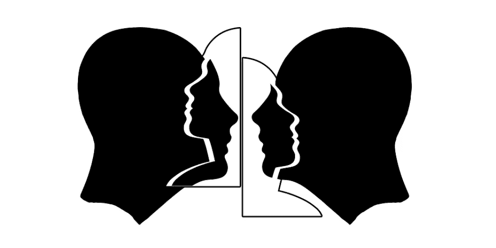

# 改善业务所需的三种同理心——第一部分

> 原文：<https://medium.com/swlh/the-3-types-of-empathy-you-need-to-improve-your-business-part-i-5e5a62dc6c6a>

> “(……)当我们关注他人时，我们的世界就扩大了。我们自己的问题转移到了思维的边缘，因此看起来更小，我们增加了联系的能力——或富有同情心的行动。”――丹尼尔·戈尔曼，社会智力:人际关系的新科学

美国心理学家 E.B .蒂奇纳将“移情”一词引入英语。他创造了“移情”一词，作为德语单词“Einfühlung”的翻译，但当时，他更多地是指其他现象，如运动模仿(模仿他人的行为)。

但是我们今天所理解的，是不同的。

简而言之，同理心可以被定义为理解他人想法、感受和行为的能力。这是一种设身处地理解正在发生的事情的能力，而不需要有同样的经历。

同理心比同情需要更多的时间和努力，它建立在自我意识的基础上。

为什么？因为控制自己的情绪会让你足够开放(并且愿意)去理解他人的情绪。

自从我发表了第一篇关于[情商](https://maitenpanella.com/what-is-emotional-intelligence/)的博客后，我就一直在说，同理心和其他技能一样，是可以学习和提高的。就像肌肉一样。你可以把它带到健身房来防止腐烂，或者每天锻炼它，让它变得强壮而有意义。

**移情在我们日常生活中的重要性是可以理解的；但为什么它的结果对商业如此重要呢？**

因为如果我们能够适应我们的客户、同事、同事和上司，我们可能会得到更好更快的结果。

👉仅举几个例子:

👉根据客户的需求，改进货物或服务交付的时间和质量

👉与组织中的关键成员建立重要而持久的联系

👉能够及时解决困难或帮助他人解决障碍

👉建立纽带和联系，形成忠诚的基础

👉在相互信任和尊重的基础上打开创新之门

同理心植根于自我意识，在自我管理中培养自己，并为关系管理铺平道路。

# 戈尔曼模式中的三种移情

心理学家丹尼尔·戈尔曼和保罗·艾克曼将移情的概念分为以下三类:认知的、情感的和富有同情心的。

让我们快速浏览一下:

📍认知同理心:这指的是理解一个人的感受或想法的能力。它就像一个“信息”的通道。

它回答了“另一个人在经历什么？”

例如，“汤姆想和他的主管谈谈可能的晋升，但他似乎很难找到合适的方式来打开话题”或“我的客户一直要求与我的公司建立直接的沟通渠道；我网站上的问答页面对他们来说似乎还不够”。

📍**情感同理心**:这是指通过情感联系理解另一个人感受的能力。

它回答了➡的问题“对方感觉如何？”

例如:“汤姆觉得他的主管不会注意他的要求，他感到害怕和不安全，这就是他推迟谈话的原因”或“我的客户感到沮丧，因为他们希望有一个直接的沟通渠道，与真人而不是机器人”。

📍**同情心**:这是第三种类型，远远超过前两种，因为它涉及到行动:如果我们理解并分享对方的感受，我们实际上可以提供帮助。

它回答了这个问题:“我能帮上什么忙？”

例如，“我可能会帮助汤姆找到开放和自信的方法”或“我将在我的网站上建立直接沟通渠道，在社交媒体上建立客户服务热线”。

## 提示:语言很重要。通过语言表达同情会有所帮助。

👉遇到新情况需要更多信息后:“你介意多告诉我一些这方面的情况吗？我知道的越多，我们就能越快解决问题”

👉发现新的事件或情况后:“我只是想让你知道，我理解你的感受”

👉在收到一封带有请求或评论的电子邮件后:“您是通过电话还是当面讨论更方便？

👉如果你觉得准备好采取行动:“我能为你做些什么吗？”

*这篇文章“为了更好的生活和事业的三种同理心”最初出现在 https://maitenpanella.com*梅腾·帕内拉的网站上