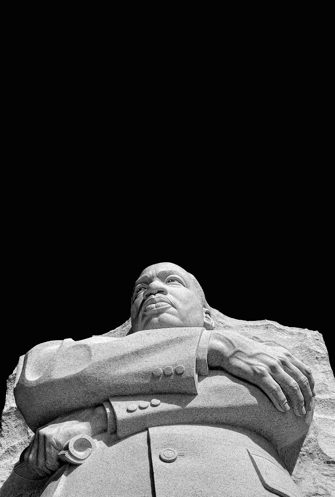

# 我在与马丁·路德·金三世共进晚餐时学到的 4 个教训

> 原文：<https://medium.com/swlh/the-4-profound-lessons-i-learned-while-having-dinner-with-martin-luther-king-iii-98a887f98b89>

## (第三条是我最喜欢的——我将永远铭记在心的变革课程)

Photo by [Ricardo Gomez Angel](https://unsplash.com/photos/p-spl5HkqJM?utm_source=unsplash&utm_medium=referral&utm_content=creditCopyText)

或许就像你一样——我也在与冒名顶替综合症作斗争。

有时候我觉得我不属于这里。