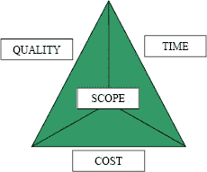

# 项目管理的 5 个要点

> 原文：<https://medium.com/swlh/the-5-essentials-of-project-management-9ab4e391ea1d>

对许多人来说，项目管理可能是一个相当模糊的术语。假设一个人将基本上管理一个项目是正确的，但是过于简化会导致问题。有五个要点构成了项目管理的框架，记住这些要点(支柱)将导致项目管理的不断改进。

项目管理依赖于五个要素中的第一个，铁三角。不是铁十字，是铁三角。

source 1:[https://www . PMI . org/learning/library/beyond-iron-triangle-year-zero-6381](https://www.pmi.org/learning/library/beyond-iron-triangle-year-zero-6381)

从上面可以看到，铁三角，顾名思义，是由三部分组成的。进度、成本和质量支撑着你其余的基本要素。随着时间的推移，铁三角的讨论越来越深入到包括质量在内，但是我们将在后面讨论这个问题。所有的三个角落，或点，需要完全和谐，否则项目将无法妥善管理。如果质量要求高，就需要更多的成本和更多的时间。保持这种平衡会让任何人在短时间内成为项目管理专家。

质量决定了你作为项目经理是否能得到参考，并跟进更重要的项目。质量总是基于客户/涉众的期望来衡量的。“顾客永远是对的”这句老话是质量的决定因素。他们永远是对的，不是你。质量差可能是一大堆事情。尽管在项目中投入了大量的细节，你的项目可能会显得仓促和不整洁。如果一个项目经理开始根据个人的质量而不是客户的质量来判断，这个项目肯定会失败。

项目经理可以记住一些项目，以保持与客户预期的质量一致。关于如何判断质量，有几个共同的质量特征:

1.  表演
2.  功能
3.  可靠性
4.  一致性
5.  适合

规划质量和实践质量保证将确保项目符合涉众的质量要求。但是，当试图超越利益相关者的期望时，会有风险。

特征蠕变，哦特征蠕变！必须避免。你可能想知道什么是特性蠕变？特征蠕变是一个浅显的术语…额外的。当一个项目经理添加一些不需要的东西时，它会破坏任何给定项目的质量和成本。无论对你或你的项目团队来说这个项目看起来有多漂亮或有多切题，多余的功能会毁了整个项目——尤其是当你向项目干系人展示了这些功能后，他们就不想要了！

如果你有添加的强烈愿望，你必须联系客户。由客户决定一个特性是否应该融入他们的项目，他们必须权衡一个特性的价值和重要性。

预算和时间通常是项目中是否允许额外功能的决定性因素。

要领之四，戒镀金。镀金会使项目华而不实，从而破坏项目的质量。有些人会将两者混淆，但是基本的区别是特性蠕变是在项目“期间”发生的，而镀金是在项目“之后”发生的。

你见过俗丽的珠宝吗？当然，有时古怪和“镀金”是珠宝设计的起源。很多时候，少即是多。当你看到美丽的钻石或红宝石时，简单高效的展示就能达到目的。当设计师被要求设计一枚三颗宝石的订婚戒指时，他不会仅仅因为提前完工或者钻石价格便宜就额外增加。项目管理也是如此。提前完成或在预算之内完成并不能给你许可去给一个不需要额外费用的项目增加额外费用。您的组织中的其他地方可能需要花费的资源，如您的项目团队或高于预期的利润率。

最内省的要领是最后一条。项目只是因为人而变得重要。

当然，客户和利益相关者很重要。你和你的项目团队也是。最好的项目旨在让人们快乐或提高每个人的生活质量。

作为项目经理，你将和一群人交谈。做一个关于人的项目需要人际交往技能。成功管理项目需要什么样的技能？

首先，养成利用倾听耳朵的习惯。在任何需要与客户打交道的工作中，积极倾听是最受欢迎的技能之一。这些客户有他们想向您表达的顾虑，并且他们对自己的项目有一个清晰的愿景。如果他们对你的问题没有太多的答案，你的积极倾听将是最大限度发挥项目潜力的关键。

情商是另一项在职业领域令人垂涎的软技能。作为项目经理，你的大部分工作是与所有相关人员沟通。这是客户、利益相关者，甚至是你可能委派给他们某些任务的下属。

一起工作的人确保铁三角是稳定的。从三角关系的各个方面实施支持的能力确保了项目将及时地、有价值地满足期望。

将项目管理视为关系管理。遵循这些要点，你不仅会成为一名成功的项目经理，你还会建立职业关系，这将导致未来的就业选择和成功。

引用和来源:

1: Caccamese，a .和 Bragantini，D. (2012 年)。铁三角之外:零年。在 2012 年 PMI 全球大会上发表的论文——法国 EMEA。宾夕法尼亚州新城广场:项目管理研究所。

## 这篇文章发表在 [The Startup](https://medium.com/swlh) 上，这是 Medium 最大的创业刊物，拥有+415，678 名读者。

## 订阅接收[我们的头条新闻](http://growthsupply.com/the-startup-newsletter/)。

