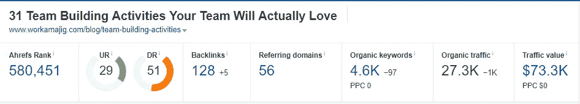

# 2019 年你需要遵守的 5 个 SEO 承诺

> 原文：<https://medium.com/swlh/the-5-seo-promises-you-need-to-keep-in-2019-4f19ba1f897e>

我不认为自己是一个搜索引擎优化专家。关于语义搜索或结构化数据，我不能告诉你太多。但是我*确实*帮助我的公司将有机流量从每天不到 500 次浏览量增加到超过 7000 次浏览量(在[这些人](http://growthpub.com/)的帮助下)。

我们做到这一点没有任何聪明的黑客或花哨的策略。只是好的老式内容营销。

在这个过程中，我学到了一些关于 SEO 的东西，尤其是对于 B2B 科技公司。如果你想在 2019 年得到类似的结果，下面是你需要知道的。

# **1。删除不增加任何价值的内容**

像许多其他科技公司一样，Workamajig 早在 21 世纪初就跳上了博客列车。像许多其他科技公司一样，我们的博客缺乏严谨和专注。

结果，我们收到了数百篇质量不一的博文。有些是聪明的想法。其他的是 100 多字的文章总结。

2018 年初，我们决定清理门户。我们浏览了整个博客，删除了所有:

*   太短了——不到 200 个单词
*   专注于一个在其他地方讨论得更好的主题
*   无关紧要或者没有给我们的观众提供任何有价值的见解
*   几乎没有交通

我们使用 301 重定向将流量从这些修剪过的页面发送到更新、更相关的内容。

在撰写本文时，我们仍在清理门户——我们的总索引页面在这一年中一直在稳步下降。

令人惊讶的是，当我们删除内容时，我们的排名也有所提高。这违背了很多内容营销者“创造更多内容”的建议。

然而，我们发现删除内容并将它们重定向到更好的 URL 会导致更好的排名，并且，由于没有更好的词，会导致更“有凝聚力”的用户体验。

# **2。专注于你最重要的 20%内容**

帕累托原则适用于 SEO，就像它适用于世界上大多数事情一样:你的前 20%的内容将占你的流量的 80%。

在我们的案例中，我们的前 10 个页面聚集了我们全年 140 万次页面浏览中的 962，728 次。

所有这些网页都以高流量、宽泛的关键词为目标。这些关键词不仅给我们的博客带来了大量的流量，还帮助我们自动获取反向链接。例如，我们流量最高的页面之一，由于其他人引用了我们的内容，已经获得了 50 多个反向链接。

这是你在制定 2019 年 SEO 战略时需要记住的事情。很容易将你的注意力分散到多个关键词上。

但在现实中，关注一堆高流量关键词并让它们排名是值得的。

# **3。更新旧内容而不是创建新内容**

众所周知，谷歌对“新鲜度”有偏见。而且理由很充分——信息很少保持常青。在 2016 年可能可行的想法和战略在 2019 年可能会过时。

这就是为什么你在 2019 年的首要任务应该是更新你现有的内容，而不是创造新的内容。

例如，我们在 2017 年 8 月更新了一篇文章。当时，它每周的浏览量不到 100 次。更新后，流量几乎立即飙升，并持续攀升至每周近 600 次浏览量。

当然，你不必更新*所有*你的内容。取而代之的是，列出所有排名在第 2 页到第 5 页的内容，也就是那些获得了一些流量但没有发挥出潜力的页面。

用更多更新的内容更新这些页面。你的目标应该是达到 1000 字左右。

**4。制作更长的内容**

我知道你们很多人可能已经看过[这张图片](https://backlinko.com/search-engine-ranking)在营销博客上流传:

这要追溯到 2016 年。SEO 中很少有东西能保持几年以上，但很明显，这一条是真的。

我们特别注意确保我们所有的新内容至少有 2000 多字。我们每个月也至少发表一篇 3500+字的文章。

我不知道是内容长度还是其他因素，但它确实帮助我们获得了我们的结果。我们经常比权威网站排名更靠前，主要是因为我们的内容比竞争对手的更长更详细。

当然，更长的内容并不一定意味着更好。当然，有些情况下，你会想写一篇 500 字的有力文章，而不是一篇 2000 字的曲折文章。

但对于大多数宽泛的关键词——我们的目标——谷歌似乎偏向于字数和新鲜度。如果你的重点是这样的关键词(而不是超级长尾关键词)，你会看到追求这个策略的好结果。

如需我们内容的样本，请查看我们最受欢迎的一些内容:

*   [如何让你的公司员工开心(有科学依据)](https://www.workamajig.com/blog/keeping-employees-happy-at-agency)
*   [全球最高效管理者的 8 个协作习惯](https://www.workamajig.com/blog/collaboration-habits-of-managers)
*   [如何在您的机构中营造多元化和包容性的文化](https://www.workamajig.com/blog/how-to-create-culture-of-diversity)

# **5。强大的内容和有针对性的链接总是有效的**

这是我们用来在一年内将流量扩大近 15 倍的策略:

*   选择一个每月至少有 1000 次以上搜索的关键词
*   针对宽泛的关键字和多个相关的关键字创建长的、高度集中的内容
*   通过手动外联和行业出版物上的客座博文，建立指向此内容的定向反向链接

在 SEO 中很少有保证，但是这种策略在大多数时候是有效的。首先，它很好地配合了谷歌的规则。你在创造人们想要的内容，你在有机地推广它。

如果你选择了正确的关键词，你会发现这个策略有倍增效应。高流量关键词排名的内容往往会自动从其他网站获得反向链接。这提高了你的整体域名权威，使你更容易为其他相似的关键词排名。

另外，这是一个任何人都可以遵循的策略——无论有没有搜索引擎优化公司的帮助。

我不是说我们的结果是典型的；我们确实得到了很多帮助。但我们的结果也表明，你不需要任何花哨的策略，使搜索引擎优化工作。持续生产高质量的内容，改进你现有的内容，建立有针对性的反向链接，这是你在 SEO 中可以拥有的“保证”成功的策略。

*我在*[*work majig*](https://www.workamajig.com)*工作，一个创意团队和机构的管理系统。* [*查看我们的博客*](https://www.workamajig.com/blog) *了解我们的内容。*

## 这篇文章发表在 [The Startup](https://medium.com/swlh) 上，这是 Medium 最大的创业刊物，拥有+415，678 名读者。

## 在这里订阅接收[我们的头条新闻](http://growthsupply.com/the-startup-newsletter/)。

