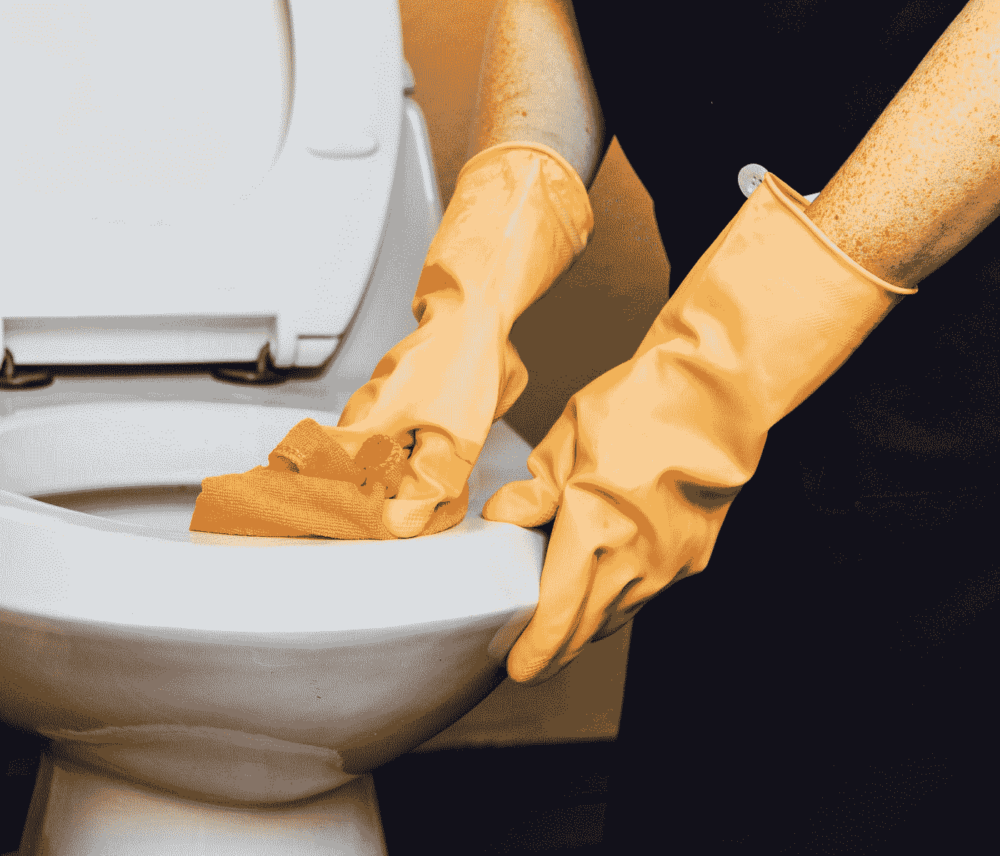

# 作为创始人，我执行过的 5 个最愚蠢的任务🚀 💩

> 原文：<https://medium.com/swlh/the-5-stupidest-tasks-ive-ever-executed-as-a-founder-4f0c71770912>

## 或者:怎么什么事都自己做，毁了自己的网上奶茶店

Photo by [rawpixel](https://unsplash.com/@rawpixel?utm_source=medium&utm_medium=referral) on [Unsplash](https://unsplash.com?utm_source=medium&utm_medium=referral)

> 没有人能比我做得更好(西蒙·特尔涅克)

创始人通常有一个大问题:那就是他们的自我和对完美主义的偏好。大多数创始人热衷于他们的服务或产品。我在网上卖茶——一…