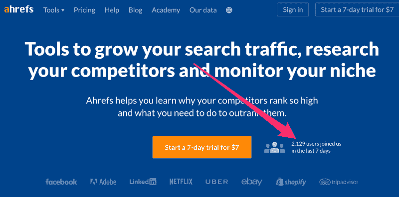

# 成为优秀营销人员的 9 点蓝图

> 原文：<https://medium.com/swlh/the-9-point-blueprint-for-becoming-a-great-marketer-d8a810aa968f>

你好。我是 Tim，我的正式职位是 [Ahrefs](http://ahrefs.com) 的“首席营销官兼产品顾问”，这是一款行业领先的 SEO 工具。

我做“CMO”已经四年了。这是一个令人浮想联翩的头衔，让人想起领导庞大的营销和销售团队——但事实是，到目前为止，我大部分时间都是在独角戏。(我甚至[写过这段旅程](/swlh/how-i-built-an-8-figure-marketing-team-from-scratch-4dccca716f1a)，但那是另外一个故事了。)

换句话说，虽然我非常乐意卷起袖子自己做每件事，但问题是:我已经习惯了自己做每件事。

你大概可以猜到故事从这里开始。随着我们营销部门的扩大，我继续做我擅长的事情……而不是我的 CMO 头衔中的“执行”部分。

比如说，管理我的团队。

我就这样熬过来了，直到几乎被团队的很多成员当面质问他们的职业进展。或者更具体地说，他们对自己在该部门的未来的不确定性和担忧。

因此，我卷起袖子，在团队的一点点投入下，想出了以下关于如何计算营销人员“价值”的 9 点蓝图。

***

# **0。产品知识**。

我已经[重复了太多次](https://entrepreneurshandbook.co/this-is-what-separates-a-good-marketer-from-a-great-one-1e6c49433895)的规则几乎不需要再说了:

> 如果你不比我们的任何一个顾客更了解产品，你就不能成为一个好的营销者。不要等到其他团队成员向您介绍我们的产品；自己研究吧。

# **1。成功完成的项目**。

无论什么时候给你一项任务，它都必须完成。忘记事情，推迟事情，拖延，推迟截止日期——这些都是不好的事情。把事情做完是非常重要的。

做你自己的经理——不要等我来质问你自己的待办事项。

说到完成工作，学会高效是你能做的最好的事情之一。以下是一些入门帮助:

*   这是一篇关于这个话题的非常实际的文章，作者是格伦·奥尔索普。
*   如果你以前从未研究过生产力这个话题，这是一个很好的起点。
*   最后一条建议:[阅读这本书](https://www.amazon.com/Bullet-Journal-Method-Present-Design-ebook/dp/B07B7C4F9C/)并开始一个“子弹日记”

# **2。质量是第一位的，但是速度和效率也很重要。**

在 Ahrefs，我们重视工作质量，而不是工作完成的速度。也就是说，完美主义和拖延症一样，是完成事情的大敌。

一个优秀的营销人员能够在质量、速度和效率之间找到平衡点，从而取得更好的效果。(“质量”通常是一个模糊的术语，因此这将基于来自我们团队中更有经验的成员的输入、来自我们社区的反馈或简单的 ROI。)

我希望我能给你更多切实的建议，让你在质量和速度之间找到平衡，但这是你必须自己解决的事情之一，并通过实际的过程来学习掌握。

# **3。FSO 因素——搞清楚！**

为了成功地完成一个项目，你必须要么拥有相当多的领域专业知识，要么能够快速学习并在进行过程中搞清楚。

能够在不涉及团队中任何其他人的情况下，为不熟悉的问题提出很好的解决方案，受到高度重视。团队中其他成员照看你和控制你的产出质量的越多，你的工作就越没有价值。

# **4。ROI**

非常简单。你的工作要么是为我们公司带来新客户，要么是帮助留住现有客户。你可以写出世界上最好的文章，但是如果它没有获得流量或者没有把读者转化为客户，它对公司就没有价值。(因为我们不太喜欢[跟踪我们所做的每一件小事的投资回报率](/ahrefs-marketing/how-i-learned-to-stop-worrying-about-my-sales-funnel-and-embraced-the-unpredictable-1a19b13f2f05)，这里的“投资回报率”是指“团队其他成员的看法”。)

# **5。原创创意**

在大多数情况下，人们会根据现有的产品开发和营销路线图告诉你该做什么。但是熟练的专业人员可以很容易地自己找到高产出的任务，或者在交给他们的任务上具有高度的创造性和主动性。对你负责的任何任务负全责，想办法最大化产出，同时最小化完成任务所用的资源。

一个有助于提出超出你正常工作范围的原创营销想法的练习是，始终考虑底线——也就是公司的增长。

*   你还能做些什么来为我们赢得更多客户或留住现有客户？
*   什么会阻碍我们获得或留住客户？
*   哪些营销噱头能对我们的品牌产生积极影响？

…如此等等。

通过不断地问自己这些问题，你会不可避免地找到很好的行动机会。

# **6。乏味的工作**

并非所有的营销工作都是蝴蝶和彩虹。乏味、无趣的事情总是会出现。真正关心公司成功的人会自愿去做任何需要做的事情。

当我说“完成”时，我从来没有说它不能以某种方式外包。你必须有效率，记得吗？

# **7。适用的营销知识**

关于营销、SEO 和文案的方方面面，有大量的书籍、课程和博客。如果你自己找不到时间阅读或学习，你将永远比那些阅读或学习的人落后很多步。

让我给你几个建议:

*   [常年销售者:制作和营销作品的艺术经久不衰](https://www.amazon.com/Perennial-Seller-Making-Marketing-Lasts-ebook/dp/B01N8SL7FH/)
*   相信我，我在撒谎:一个媒体操纵者的自白
*   [传染性:为什么东西会流行起来](https://www.amazon.com/Contagious-Things-Catch-Jonah-Berger/dp/1451686587)
*   [网络秘密](https://dotcomsecrets.com)(小心追加销售)

# **8。网络**

我之所以能够完成相当多的营销噱头，是因为我认识某些人，或者能够从一个普通朋友那里得到介绍。总是寻找与有趣的人联系和保持联系的方法。如果你积极地做第 1-6 点，你也会发现其他人自然会想和你联系。

# **9。团队合作**

不要以自我为中心:你的工作应该帮助整个公司取得成功，而不是你一个人。这不是一个零和游戏，你也不是在和你的队友竞争——你们是一个团队的。所以只要有可能就去帮助别人，这只会让我们的团队更强大。

顺便说一句，“帮助”并不等同于“为他们工作”帮助队友，礼貌地指出他们的错误，并教他们如何解决问题。

***

这个蓝图现在放在我们的想法板上，供整个团队参考。

当然，需要一些背景:Ahrefs 是一个 SaaS 的搜索引擎优化工具，我们身体力行，这意味着我们非常注重搜索引擎优化和集客营销。

我们的营销策略围绕着创造人们积极寻找其教育价值的转换思想的内容。通俗地说，我们创建关于搜索引擎优化的高质量博客文章和视频，这些文章和视频在谷歌和 YouTube 上排名很高。许多消费我们内容的人最终成为了我们的客户。

这意味着我们每天都可以获得线索，而不用耗尽我们的资源来策划复杂的营销活动或在付费广告上花费大量的金钱。

在我看来，优秀营销人员的特质可能与你不同，这取决于你的团队结构和你的商业价值观。

也就是说，我想知道你的列表会不会和我的有太大的不同。

你觉得这个蓝图相关吗？

你会对这份清单做些什么改变或补充？

我很乐意收到你的来信。

//

> 感谢阅读。如果你喜欢这篇文章，请随意鼓掌👏按钮几次(👏👏👏👏)帮别人找:)
> 
> 更多深入的营销文章，请访问 [Ahrefs 博客](https://ahrefs.com/blog)。

//