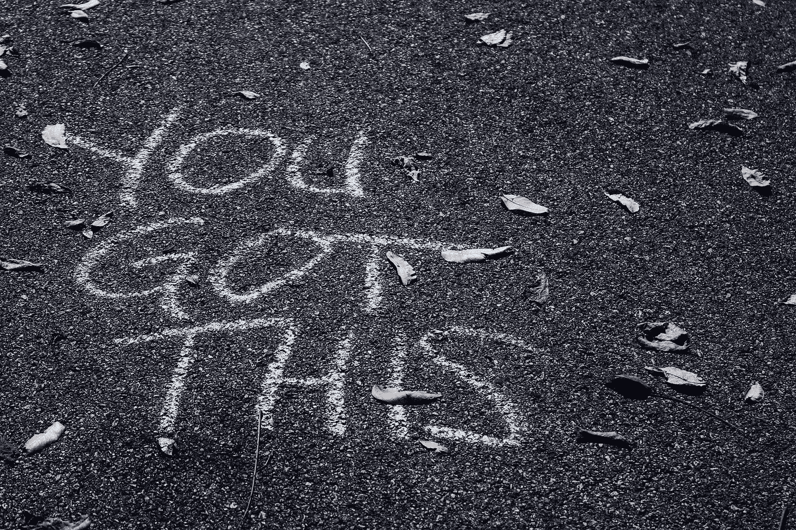

# 自信的自动测试

> 原文：<https://medium.com/swlh/the-a-c-t-of-self-confidence-9bab641557ff>

## A.C.T .的三个简单原则

“You got this” (Photo by [sydney Rae](https://unsplash.com/photos/geM5lzDj4Iw?utm_source=unsplash&utm_medium=referral&utm_content=creditCopyText))

> psst…有兴趣看/听这篇文章作为演讲吗？[在 YouTube 上观看](https://www.youtube.com/watch?v=Scy3dZGHn_I)

> 你曾经怀疑过自己尝试新事物的能力吗？
> 
> 你有没有觉得自己没有能力成就一番伟业？
> 
> 你有没有因为别人的想法而争论过采取某种行动？

如果你想到你可能是唯一一个对这些问题都回答“是”的人，那么你不是！几乎所有我见过和说过话的人都会说“是的”。这也包括我，因为在我人生和职业生涯的某个阶段，我怀疑过自己。

我怀疑自己能否成功地与一屋子固执己见、地位很高的利益相关者举行第一次会议。

我也怀疑自己是否能在高峰时间在健身房做引体向上，因为那里什么都有排队。老实说，有这么多陌生人在身边，尝试做一项新的锻炼可能会很吓人。谁知道别人对我的锻炼技术有什么看法？他们可能会暗中判断我做某项特定工作的方式，或者那只是我的想象。

但是别人怎么想重要吗？

这些年来，我意识到，我越频繁地把自己置于不舒服或困难的境地，我就越能学会如何生存。

> 自信是一项基本技能，它推动你如何行动和思考，你对他人的感觉以及你在生活中有多成功。

我想分享 3 个简单的原则，每个人都可以用来建立自信。毕竟，我们从研究中知道[自信是一种可以训练的技能](https://www.forbes.com/sites/carolyncenteno/2018/04/18/your-brain-on-confidence/#3cab405160cb)。

# **原则 1:意识到无知**

你知道吗，如果你在心里平静地说“是”，或者对本文开头的问题微微点头，你就已经朝着这个首要原则迈出了第一步。

干得好！给自己一点鼓励。)

## ***快速思维练习:***

请花几秒钟思考一下:

*   一次你想在一个重要的工作会议上说些什么…
*   一次你想消除做某个决定的遗憾…
*   一次你想在一个新的城市问路…

你觉得怎么样？你是如何行动的？你感觉如何？

> 认识到你在任何情况下的感受和想法是提高你自信的第一步。

意识是关于识别你感到自信或不自信的情况，以便更容易做正确的事情。这也包括为你的努力工作邀功。

我们的思想是一个强大的工具，它可以成就我们，也可以毁灭我们。研究表明，我们的思想会影响我们的行动。

> 原则 1 是关于意识到自己的思想、感觉和行为。

# **原则二:持续改进**

建立自信没有简单易行的方法。也没有所谓的“完美”自信。

> "持续的改进胜过延迟的完善."—著名作家马克·吐温

## 熟能生巧

49，200 分钟是我为期末钢琴考试而练习的时间。

我弹了 12 年多的钢琴，快结束时，我决定去[皇家音乐学院](https://www.rcmusic.com/)攻读我的教学文凭。为了期末考试，我必须记住 40 张乐谱和几种不同的技能。

最重要的是，在人前表演我会紧张。紧张的最糟糕的部分是在播放一首歌的过程中，随机地陷入空白，然后不知道如何以及在哪里继续。

我的父母和钢琴老师都说我只需要练习，练习，再练习。当然，我告诉自己，他们是荒谬的，我不可能变得更好。我没有看到改进。但是在一年半的时间里，在一些独奏会上演奏和每天 1.5 小时的练习后，它确实有帮助！

## 反馈和防御感

你有没有收到过来自同事的反馈，让你觉得有所防备？

默认情况下，我们不喜欢被人说我们不擅长某件事，或者我们做得不如自己认为的那样好。感觉不太好。

但这里最重要的是你如何看待这个反馈，以及你下一步该采取什么行动。虽然反馈并不“积极”，但我们仍然可以选择如何解释它。不是每个人都是优秀的沟通者，所以反馈并不总是以“最好的方式”传达。

成长的唯一途径是不断努力将我们的弱点转化为优势。这包括思考反馈的意图，并为你下次做得更好找到方法。

## 不放弃的力量

这是我最喜欢的视频之一，它实际上结合了自信的三个原则。这个小女孩知道自己的优点和缺点，她坚持不懈地尝试了无数次，她相信自己。

The power of not giving up.

> “实践创造自信。自信赋予你力量”

> 原则 2 是用坚持不断提升自己。

# **原则 3:相信自己**

你是否曾经很难认识、理解或相信自己的价值？

你曾经参与过消极的谈话或者让你消极的自我控制吗？

根据谷歌的说法，信任是“对某人或某事的可靠性、真实性或能力的坚定信念”。我们信念的集合构成了我们的思维模式。你认为你更倾向于“我能行”还是“万一”的态度？

相信自己会为你自己的能力和经历打开机会和成长的大门。

## 开始一份新工作

我的一个朋友去年被提升了。他对在一个新的领域工作感到非常兴奋，但随后开始质疑自己做好新工作的能力。他也不知道自己是否合格，是否能融入新的团队成员。

事情是这样的，如果你不相信自己能做好工作，那么谁会呢？

如果一个同事总是对每种情况说些负面的话，你会觉得更自信还是更不自信？

研究表明消极情绪会传染。但是你知道这种积极的态度也是会传染的吗？

> 摆脱消极的想法，为积极的想法腾出空间。

正如我前面提到的，只有当你意识到自己消极和积极的想法、行为和感受时，你才能做到这一点。

## 获得晋升

没有什么事情是绝对完美的，不良情况时有发生。

几个月前，我姐姐打电话给我，告诉我医院有一个主管职位空缺的消息。她是加拿大的职业治疗师。

她问“我应该接受这个职位吗？这是我想接受这个职位的原因，这是我担心的原因。请注意，问题清单似乎更长了，但它们只是她决定压倒自己的问题吗？

事情是这样的，她想升职并接受挑战，她有资格和经验。但让她不安的是学习新事物和建立新关系的已知未知。

我只是简单地重申了她迄今为止在私人工作和全职工作中取得的成就。我的目标是让她意识到，她有充分的理由相信自己能够更进一步。

六个月后，她在管理岗位上的表现令人惊叹。

我们经历思维过程，但重要的是要意识到我们为自己描绘的是什么样的图景。没有一个思维过程只有一个画面。这归结于我们的心态，以及我们如何看待我们遇到的情况和事件。

> 原则 3 是关于转移你的思想，相信你。

# 最好的你始于你自己

> “挑战自己。这是通向成长的唯一道路。”—摩根·弗里曼

S **自信是我们需要不断挑战自我的技能之一**，无论是能够相信自己做出的重大决定是在特定情况下最好的决定，还是不允许自己再次经历不利或痛苦的过去事件。

信不信由你，你需要自信来做出最简单的决定，比如选择带外地客人去哪里吃饭，或者穿什么去面试。

## ***快速思维练习:***

1.  抓起一张纸，写下(或记下)你对赞美不屑一顾的时候。
2.  在你的脑海中再次播放那个瞬间。
3.  现在想象一下，如果只是简单地说“谢谢”会是什么样子

接受他人的认可也是建立自信的一部分。这包括对自己努力工作的时间给予肯定。

> 建立自信从你开始

你是唯一可以:

1.  要 ***意识到*** 你是如何思考、行动和感受的。
2.  在 ***持之以恒*** 不断提升自己的自信。
3.  ***相信自己*** 。

没人说你必须一个人去做。有一个导师是一个很好的开始或者激励你的方法。

你还在等什么？

> “当生活给你柠檬时，就做柠檬水”

我个人现在就向你挑战 A.C.T .(觉知、持续、信任)！

## 有灵感吗？拿着👏说“谢谢！”并帮助他人找到这篇文章。

你想要更多吗？ [*关注我或在此阅读更多*](/@amandakwoo) *。*

## 让我们一起庆祝胜利

你是通过什么方式增强自信的？什么对你有效？如果你愿意分享的话，我很乐意听听。欢迎在下面的评论中或通过电子邮件(Amanda @ interesting bydefault . com)分享。

## 这篇文章发表在 [The Startup](https://medium.com/swlh) 上，这是 Medium 最大的创业刊物，拥有+436，678 名读者。

## 在这里订阅接收[我们的头条新闻](https://growthsupply.com/the-startup-newsletter/)。

