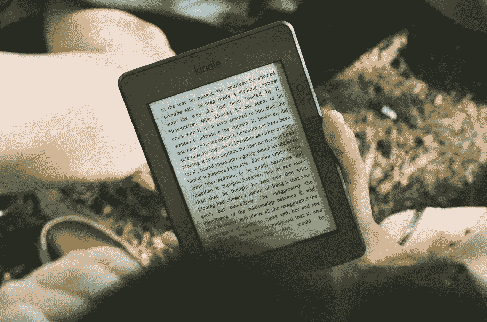

# 顶级赚钱畅销书作家——分析

> 原文：<https://medium.com/swlh/the-a-list-money-earning-bestselling-writers-analyzed-9e5638257c2b>

谁在传统出版业中赚钱最多，独立作者能从他们身上学到什么？

Photo by [James Tarbotton](https://unsplash.com/@jamestarbotton?utm_source=medium&utm_medium=referral) on [Unsplash](https://unsplash.com?utm_source=medium&utm_medium=referral)

**(注:这篇文章最初出现在 Joe Konrath 的博客上，是 2013 年的一篇客座博文。通常一个导入故事的媒体链接在底部，但是我想让每个阅读这篇文章的人都明白这一点。我感谢乔出版了它。)**