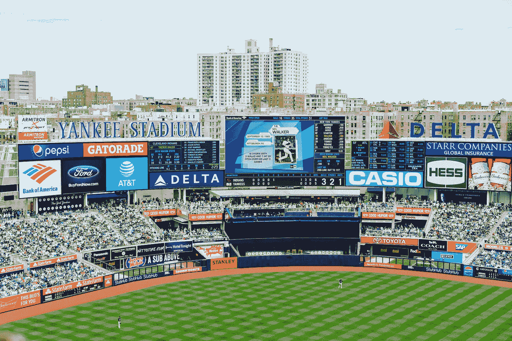

# 广告的出现

> 原文：<https://medium.com/swlh/the-advent-of-advertisements-bca5368af162>

广告正以某种令人讨厌的方式卷土重来，而且是以某种令人惊讶和偷偷摸摸的方式。

Photo by [Dan Gold](https://unsplash.com/photos/MyQRGqdq2fE?utm_source=unsplash&utm_medium=referral&utm_content=creditCopyText) on [Unsplash](https://unsplash.com/search/photos/ads?utm_source=unsplash&utm_medium=referral&utm_content=creditCopyText)

我相信，我们正转向一个更具破坏性、更缺乏创新性的民主和资本主义社会。

简而言之，我认为创新和制造好的产品对公司来说是次要的。