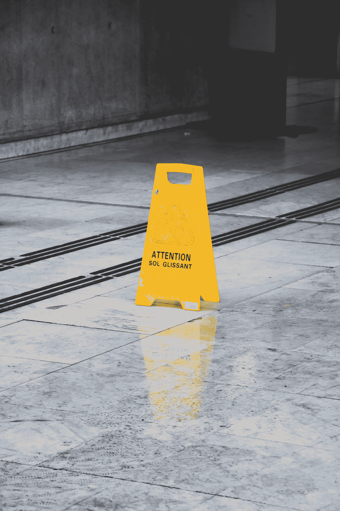

# 注意力的时代

> 原文：<https://medium.com/swlh/the-age-of-attention-c09e43933481>

Photo by [Justin Chrn](https://unsplash.com/photos/yRcq80gAQgo?utm_source=unsplash&utm_medium=referral&utm_content=creditCopyText) on [Unsplash](https://unsplash.com/search/photos/attention?utm_source=unsplash&utm_medium=referral&utm_content=creditCopyText)

获得关注并不是一件新的事情。这是所有想生存下去的企业的面包和黄油。这是某些新闻在所有正在发生的事情中保持相关性的方式。这就是我们如何找到我们想要购买的最新/最酷/环保的产品。

然而，它也是新的*经济*。

这不是一个很大的见解，但让我们深入研究。

*社交媒体*为每个人和任何人搭建了表达意见的平台。那些有机地生长出一个深网和广网的人将能够达到数千、数百万甚至更多。这是前所未有的。

青少年正从关注中变得富有。比特币黑客正从关注中变得富有。Instagram 已经成为注意力经济的金矿。

这场革命不会被电视转播。它就发生在我们眼前。

推销自己的方式有很多——人们不得不思考未来 5 到 10 年将会是什么样子。很明显，信息量会让我们的大脑爆炸。同样显而易见的是，这些社交媒体式的技术在我们生活中的整合只会变得更加错综复杂。

事情会变得越来越奇怪。

成功脱离 Soundcloud、YouTube 和 Instagram 的年轻百万富翁的涌入会对社会产生什么影响？

新的名人会越来越年轻吗？

当这些发现注意力游戏的黑天鹅和我们其他人只是坐着看他们变得更富有时，技术会继续加剧工资差距吗？

还是整个社会会变得更加富裕。正如他们所说，

> 水涨船高。

真是有趣的时光。

然而。

我们都明白并认为互联网将会成为主要的民主化工具。这将使经济地位的竞争环境变得公平——信息将跨越在全球连接器出现之前就存在的边界。

这一愿景已经部分实现，而且在很多方面都实现了。注意力时代的另一面是，任何人都可以领导自己的部落。

我读过赛斯·戈丁的短篇小说《部落》。我向任何想要快速阅读的人推荐这本书，它有很多理解新的基于关系的经济的技巧。

我计划在另一篇文章中写更多这方面的内容，但其中一个想法让我印象深刻:

> 在基层变革的时代，金字塔的顶端离行动的地方太远，无法发挥多大作用。耗时太长，缺乏影响力。顶端不再是顶端，因为街道是行动的地方。
> 
> 每个人都可以利用的新杠杆意味着现状比以往任何时候都更受威胁，每个员工现在都有责任在别人改变规则之前改变规则。

在整本书中，他都以积极的语气推动这样一种观点，即我们所有人都可以领导，我们所有人都应该领导，因为现在，人们比以往任何时候都更希望成为一个更宏大的愿景的一部分，这个愿景超越了他们的日常生活。

所以——当然我们可以在一旁观看，但是*为什么*？为什么不说出你的真相，有人想听。即使是你的朋友，阿姨或者邻居家的猫，它们看起来没有家，因为它们住在每个人的后院。

我们不是在争夺关注。

相反，我们是在讲述我们所看到的故事。或许你也会乐意分享你的。

感谢阅读。