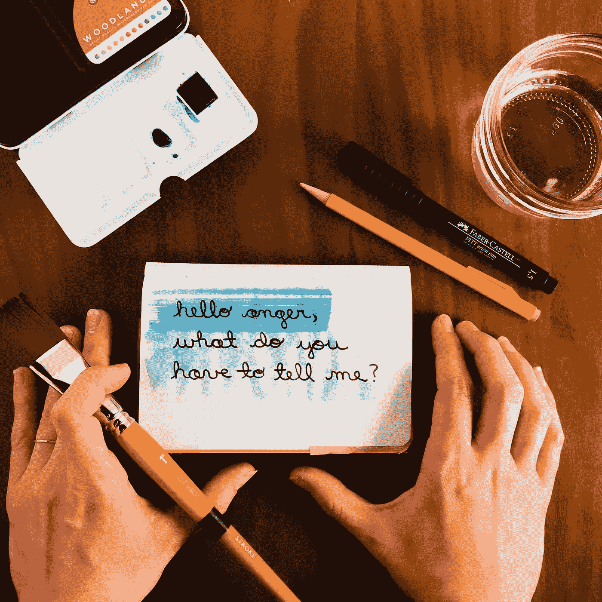

# 愤怒警报

> 原文：<https://medium.com/swlh/the-anger-alert-c716bdca3a91>

## 我们需要停止假装愤怒是一件坏事

Source: [Words by Emily](https://wordsbyemily.co/) (the author)

很长一段时间以来，我觉得不愉快的感觉——愤怒、易怒、焦虑、羞愧、后悔、悲伤、压力——就像是商务会议上的一个屁。往好里说，是失礼，往坏里说，是完全令人厌恶。

在内心深处，我认为我真的相信，如果我正确地生活，我可以避免那些不愉快的感觉。我…