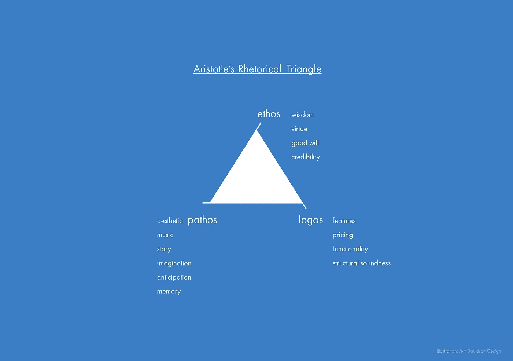
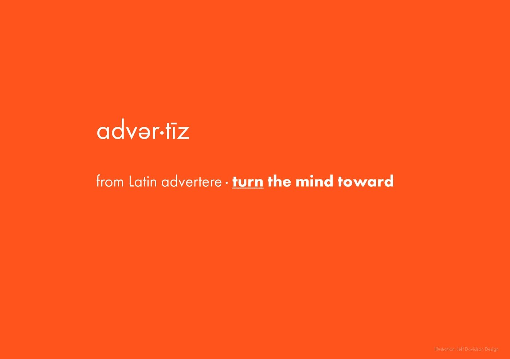
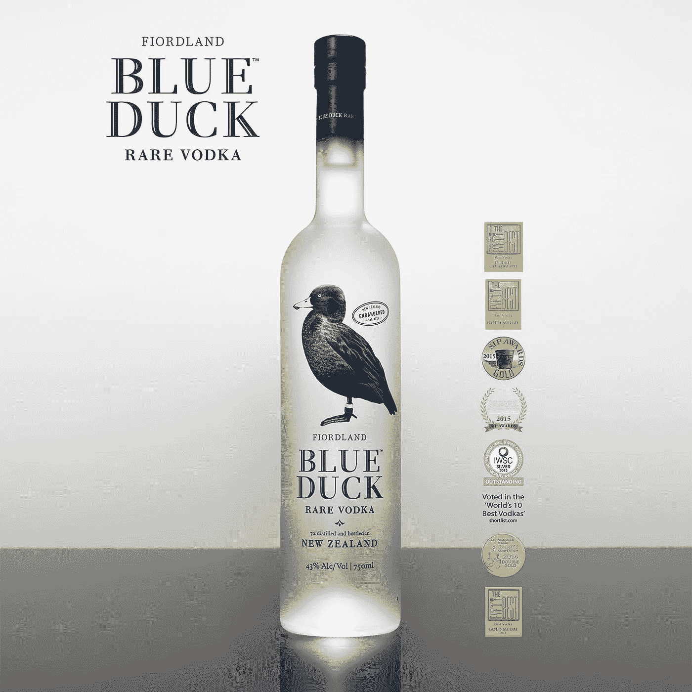
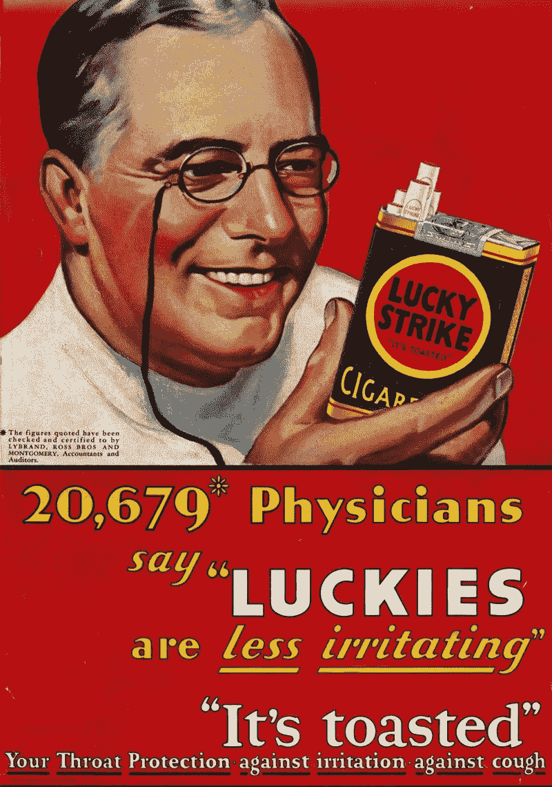
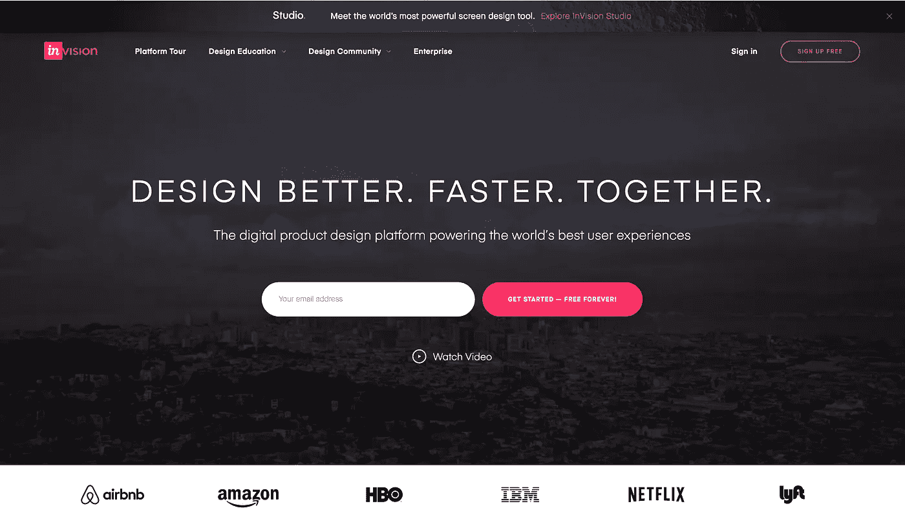

# 获得顾客的艺术

> 原文：<https://medium.com/swlh/the-art-of-acquiring-customers-616013fcc2c1>

## 亚里士多德与修辞学

我职业生涯的大部分时间都在试图设计伟大的产品。随着时间的推移，我逐渐意识到一个好的概念和产品只是成功的一半。在一个信息过载的世界里，事情需要被看到，而且这项任务每天都变得越来越困难。产品或服务不仅需要被看到，还需要被理解和记住，因为人们在实际使用之前就已经在心理上购买了东西。在使用它之前，他们必须想象这个值。

这篇文章是关于获得客户的艺术——更具体地说，它概述了亚里士多德提出的修辞的三个“支柱”;*风气*、*悲情*和*标识*。我还将提出一种新的关键的“说服”方法，这是二十一世纪销售所必需的。这第四个支柱是*经验性的*，意味着人们实际上需要*得到*它，在一个完全承诺的交易之前。我认为免费试用和数字经济使得说服某人买东西变得非常困难。纯粹的外在营销不再流行——伟大的产品和服务流行。在本文中，你将了解这些支柱是什么，以及如何利用它们来创造更有效的广告和营销策略。

# 什么是广告？

“advertise”一词在拉丁语中翻译为“将思想转向”。从基本意义上来说，广告应该“突出”和直接。它需要指出他们可以购买或了解更多产品/服务/事件的地方。广告告知并激起人们的兴趣。好的广告也能激发想象力，因为你的观众必须在购买之前想象价值。想想吧。在任何交易之前，用户必须已经在脑海中购买了该产品。他们需要进行心理上的讨价还价，才能做出交钱的决定。好的广告也是功能性的，这意味着图像、符号和文字必须可读。信息需要明确。

产品越复杂，就越难销售，因此需要更多的修辞。例如，如果你饿了，我给你一些食物，你可以立即理解这份食物的价值。这是你能感觉到的一种迫切的生理需求。另一方面，现在一些会计软件的价值还没有确定下来。这个软件能为我节省多少时间？时间如何转化为金钱？要学多久？这些都是你的用户需要回答的问题，所以你必须让这些信息非常明确和吸引人。

这篇文章主要是关于亚里士多德在公元前 4 世纪关于说服艺术的论文《修辞学》中的概念。许多修辞学家认为《修辞学》是“有史以来关于说服的最重要的著作”。艾伦·格罗斯(Alan Gross)和亚瑟·沃尔泽(Arthur Walzer)(两位著名的历史学者)指出，‘*正如阿尔弗雷德·诺斯·怀特海认为所有西方哲学都是柏拉图的脚注一样，所有随后的修辞学理论不过是对亚里斯多德的*修辞学*所提出的*问题的一系列回应。正是因为这种对修辞的赞美，以及我们今天看到的这些方法被使用的速度和频率，使得这些理论现在与 2500 年前它们被首次阐述时一样重要。

# 方法 1 徽标

*Logos* (不是公司图标的复数形式)是一个描述基于逻辑的诉求的术语。每当你看到一个广告强调它的功能集、性能指标、价格或效率，它都会吸引我们理性的自我。标识指的是产品的效用——它给人们一个购买某物的理由，即使它不是我们购买的核心潜在原因。此外，标识允许一个人证明他们的情感购买决策。稍后将详细介绍。

统计数据、数据、列表以及一般来说更多的事实信息都是徽标的组成部分。当实践这一修辞支柱时，往往越多越好。这是因为当变量已知时，人类更有可能选择一个结果。心理学家认为这就是模糊效应，这也是声音信息设计如此重要的原因。用户必须非常立即和容易地意识到购买中涉及的所有因素。这包括非常明确的退货政策、固定运费和产品保修。

社会证明也是逻各斯的一种形式。我们基于他人已经购买的事实来合理化我们的决定。你有没有注意到每个设计和营销机构是如何*获奖的*？事实的真相是，普通用户甚至潜在客户**很少会进行事实核查，**所以这些奖项往往要么是谎言，要么来自不可信的机构。请注意，在上面的广告中，他们列出了这款伏特加获得的多个奖项。有没有人深究一下，看看奖项实际上是否可信？普通人可能不会研究它。我们盲目地假设，如果它获得了*某个*奖，它一定是好的。在质疑和抵制营销时，这是一个重要的要点。

请记住，尽管标志是一种非常有效的修辞形式，但它通常用于补充一些燃烧的情感价值——营销人员试图触及的承诺。然而，标识更重要的作用是，它给人一种有意识地证明其购买合理性的方式。例如，研究表明，我们大约 95%的购买决定都是下意识地做出的——然而，当面对我们的支出时，我们会用显而易见的逻辑事实来证明这一点。我买它是因为它在打折，比其他选择更有效或更快。

# 方法 2 精神气质

*精神气质*是一种诉求，基于与公司或品牌相关的演讲者、作者或人物的可信度。你还记得上世纪 80 年代苹果公司推出*与众不同*广告的时候吗？照片上有约翰·列侬、巴勃罗·毕加索和穆罕默德·阿里等名人，旁边还有苹果的标志和标语 *think different* 。这里明显具有讽刺意味的是，这些有影响力的人物在竞选时都不相关。事实上，在 20 世纪 60 年代和 70 年代，苹果公司甚至还不存在，当时很多这样的人物已经声名鹊起。不管怎样，我们(观众)无意识地把这两者联系起来——他们的价值观和行为。因此，在某种程度上，苹果(和许多公司一样)从这种艺术中吸取了价值，并将其注入到自己的品牌中。非常有效。道德？也许不是。

历史告诉我们，一个杰出的人物可以成为最有力的修辞工具。人对人是痴迷的。我们不断地刻板印象——想象我们在媒体上听到的个人的情景，我们继续对这些人做白日梦 ***超出对他们的粗略感知*** 。迈克尔·乔丹，阿尔伯特·爱因斯坦，埃隆·马斯克。这些都是具有巨大影响力的人，很大程度上是因为他们完成了伟大的事情，观众知道这一点。想要模仿和学习最优秀的人是很自然的。甚至史蒂夫·乔布斯也成为了一个偶像，尽管他是一个相当内向、害羞的人。

此外，人们想知道谁是这些创造背后的统治者——我们想给产品和服务真实的面孔。公司可以通过给他们的企业一个透明的领导者，围绕他们的产品创造真实或不真实的角色和故事，在他们的网站上放推荐等等来驾驭风气。如果你能找到一个可爱的、值得信赖的、知名的人来使用你的产品，你就成功了。此外，考虑这种策略背后的风险。还记得赛百味里的杰瑞德吗？

权威是民族精神的重要组成部分。请注意上面的香烟广告，它的主角是*医生*，他是一个有文化知识的，传递信息的著名人物。观众凭直觉认为，如果这位专家在推荐它，它一定是好的。20 世纪 60 年代的米尔格拉姆实验支持了权威对说服的影响，或对说服的感知。在这些实验中，米尔格拉姆证明了人们会毫无疑问地听从一个恶意的、虐待狂的实验者的命令，对一个得到错误测试答案的参与者进行痛苦的电击。正是像这样的实验，加上我们每天看到的从众偏见——证明了*的精神气质*是*的一种极其有效的修辞工具。*

企业可以通过多种方式利用风气。在你的市场上找一个可信的人来支持你的产品或服务。建立一个虚构的角色，给他们可信度，并在你的广告和营销材料中使用他们。使用评级和证明来支持你的产品或服务。在你的内容中使用与你的行业相关的有影响力的人物的图片。让你的首席执行官公开志愿或捐助慈善事业(善意)。有些会被擦掉。

# **方法 3 病理**

悲情是对情绪的诉求，情绪是通过外界刺激引起的生物机制来唤起的。衣着暴露的模特、幽默和讲故事都是悲怆的组成部分。

情绪是潜意识的，是很容易被唤起的生物“影响”。当公司将理想的状态、配偶或地位与它们的项目配对时，我们开始将*与该产品或公司*产生深层的生理联系。这本质上就是品牌化的过程。时装模特是悲怆的缩影。当你看着一个外表迷人的人时，生物信号开始激发，我们开始想象这个人的潜在场景。

人类也爱故事。我们填补空白来创造它们，我们用错误的信息来修饰它们，一直如此。我们更喜欢有高峰和低谷，以及深藏在我们脑海中的各种情感变化的故事。我们喜欢有曲折、转折、新奇和刺激的故事。

直到今天，Pathos 仍被广泛使用，即使没有大量使用吸引人的模型或引人入胜的基于图像的故事。我总是在 LinkedIn 和脸书上看到这样的帖子，其中一个人以吸引眼球的一句话开头，比如“两年前我醒来时(插入谷底情景)”。先知接着说，他们是如何坚持不懈，才在今天的职业生涯中取得如此辉煌的成就。然后他们会引导你到他们网站的链接，你可以在那里购买他们的课程。这些类型的帖子在转化方面非常有效，因为它们与卖家建立了融洽的关系和共鸣。它们通常也是模棱两可的，这对广告来说是一件好事，因为人类总是在努力发现因果联系。

# 方法 4 经验

当亚里士多德写《修辞学》的时候，产品、服务和意识形态比现在更基本，这篇文章的大部分内容都来自于此。当你用食物换毛皮时，各方之间有非常明确和具体的价值交换。由于我们现代经济的复杂性，某些东西的价值变得更加难以沟通。这个东西实际上是做什么的，有什么好处？这将为我节省多少时间或金钱？它会给我安慰或安全感，或者让我更充分地表达自己吗？我会因此而变得自我实现或开悟吗？

这是由于数字产品的复杂性以及它们在市场上的绝对饱和性，人们必须在完全投入之前尝试该产品。这使得 100%退款保证或免费试用几乎势在必行。现在，销售一个糟糕的产品并希望侥幸逃脱是不可能的。

***好的产品会胜过任何其他营销努力，因为好的产品会营销自己*** 。口碑或推荐营销是最强大的广告形式，因为个人推荐显然没有非法意图。当一个人告诉一个朋友他们买了很酷的东西时(他们确实这样做了)，他们这样做并没有赚钱——他们这样做只是为了表达。正是由于这些原因，那些设计和制造出正确产品的公司总是能赢得操纵者的支持。诚然，总会有一些行业被营销和品牌(时尚)所吞没，但互联网和社交评级服务让纯粹的欺诈在当今世界变得极其困难。只要设计有价值的产品和服务，让用户为你做销售！

···

# 我是杰夫·戴维森

我是一名数字设计师，帮助公司设计和营销有利可图的产品和服务。项目咨询请联系 jeffdavidsondesign@gmail.com。可以在 [*我的网站*](http://jeffdavidsondesign.com/) *上获得免费的设计和商业课程。*

[http://jeffdavidsondesign.com/](http://jeffdavidsondesign.com/)

## 这篇文章发表在[《创业](https://medium.com/swlh)》上，这是 Medium 最大的创业刊物，有+409714 人关注。

## 订阅接收[我们的头条新闻](http://growthsupply.com/the-startup-newsletter/)。

