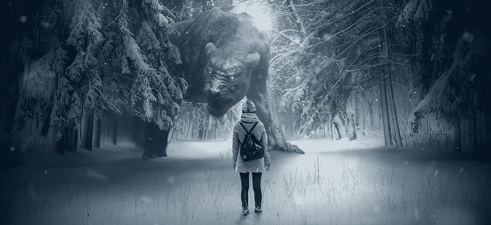

# 无畏的艺术

> 原文：<https://medium.com/swlh/the-art-of-being-fearless-85db1f87df69>

[Source](https://pixabay.com/illustrations/fantasy-forest-dog-monster-girl-3846418/)

在生活的许多方面，我们都需要克服恐惧。说起来容易做起来难，对吧？我在自己的生活中也意识到了这一点，但仍然不得不每天努力去面对它。

恐惧的迷人之处在于它可以有很多种变化，对死亡的恐惧，对飞行的恐惧，对人群的恐惧，对死亡的恐惧。