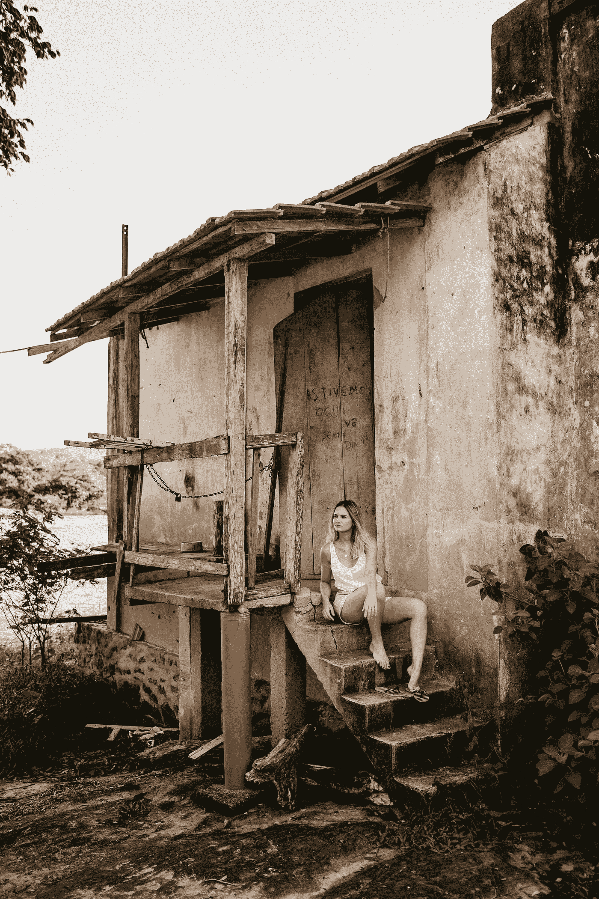

# 满足的艺术

> 原文：<https://medium.com/swlh/the-art-of-contentment-fc9a89a77780>

## 在不完美中寻找快乐

Photo by [Jonathan Borba](https://unsplash.com/@jonathanborba?utm_source=medium&utm_medium=referral) on [Unsplash](https://unsplash.com?utm_source=medium&utm_medium=referral)

颜料顺着凹槽滴落，这是一团以水为基础的牡蛎壳在执行任务。我用刷子刷着它，在房间里慢慢移动，填满了我们 80 多年前的家的每一处榫槽墙。

这座房子没有一处是垂直、水平或方形的。裂缝和缝隙是主要特征，出现在…