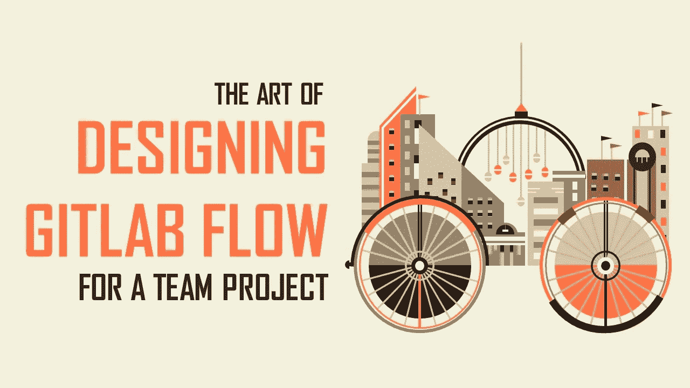

# 为团队项目设计 Gitlab 流程的艺术

> 原文：<https://medium.com/swlh/the-art-of-designing-gitlab-flow-for-a-team-project-76994b9df337>

> **工作流**有助于简化和自动化可重复的业务任务，最大限度地减少出错空间，提高整体效率。—杰米·约翰逊

当了多年的独狼，学会了独自编写计算机程序，你终于可以在团队中工作了。万岁！在和你的队友聚集在一起并分解了你们必须完成的所有任务后，你…