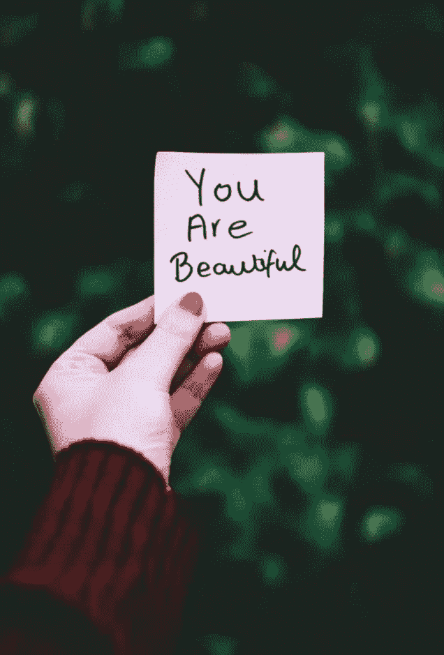

# 培养自我对话的艺术:如何告诉你自己你需要听到什么

> 原文：<https://medium.com/swlh/the-art-of-nurturing-self-talk-how-to-tell-your-self-what-you-need-to-hear-5ea0846882dc>

我正在这个网站上注册一个新账户，其中一个安全问题问我，“你最好的朋友叫什么名字？”我知道它只是简单地问我任何答案，真的，但我记得问:

“我想知道我会不会和自己成为最好的朋友。”

当我们谈论关系和关系建议时，我们经常忘记讨论这个世界所能提供的最重要的关系——你与自己的关系，或者有时缺乏的关系。

老生常谈是真的。我们许多人不太知道如何去爱。我们生来就爱着彼此，但似乎我们如何去爱已经在翻译中迷失了。

在关系中学习爱的语言并不是一个新概念，但是我们对理解他人的重视与我们对理解自己的关注和专注相比应该是微不足道的。

# 向内看

> "要说“我爱你”，首先必须知道如何说“我”。"—安·兰德

在今天的精神健康环境下，我们许多人认为自言自语是疯狂的。任何超过待办事项清单提醒我们自己的事情都被认为是妄想。

但是我并不觉得和自己交谈和倾听自己的声音是疯狂的。我和我自己有成熟的对话，争论，甚至喜剧特辑(也许我有点疯狂)。

它不是在和我自己说话，因为我没有能力和别人交朋友。更确切地说，我在和自己交流，倾听自己觉得他需要什么。

> 如果我不了解自己性格的最深处，我怎么能指望有人理解和迎合我的欲望呢？

## 你要为你自己负责

如果没有培养与自我的适当交流，你就会产生一种不健康的动力，变得依赖他人的关心和关注。你实际上是在让别人奉献自己来为你服务，因为你没能帮助你自己。

听起来浪漫吗？除非对方愿意。否则，你会利用他们天真的慷慨耗尽他们的生命。我把这定义为需要——总是需要一些东西或人来关心他们，为他们着想。

有需求并没有错，但是在什么程度上你会觉得自己足够自私以履行作为一个个体灵魂的职责呢？

当我们理解了这一点，我们意识到我们的关系——无论是职业的、社会的还是浪漫的——是我们当前自我接受水平的反映。

# 在内部接受

> “你自己，就像整个宇宙中的任何人一样，值得你去爱和喜爱。”——莎伦·萨尔茨伯格

在我生命的大部分时间里，我把自我接受和自我意识联系在一起，我认为这两者是同义词。我可以看着镜子，注意到盯着镜子看的人的各个方面；超重、害羞、焦虑等。我想既然我能够客观地观察并指出弱点，我就有自知之明。

我不会错，但直到两天的瑜伽静修，我才知道自我意识和自我接受的区别。

## 看着你的眼睛

在这个特别的练习中，瑜伽大师在我面前放了一面手持镜子，让我坐下来，直直地看着镜子里的倒影两分钟。如果你没有尝试过这个练习，两分钟什么都不做，只是盯着镜子里的自己，感觉就像两个小时。

我记得那次经历让我感到奇怪的不舒服。但是为什么呢？这不是第一次看到自己的倒影，但我发现几乎不可能与自己保持目光接触。

我对镜子里的人做出判断，却忽略了那个人到底是谁的事实。镜子里那个超重、害羞、焦虑的人实际上就是我。

当我意识到把这些不太理想的特征归咎于自己时，我感到不安，感到沮丧。

我感到厌恶。只花了大约 20 秒钟，我就想把镜子扔到房间的另一边，粉碎所有回头看的怪异的人的残余。

## 你是独特的

自我接纳不仅仅是认识到我们的优点和缺点，也是承担起关注自我细微差别的责任。

是的，我们都是人。但是我们是不同的，这意味着我们感受、思考和回应生活的方式不同。对另一个人有益的事情可能不会给你带来如此积极的结果。这就是差异的美妙之处——我们不一样。因为千篇一律很无聊。

在这个创造的生命中，我们每个人都有责任以一种特定于我们独特性格的方式来照顾我们自己，这种方式被证明对我们自己的理想版本最有益。

# 拥抱内心

> “你如何爱自己，就是你如何教别人爱你。”——露比·考尔

自我接纳比自我意识高了一步，但我鼓励每个人向更高的一步努力:自爱。不要觉得自己有义务履行自己的职责，而是选择去爱它们！

选择如此爱自己，以至于让别人好奇他们在哪里可以找到如此强烈的爱，无条件的爱。 ***这是关键。***

爱我们自己有错吗？

当我们无条件地爱一个人时，我们重新定义了障碍、缺点和困难，从令人沮丧的冲突到加强关系的生活课程。这种短暂的痛苦帮助我们成长为我们选择成为的人，就像热和压力可以把木炭变成钻石一样。

> 在向他人寻求这种始终如一的支持之前，让我们扪心自问:我们对自己付出了足够的温柔和关爱吗？

# 我，我自己，还有我

我们在外部关系中感受到的所有激情和责任感——亲密、好奇、承诺——都是你的自我渴望的。

你是你自己的生活伴侣，你的灵魂伴侣，你的另一半，你最好的朋友。

你在外面寻找的爱，你找错了地方——它一直在里面等着你。

爱你自己。