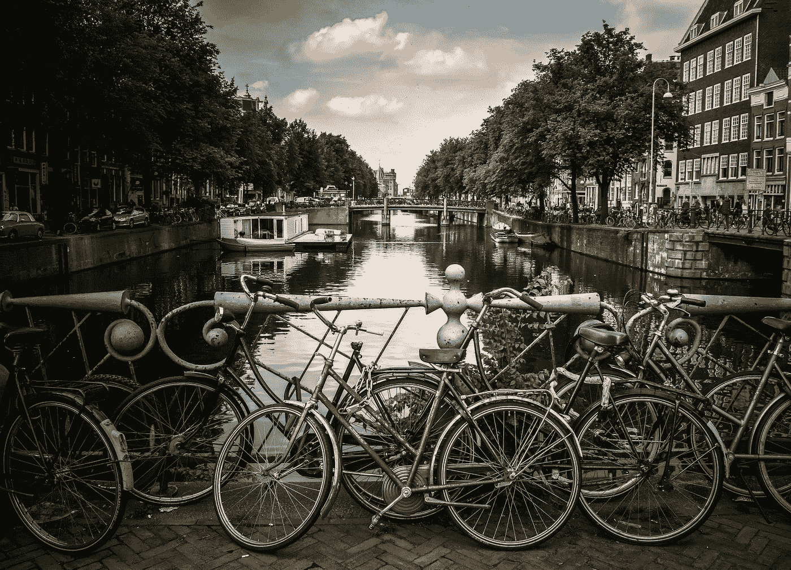

# 团队解决问题的艺术

> 原文：<https://medium.com/swlh/the-art-of-team-problem-solving-4d63f6d2c99b>

## 让最好的想法胜出

Photo by [Jace & Afsoon](https://unsplash.com/@jacegrandinetti?utm_source=medium&utm_medium=referral) on [Unsplash](https://unsplash.com?utm_source=medium&utm_medium=referral)

荷兰城市 Utrectht 建造了一个[自行车基础设施](https://www.citylab.com/transportation/2019/07/bicycle-friendly-city-utrecht-streetfilms-bike-lanes/593320/)，每天支持超过 125，000 次出行。他们用大规模的问题解决方案做到了这一点。他们已经取得了一些辉煌的社会和财政回报。

> 减少空气污染和医疗保健成本带来的节约估计每年价值约 3 亿美元。