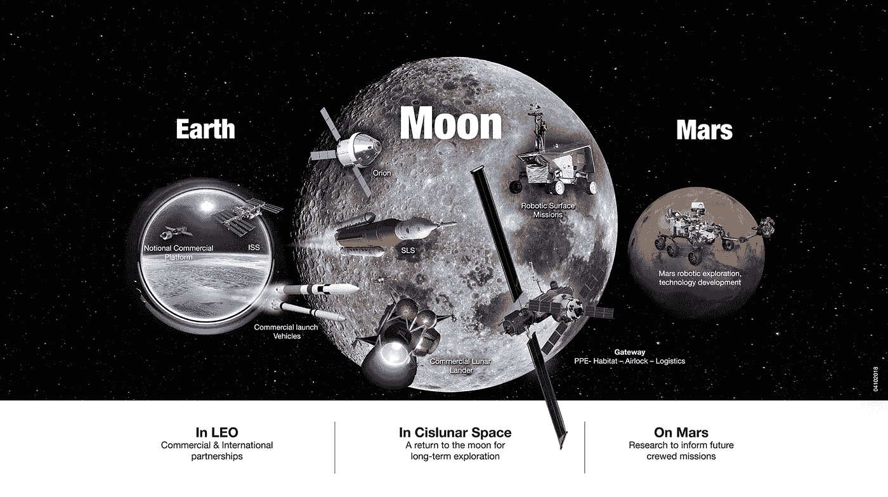

# 阿耳忒弥斯计划:美国宇航局将重返月球

> 原文：<https://medium.com/swlh/the-artemis-program-32db821c6d99>

阿尔特弥斯计划不是一些初创公司的白日梦，也不是小型月球探测器的着陆；这是真正的交易。人类将重返月球，而且这次要留下来。

美国宇航局的 21 世纪月球计划并不新鲜。太空发射系统(SLS)是美国国家航空航天局计划用来将人类送上月球和火星的火箭，这项工作始于十年前。此外……