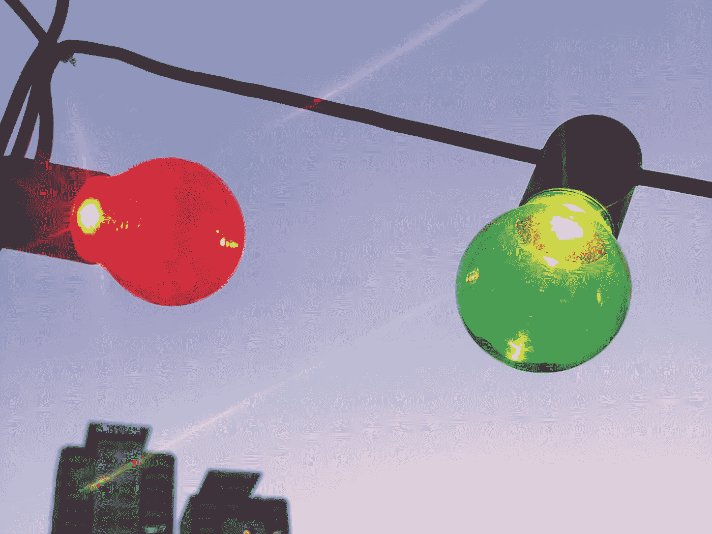

# 说不的大胆魔力

> 原文：<https://medium.com/swlh/the-audacious-magic-of-saying-no-4f6226a6139b>

作为社会动物，人类渴望在他们的关系中有一定程度的互惠和参与。这应该是他们的全部意义所在。互惠互利。社会已经让我们习惯于将关系视为交易，并将那些获得最高回报(无论是情感、物质还是其他)的关系视为更令人满意。简而言之，我们真的喜欢和那些让我们…