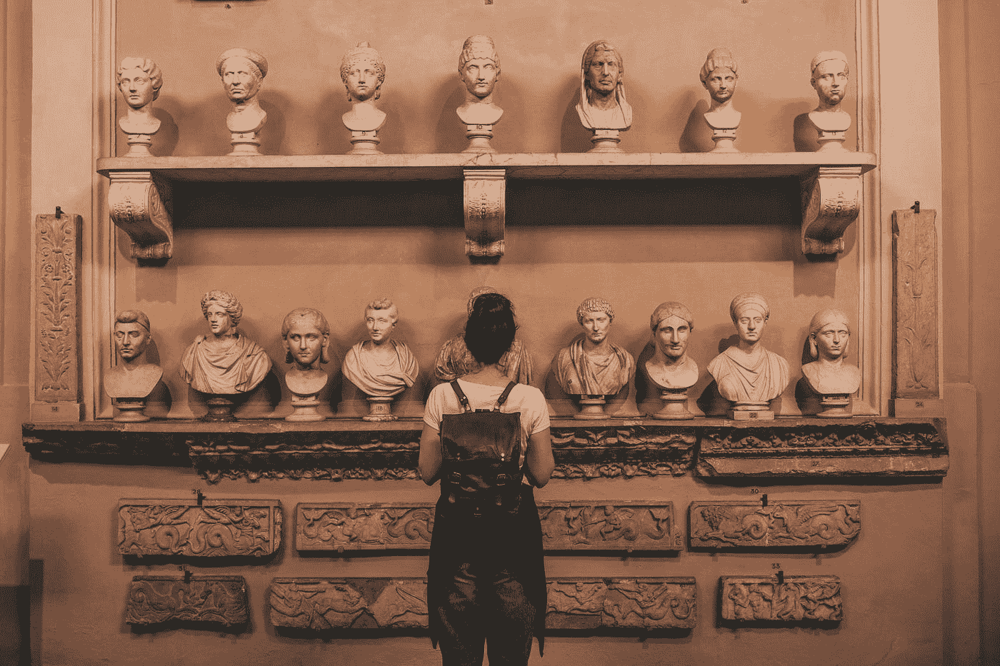

# 讲故事的美丽力量

> 原文：<https://medium.com/swlh/the-beautiful-power-of-storytelling-c77f87991e28>

## 大多数博物馆都很无聊。你有没有想过为什么？

Photo by [Cristina Gottardi](https://unsplash.com/@cristina_gottardi?utm_source=medium&utm_medium=referral) on [Unsplash](https://unsplash.com?utm_source=medium&utm_medium=referral)

如果你去过你知道的博物馆，它们是旅游陷阱。人们走进来，期待一些不寻常的东西。在那里，他们看到了在祖母的阁楼上找到的一段纱线和在建造商场时挖出的一些骨头。