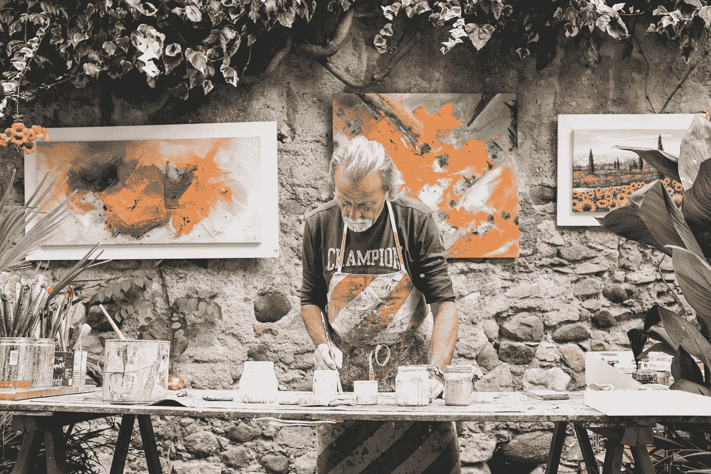

# 追求之美

> 原文：<https://medium.com/swlh/the-beauty-of-pursuit-e23a0e0aaf21>

Photo by [Eddy Klaus](https://unsplash.com/photos/BHNxfaeNCTI?utm_source=unsplash&utm_medium=referral&utm_content=creditCopyText) on [Unsplash](https://unsplash.com/search/photos/painter?utm_source=unsplash&utm_medium=referral&utm_content=creditCopyText)

当克里斯托弗·哥伦布扬帆起航，寻求一条连接欧洲和亚洲的清水通道时，他不知道等待他的是什么。

一无所获。

虽然他心中有一个明确的目标，但可以肯定地说，是追求、冒险、旅程和巨大的未知激发了他探索的触角。

达到目标将是对一次成功航行的奖励。但是成功从来没有保证。

永远不能保证成功。

大多数成功人士会告诉你，他们的满足感不是来自于达到目标本身，而是来自于对目标的追求。从他们的辛勤工作和毅力，通过惊涛骇浪，怀疑，唱反调和不确定性。这就是他们所回顾的。这就是他们的成就如此令人欣慰的原因。之后的一切都只是奖励。

加里·维(Gary Vee)和我有一种爱恨交加的关系(不是说你或他或任何阅读这篇文章的人应该在乎)，他一直在宣扬对旅行的热爱。

那是你必须关注的地方。不在目的地。

现在，我不成功。至少不是按照这些混蛋的标准。我还在追踪模式。我很乐意乘风破浪。因为即使我到达了我认为我想去的地方，通过观察，我发现在目标实现后不久，饥饿感会迅速增加，而满足感会停滞不前。

似乎我们总是在追求。

所以，我们最好学会享受它。至少在很大程度上。我不知道你怎么想，但我的追求有时会让我抓狂。我猜这让一路上的小胜利更加甜蜜。

*正如厄休拉·K·勒·古恩曾经说过的；*

> *“旅程有终点固然好，但最终重要的是旅程。”*

在一个难得的反思时刻，与十年前的生活相比，我会对现在的生活感到惊讶。但是我们很少对自己那么好。因为我们总是向前看。看着其他人。

我们总是在追求。

太多时候它是丑陋的，因为我们只允许自己在到达目的地后享受它。考虑到这可能需要一生的时间——这是一种非常糟糕的对待自己的方式。

## 同时…

> 反思带来视角。
> 
> 感恩带来快乐。
> 
> 一点威士忌能让你保持清醒！

即使是最富有的人也不会对自己的成就完全满意。

他们总是想要更多。

首先是跑车，然后是直升机，接着是游艇和私人飞机。一些人现在希望通过购买名声。

在杰夫·贝索斯(白痴)、理查德·布兰森(传奇人物)和埃隆·马斯克(陪审团不在)的情况下，当你买得起地球上的每一个玩具时，你就会给自己买一艘宇宙飞船，飞向月球。*还是他妈的冥王星取决于你有多大的野心？*

That’s the extreme of it.

我们大多数人都会——也应该——继续追求更好的生活。为了我们自己，我们的家庭，我们的社区，以及整个世界。

如果你只关注最终目标，你会对自己非常苛刻。

例如，如果你超重了，如果你看着《男性健康》杂志上的某个石头雕刻的家伙，心里想，你不太可能会喜欢追求成为一个更健康的你

> “我想要那个，我现在就想要，不得到我不会开心。”

你放弃的概率会高很多，因为你不会很快看到结果。

你的思想会被现实扭曲。

另一方面，如果你开始工作并专注于实际结果——没有比较——以及体重秤和你的身体告诉你的，专注于每天进步 1%,你会更快看到结果。正因为如此，当你开始享受旅程时，你会建立动力和动机，确保你更快地到达目的地。

我知道我的首选方法是什么。我将 a)享受它，b)最有可能实现它。

当然，你可以从你周围的世界中获得动力，但这是你应该做的。

*正如约翰·伍登所说；*

> *“不要和你的朋友或你周围的人唱反调，因为你永远不会找到和平，因为你将永远处于战争中，但永远不会停止做最好的自己。”*

这些旅程有黑暗的一面，许多人——包括我自己——都是受害者。停滞不前或者倒退。不要每天起床追逐你的梦想或更好的生活。

> 放松一下，享受一下你的劳动成果是有好处的，但是停滞太久会让你头脑混乱。会造成精神上的困扰。去他妈的精神痛苦。你肯定不想停下来。所以振作起来，继续前进。

开始总是最难的，因为这是最让人焦虑的决定。我们拖延是因为我们只关注最终目标。这样一来，旅途中感受到的压力总会产生负面影响。

然而，当你停止思考并开始行动时，事情就发生了。你的心态变了。当然，这可能很可怕，但也令人难以置信地自由。

> 我不会告诉你该追求什么。无论是追求爱情、幸福、事业、冒险、健康、健身还是其他任何事情。没关系。只要它对你有意义。

这才是最重要的。

尽管我不再住在那里，搬到温哥华可能是我做过的最好的决定。

这是我明确地对自己说我不再被拖延的方式。我对我的精神状态感到恶心，我在我的屁股上插了一枚火箭来做些什么。它经常很糟糕，但也有很多原因让它变得很棒。生活课程不断涌入。现在仍然如此。

Life Lessons!

当你开始追求时，你别无选择，只能去了解自己，向内看所有你不想看的东西。去发现新方法，尝试新事物。

> **明确一点**:我不是在说追求你的“激情”或“目的”，并把它变成一门生意。现在，这只会让更多的人陷入困境。

我说的是追求能给你的生活带来更多快乐的东西——任何东西。这会让你感到自豪、满足、满足和激情。

和所有事情一样，必须要有一个平衡。如果你沉迷于追求幸福，你会发现自己不那么幸福。如果你沉迷于追求金钱，你将永远感到贫穷。

不要孤注一掷。让你追求的多样化。

> 在生活的各个领域扩大你的财富，同时主要关注那些将支付最大红利的领域。

这可能是一些狗屎开始，但随着时间的推移，它将释放出最大的能量，并确保你尽快享受自己。

> *“如果你不能飞，那就跑吧。*
> 
> *如果跑不动，那就走*
> 
> *如果走不动，那就爬吧，*
> 
> 但是无论如何，继续前进。”
> 
> —马丁·路德·金

**不要失速。**

一旦你上路了，即使你过了糟糕的一天，你也可以一直睡觉，知道明天会更好。

如果你坐在那里接受痛苦，关注他人，为自己感到难过或感觉自己是个失败者，你几乎肯定会在睡觉时知道明天会比今天更糟，如果不是更糟的话。

**于是起航。**

当哥伦布开始他的处女航时，他不知道会发现什么。他希望去亚洲，结果却在美洲着陆了。他没有找到一段话。他发现了一个大陆。

现实是你永远不知道你会在哪里着陆。通常结果会比你最初的目标更好。

现在，我正在巴厘岛踢球。

**这就是追求的美好。**

# 免费训练:如何将焦虑和压力转化为适应力和精神力量

[**点击此处立即进入。**](https://go.freeyourmindanxietyprogram.com/)

**请注意:**这是最初贴在[道场巴厘](https://blog.dojobali.org/inspiration/the-beauty-of-pursuit/)上的。在此期间，埃隆·马斯克听到了风声。据说，他得知我对他的看法还没有定论时，并不高兴。作为回应，他释放了所有的 Telsa 专利来帮助拯救地球。对此，我不得不说，*公平性交！*

## 这篇文章发表在 [The Startup](https://medium.com/swlh) 上，这是 Medium 最大的创业刊物，拥有+419，678 名读者。

## 在这里订阅接收[我们的头条新闻](http://growthsupply.com/the-startup-newsletter/)。

