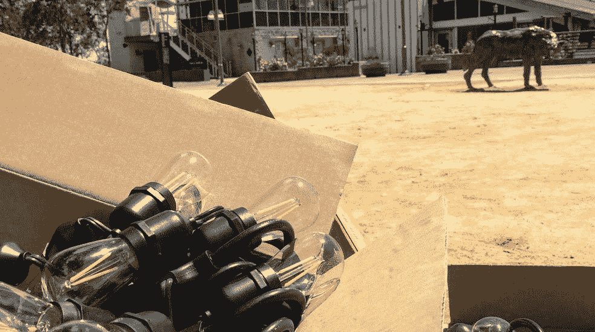

# 我听过的关于工作的最好和最差的建议

> 原文：<https://medium.com/swlh/the-best-and-worst-advice-i-ever-heard-about-work-54dc99ddbbf7>

当一位同事从我身边走过，走出房门时，我向他挥手微笑。天色已晚，打烊了。我把电话夹在肩膀和耳朵之间，翻看桌上的文件。“所以我必须呆到很晚才能把事情做完，而且——”

“你知道，这里没有纪念碑。”

我把手机放在耳边，想知道我是否错过了对话的前一部分。“什么？”

“没有纪念碑。”重复建议的语气显示出一种无所不知的耸肩。"你的公司不会为你的努力建造一座纪念碑."

我的肩膀垂了下来，我把手机抓在手里。一座纪念碑？我只想做好工作，为了我自己的成就感。然而，我没有解释我的动机，令我遗憾的是，我想不出任何反驳“没有纪念碑”的话，尽管我认为这是我听过的最糟糕的建议。这些话感觉是失败主义的，悲观的，旨在打击我的自信心。

然而，我不能否认这个想法的表面真实性。我的公司不会为我的努力建造一座献给我的地标。我离开的那一天，商业运作不会停止，我很快就会被遗忘。然而，这个想法的真实性并不大于它可能的后果。我很感激这个建议并没有让我很好地接受，而且自从我第一次听到这个建议以来，我已经获得了一点智慧——我希望把这个智慧传递给你。

我猜你希望这篇文章包括我收到的关于工作的好的和坏的建议。我不想让人失望，所以请看下面的列表。然而，我的意图是告诉你我听过的最糟糕的建议，并解释为什么它也是最好的建议。但首先，这里是我职业生涯中听到的“顶级”可靠和有问题的建议。(我也喜欢以易于理解的列表形式呈现的信息):

## **可靠的建议**

1.  穿得漂亮点。
2.  记笔记。
3.  早上问候你的同事。
4.  提问。
5.  友好点。

## **有问题的建议**

1.  在简历中附上一张你自己的照片。
2.  没事，大家都把办公用品带回家。
3.  如果有同事打扰你，无视他们就好。
4.  试着自己解决。
5.  没人上班是为了交朋友。

# 历史灵感的推动

我有时开车经过加利福尼亚州伯克利市众议员威廉·拜伦·拉姆福德(1908-1986)的雕像。拉姆福德先生是一位美国药剂师和政治家，他是北加州第一位当选公职的非洲裔美国人。用他自己的话来说，也是从雕像上的匾上来说，“所有的人都有权利在这个国家自由流动，自由买卖，这是绝对必要的。我认为不应该有任何基于种族、肤色、信仰、血统或宗教的限制。”三十年来(1950 年至 1981 年),拉姆福德药店为雕像所在街道附近的顾客提供服务。

我敢打赌，你从未听说过拉姆福德先生，尽管他的成就不仅仅局限于本地。他是 1959 年《加州公平就业法》和 1963 年《加州公平住房法》的作者，这两部法律禁止各个领域的歧视。在 2016 年 7 月伯克利的雕像揭幕仪式上，该活动的主要组织者说:“这是向一个代表荣誉、卓越和努力工作的人致敬的正确方式。当人们开车经过这座雕塑时，他们会想起自己能做些什么。”

我喜欢这种简单的前提，尽管拉姆福德先生的成就并不简单，支持拉姆福德先生雕像的委员会的努力也不简单。简单之处在于，任何人都可以在日常生活中，以及在我们谋生的行业中，以荣誉、卓越和努力工作为目标。组织者的评论还解释了为什么我们会聚在一起为某人建造一座真人大小的纪念碑，以及我们如何从纪念碑提供的坚定灵感中受益。拉姆福德先生通过努力工作让每个人的生活变得更好，他的雕像背后的希望是激励其他人在未来的岁月里以他为榜样。

我想知道是否有人对拉姆福德先生说过，“没有纪念碑”，或者让他觉得自己的努力白费了。拉姆福德先生会怎么回应呢？我猜想他的努力源于他自己的成就感，他从来没有想过他的成就会导致一个像他一样的雕像。我认为拉姆福德先生每天都努力工作，以便在晚上可以短暂休息，因为他知道第二天是他进步的又一个机会。他想给别人的生活带来积极的改变，并以他认为合适的方式着手去做。

# 每天激励我的人

我与激励我磨练职业道德的人一起工作，尽管他不在我的公司工作。我公司的“老前辈”告诉我，不久前，商业协议面对面地“关闭”。一个高管团队和他们的律师会飞到另一个团队的办公室，面对面坐在会议桌前，敲定交易。现在，价值数百万美元的协议通过文件在一夜之间送达全国各地。

我们的隔夜快递员 Mike 熟练地处理复杂的住宅、零售和商业物业的快递路线。他递送堆积如山的网上零售商包裹，同时，在每晚最后一辆去机场的卡车离开之前，从他的站点收取隔夜包裹，并将其送回递送中心——日复一日，风雨无阻。迈克准时、可靠、有风度。他叫我威尔逊小姐，尽管我知道他已经当爷爷了。这是另一件事——迈克工作的物理性。我毫不怀疑，我的三分之二的同事，包括我自己，在体力上无法胜任迈克的工作。

每次见到迈克，他的荣誉、优秀和努力都会激励我。他为自己的工作感到自豪，而其他人可能会认为这份工作平淡无奇。迈克沿途的每个人都受益于他令人钦佩的努力——以至于当迈克休假时，他会提前警告我。迈克路线上的“subs”经常成为路线复杂性的牺牲品，最后我不得不在最后一刻跑到离我办公室几个街区的还书箱。当迈克回来时，我总是很放心。

# 这是最好的建议，也是最糟糕的建议…

虽然我认为这是一个无意中有益的意思，但“没有纪念碑”，表明了生命的短暂。无论现在工作中的紧急情况是什么，都不会及时发生，记住这一点是件好事。我经常看到我的同事喝着咖啡，吃着含糖的零食，为那些一个月内就会变得不重要了的任务而感到紧张。接下来的一个月，他们会为下一个紧急事件感到紧张，会喝更多的咖啡和零食。听起来熟悉吗？

如果我再次面对这个建议，我现在知道我会说什么了:**悲观是希望的怯懦替代品。生活和它的挑战可能是短暂的，我会记住这一点，但我拒绝认为所有集中在工作上的努力都是无关紧要或毫无意义的想法。此外，我们对彼此产生的**影响，无论是积极的还是消极的，都会持续下去——如果可以选择，我宁愿对同事的日常生活产生积极的影响，而不是令人沮丧的影响。从我的角度来看，这是一件很容易实现的事情——我努力工作来满足自己的成就感，努力在我控制的少数几件事情上超越他人，尊重我的同事和我每天拥有的机会，以建立我的进步。****

**这篇文章是我在奇特的职业生涯中学到的经验系列之一。主题包括当你的道德与工作冲突时会发生什么，如何处理悲伤的同事，以及对错误更好的心态，等等。**

**工作中感到不知所措或没有成就感？或者，不敢相信自己在事业上有多幸运？我去过那里，我有经验可以分享。我希望它们对你有所帮助。**

***原载于 2019 年 6 月 6 日 http://authoralisawilson.com***。****