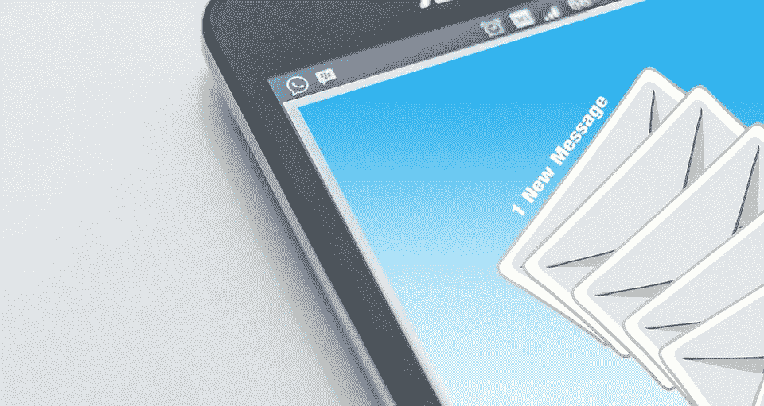

# 我每天收到的最好和最差的电子邮件

> 原文：<https://medium.com/swlh/the-best-and-worst-emails-i-get-everyday-13f5bf058c35>

Most of Us Get Hundreds of Outside Emails But How Often Do They Catch Your Attention

我每天收到许多电子邮件。

大概就是大家看这个的故事吧。

> 上班族平均每天会收到 121 封电子邮件。—活动监视器

但是我收到的很多通常是不想要的是**垃圾邮件或冷邮件。**

# **让我们定义一下垃圾邮件**