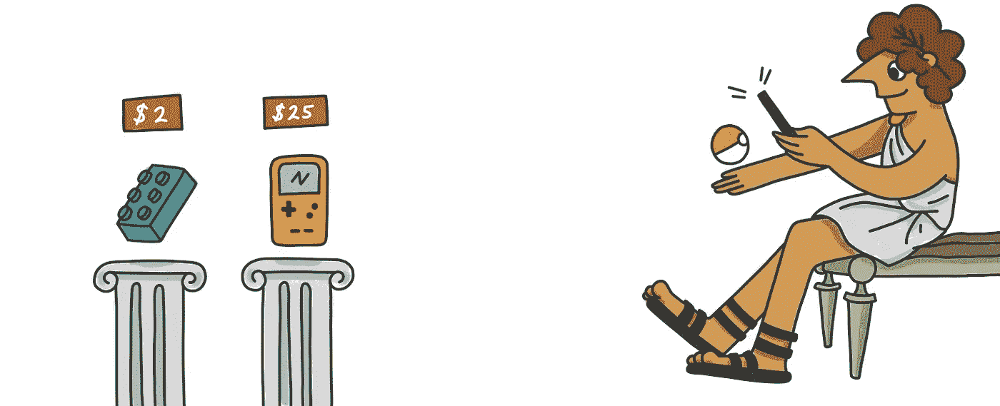

# 最好的比特币和加密货币不和

> 原文：<https://medium.com/swlh/the-best-bitcoin-and-cryptocurrency-discord-bf193e80c7dc>

这个不和谐聊天室是一个公开谈论和讨论比特币和加密货币的地方。任何人，从大师级交易者到没有钱包的人，都是受欢迎的。这个群组是由加密货币电子商务平台 Forra 提供给您的。我们想创造一个加密货币的不和，让人们可以公开谈论比特币和加密。一个有版主来保持文明的聊天室，但是一个让你觉得说什么都舒服的地方。这是我们在比特币和加密货币不和谐中的几条简短规则。

[https://discord.gg/HbC5BNR](https://discord.gg/HbC5BNR)

这里加入不和谐:[https://discord.gg/HbC5BNR](https://discord.gg/HbC5BNR)

我们的加密货币不和谐中的对话将包括任何内容。从交易比特币到获取更多密码的方法等等。在这场加密货币的纷争中，谈话的主题会有所不同。我们随时欢迎您开始自己的对话，并向 discord group 询问任何与加密货币相关的问题。这个群体中的大多数人是电子商务人士。这个小组是 Forra 和我们客户背后的共同努力。Forra 有两种类型的客户，在网上卖东西的人和对加密货币感兴趣的人。

我们希望对加密货币感兴趣的人能够谈论出售他们的加密产品，并谈论其他推动采用的加密货币服务。比特币和加密货币是这种不和谐的一切。我们都是为了同一件事而来。看到加密货币被更多人采用。这场策划加密货币纷争的人将受益于首先了解信息，并走在曲线的前面。

你应该加入我们的比特币不和谐，因为它提供了令人难以置信的信息，并且与和你有相同兴趣的人保持同步。出于不同的原因，加密货币是对人们的一种召唤。我们的小组是将有共同兴趣的人联系起来的一种方式。我们的加密货币 discord 有很多死忠的加密货币爱好者，但也有人试图建立产品供采用。

我们希望就加密货币进行普遍的对话，而不仅仅是比特币。好主意有各种各样的形式。处理同一个问题有很多方法。我们创建 Forra 是为了从整体上推广加密货币，而不是支持一种货币胜过另一种货币。

在这个比特币和加密货币不和谐的聊天室里，你会遇到有相似爱好的人。我们将这个小组视为与任何参与加密货币或电子商务的人培养关系的地方。

区块链技术是我们不和谐讨论的一个常见话题。我们希望我们的用户利用我们的免费聊天室建立有意义的联系，像成年人一样交流，并在区块链技术、比特币和加密货币带来的未来蓬勃发展。

如果你违反了这些规则，你将被禁止

*   不要要求任何人给你发送密码或试图欺骗任何人。
*   不要分享链接或要求人们注册。
*   用链接或产品在聊天中发送垃圾邮件
*   假装成不是你的人

*最初发表于* [*forra.io*](https://forra.io/bitcoin-and-cryptocurrency-discord/) *。*

## 这篇文章发表在 [The Startup](https://medium.com/swlh) 上，这是 Medium 最大的创业刊物，拥有+421，678 名读者。

## 在这里订阅接收[我们的头条新闻](https://growthsupply.com/the-startup-newsletter/)。

