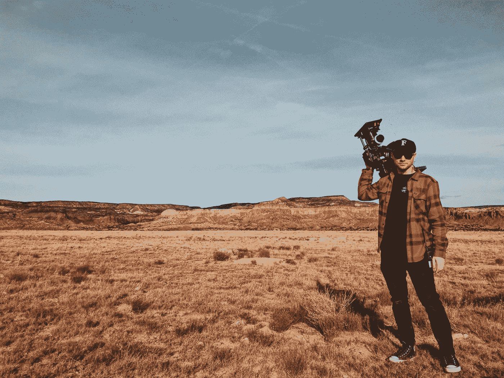

# 我收到的最好的电影制作建议

> 原文：<https://medium.com/swlh/the-best-filmmaking-advice-i-heard-1647d061ba5f>

## 一位制片人告诉我的帮助我度过第一部电影拍摄的话

Photo by [Chris Murray](https://unsplash.com/@seemurray?utm_source=medium&utm_medium=referral) on [Unsplash](https://unsplash.com?utm_source=medium&utm_medium=referral)

在我制作我的第一部故事片的几年前，我在纽约一个特别糟糕的真人秀节目中做制作助理，工资很低。我还不知道我想成为一名编剧，但我确定我不想继续在真人秀中工作。

我有幸与一位在 NBC、CBN 和国家地理有几十年经验的资深制片人共事。意识到我对工作的不满，他选择不向执行制片人举报我。相反，他告诉我，“你在这里被浪费了。去做自己关心的事情吧。”

这是不是真的并不重要——重要的是他说了这句话，这让我对未来的可能性有了不同的思考。

多亏了这位制片人的鼓励，我才开始写剧本。他晚上在纽约大学教一门课，他经常偷偷带我去他的教室，因为他知道我没钱注册。

他没有假装喜欢我的第一个剧本——那是我在他的工作室里写的——我很感激他没有拿这个来糊弄我。他称之为“没有连贯情节的场景大杂烩”

在我离开公司，失去签证赞助，回到澳大利亚后，我又做了一次编剧课程，决定把剧本拍成电影。

大约在前期制作开始的时候，我以前来自纽约的导师碰巧正在悉尼制作一部系列纪录片。我们拍摄了几个月，冒名顶替综合症对我打击很大。我以前从未拍过短片，没有电影制作技术或经验，我怎么可能尝试制作一部电影呢？

当他在镇上的时候，我对实际拍摄这部电影感到极度恐慌——我的自信心可能是我一生中最低落的。

他是这样说的:

**“你不需要知道怎么拍电影。你只需要和其他知道真相的人在一起。”**

他的意思并不是说我应该在制作之前一直假装——而是说，作为制片人，我的主要工作是找出我的剧组需要什么，并想办法为他们找到。知道自己需要什么是 T4 的工作。

生产基本上是解决问题和项目管理([，偶尔会在邦宁斯仓库发生故障](/narrative/what-could-possibly-go-wrong-on-a-film-set-6d7706f9f320)。)我的第一部故事片拍摄就是这样度过的。

所以每次有抱负的电影人向我寻求建议，我总是告诉他们同样的事情:

小心选择你的人。你可以解决所有其他的问题。

喜欢我的写作吗？在这里注册我的简讯，查看[我的网站](https://www.clairejharris.com/)或者在[脸书](https://www.facebook.com/clairejharriswriter) / [推特](https://twitter.com/Claire_J_Harris) / [Instagram](https://www.instagram.com/clairejharris_writer/) 上关注我。你也可以找到链接[看我的电影](https://www.clairejharris.com/writing/film/)。