# 你必须为你的刷卡文件保存的最佳登录页面示例

> 原文：<https://medium.com/swlh/the-best-landing-page-examples-you-gotta-save-for-your-swipe-file-ea70041d3d1f>

*由* [*科林·拉夫兰*](https://twitter.com/colinloughran?lang=en) *，内容创建者在拆封时*

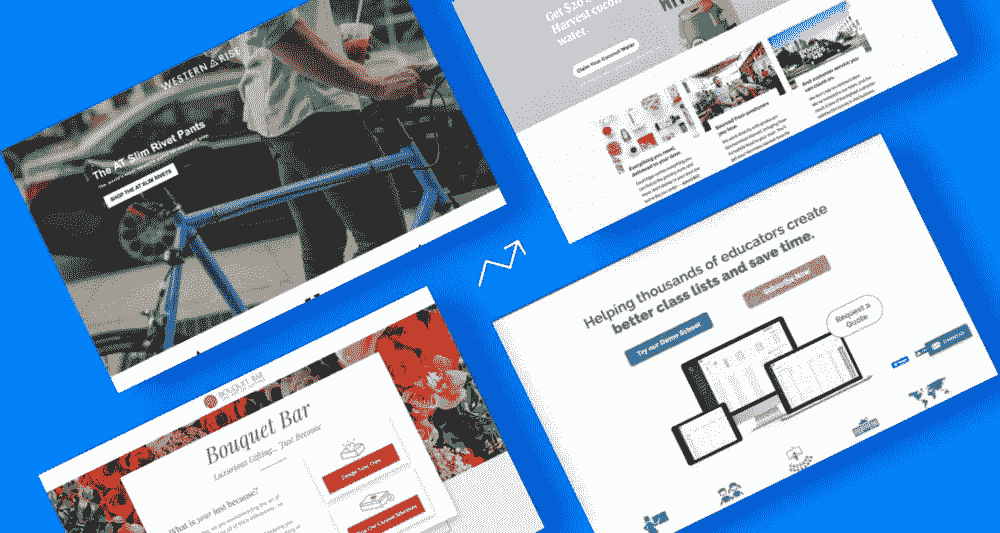

这是我们的基本原则:

> 一个精致、专业的登陆页面可以提高你的转化率。(而一个乱七八糟的会伤到他们。

很简单，对吧？你可能以前听过类似的话。但是，无论如何，登陆页面的“精致”和“专业”到底意味着什么呢？说到转化率，是什么神奇的因素让杰出的营销人员脱颖而出？

带着这些问题，我们想展示一些新鲜的登录页面示例，以激发您的下一个创作。继续为你的滑动文件保存它们最智能、最光滑和最敏捷的元素。

自始至终，我们将提供一个未经证实的观点，说明是什么让每一页如此之好——偶尔，还会说明如何改进每一页。(顺便说一下，他们都展示了你可以用 [Unbounce Builder](https://unbounce.com/features/?utm_medium=referral&utm_source=medium&utm_campaign=blog-post-best-landing-page-examples-swipe-file&utm_content=lp-features) 做什么。)走吧。

# 什么使得登陆页面有效？

在查看示例之前，有必要强调一下大多数优秀登录页面都具有的一些品质。

以下是一些高转化率登录页面的基本实践:

*   使用清晰简洁的价值陈述(在折页上方),让访问者立即理解你的网页的目的。
*   将你的主标题与访问者首先点击进入页面的广告相匹配(例如，电子邮件 CTA 的按钮)。
*   包括社会证明和证明来支持你的主张。
*   将整个页面集中在一个产品上，只有一个主要的行动号召(CTA)。
*   使用[以转换为中心的布局](https://unbounce.com/conversion-centered-design/?utm_medium=referral&utm_source=medium&utm_campaign=blog-post-best-landing-page-examples-swipe-file&utm_content=conversion-centered-design)来突出你的 CTA(考虑空白、颜色、对比度和方向提示)。
*   使用 [A/B 测试](https://unbounce.com/landing-page-articles/what-is-ab-testing/?utm_medium=referral&utm_source=medium&utm_campaign=blog-post-best-landing-page-examples-swipe-file&utm_content=lp-ab-testing)测试新想法。有时候管用的东西会让你大吃一惊。

> 不确定你自己的登陆页面是否命中目标？尝试一下 [Unbounce 的登陆页面分析器](https://unbounce.com/landing-page-analyzer/?utm_medium=referral&utm_source=medium&utm_campaign=blog-post-best-landing-page-examples-swipe-file&utm_content=lp-analyzer)来获得一个个性化的策略清单，可以将你的转化率提升一个档次。

# 最佳登录页面示例

## 1.阿萨巴斯卡大学

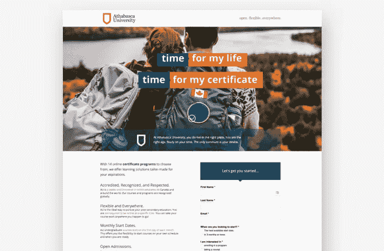

Image courtesy of [Athabasca University](https://www.athabascau.ca/). (Click [here](https://unbounce-wpengine.netdna-ssl.com/photos/athabascauniversity-lp.jpg) to see the whole thing.)

阿萨巴斯卡大学在 20 世纪 70 年代开创了加拿大的远程教育。如今，它使用登录页面来推动其在线注册计划，包括这个代表其 14 个证书项目的例子。这是一个明智的选择，因为登录页面可以让 AU 将访问者的注意力集中在众多在线项目中的特定部分。

**行业:**教育

**为什么会激发……**

*   智能文案:或许值得测试一个更直接的标题，但这里的文案与该校在其他地方的其他品牌计划相匹配。也很犀利。目标很明确:那些可能会继续深造，但觉得没有时间继续深造的人。这个登陆页面说，否则(在文字和它的英雄形象)。
*   **面向你的文案:**这一页全是关于我(或者，呃，“你”)的，而不是关于“伟大而强大”的阿萨巴斯卡大学。从事教育行业的营销人员比其他行业的同行更了解吸引自身利益的必要性，他们可能会陷入吹牛的境地。我不知道马斯洛的需求层次的哪一部分要求技术兄弟伸缩，但 AU 通过吸引自我实现的欲望做得更好。
*   **感言:**一点点灵感总没坏处。在这里，社会证据显示了在人们进行重大投资之前通往个人成功的道路。我想测试一下双倍下注是否会产生更好的结果。给每一份推荐更多的曝光度，并提供更多的传记——以及使它们更人性化的肖像——可能会提供一点推动。(当然，也可能不是。但这就是我们[测试](https://unbounce.com/conversion-rate-optimization/20-conversion-optimization-tips-for-zooming-past-your-competition/)的原因！)
*   **Z 型模式:**这一页是 Z 型模式在工作中的典型例子。也就是说，它的视觉层次利用了人们通常浏览网页的方式。在这种情况下，眼睛被鼓励从阿萨巴斯卡大学的标志到他们的标语(“开放。灵活。到处都是。”)，然后斜着穿过标题到达支持文本，最后到达行动号召。(砰！)其他视觉队列也鼓励眼睛向下移动(聪明的是，包括阿萨巴斯卡峰的尖头)。

## 2.布鲁有限公司

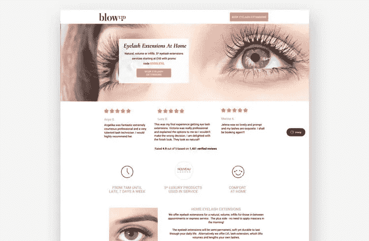

Image courtesy of [blow LTD.](https://www.blowltd.com/) (Click [here](https://unbounce-wpengine.netdna-ssl.com/photos/blowltd-lp.jpg) to see the whole thing.)

如果你看过去流行的“美丽的优步”，英国品牌 blow 有限公司以一种天才的方式解决了一个真正的问题。他们提供价格合理、专业的美容服务，更重要的是，你可以直接通过他们的应用程序预约他们的专业人士。聪明的是，登陆页面是他们活动策略的重要组成部分。例如，这个例子以巧妙的方式推广了家庭睫毛增长。

**行业:**美女

**为什么会有灵感…**

*   **水晶般清晰的价值陈述:**这个登陆页面不会乱用可爱的文案(例如，“令人惊叹的眼睛”)。相反，它清楚地陈述了报价，并依靠价值(也许还有一点新奇感)来赢得潜在客户。没有比“在家做睫毛扩展”更明确的承诺了，这也是为什么这个标题如此有效。
*   推广代码:向访问者提供一个推广代码会使事情变得更好，但是它还能做更多的事情。行动号召(“预订睫毛扩展”)重定向到他们的主网站，在那里他们可能会分心或沮丧。宣传片提供了额外的动力，让游客完成预订。想要这些积蓄？那你最好在忘记之前使用这个密码。
*   **社会证明:**人们对做头发和化妆的人很挑剔，这是可以理解的，所以提供社会证明是必须的。这里的推荐也是为了突出体验的个性化。因为 blow LTD .只有在潜在客户觉得他们可以信任他们的专业人士时才会起作用，所以提供社会证明有助于使服务人性化，并开始建立关系。
*   **简单步骤:**继续往下看，我们可能会在“它是如何工作的”部分暂停。在这个后优步时代，blow LTD .提供的服务非常容易理解，所以为什么要费事包含三个步骤呢？不过，这才是重点。该登录页面包括这些步骤来突出这种简单性。我是说，来吧——第三步是“坐下来&放松。”那是我能得到的东西。
*   **微妙的应用推广:**登陆页面以一个温和的提醒结束，提醒你可以在你的 iPhone 或 Android 上下载应用，而不是咄咄逼人地将访问者引入一个应用。(我会测试直接进入应用程序的 CTA 的移动版本。)一些人肯定会对在旅途中预订 blow LTD .的服务感到兴奋，但游客不会感到拿出智能手机的压力太大。一旦访问者转化了，就会有很多其他的机会让他们使用这个应用程序。

## 3.边境伙伴

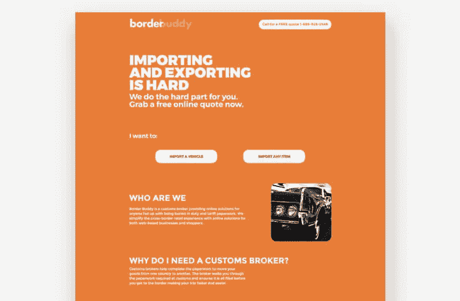

Image courtesy of [Border Buddy](https://borderbuddy.com/). (Click [here](https://unbounce-wpengine.netdna-ssl.com/photos/borderbuddy-lp.jpg) to see the whole thing.)

有没有试过把一个 10 磅重的威斯康星切达干酪轮子绑在乘客座位上(伪装成你的妻子)穿越边境？我也没有。但如果我做了，我希望我身后有个边境伙伴。这个登录页面的工作原理是唤起普遍的焦虑，然后毫不犹豫地提出解决它们。

**行业:**海关

**为什么有效……**

*   **提出问题:**标题以痛苦和不安全感(“进出口难”)开始，任何点击 PPC 活动登录页面的访问者都可能会有这种感觉。然而，关键的是，解决方案的承诺同样清晰地出现在折叠上方:“我们为你做最难的部分，”Border Buddy 说。完美。
*   **简单:**带着你的商品过境可能会变得非常混乱，所以保持这个登陆页面的整洁是至关重要的。这里没有比你需要知道的更多的信息。也没有法律术语。你会有一个报关行为你担心所有这些小细节。
*   **速度:**在 Unbounce，我们有很多关于[页面速度对转化率的影响](https://unbounce.com/page-speed-report/?utm_medium=referral&utm_source=medium&utm_campaign=blog-post-best-landing-page-examples-swipe-file&utm_content=page-speed-report)。但是 Border Buddy 在这一点上已经领先了。在移动设备上，这个登陆页面不到三秒钟就开始有意义的绘制。Border Buddy 避免了不必要的媒体或脚本拖累页面，确保了访问者的即时参与。(准备一个 SVG 版本的 logo 可以把已经很薄的页面减少几千字节。)
*   **意想不到的活力:**有时，营销人员会将追求更快的速度与牺牲登录页面的视觉吸引力联系起来。这个来自 Border Buddy 的例子向我们展示了事实并非如此。他们在字体、布局和视觉效果方面做出了谨慎的选择，以最大化影响和强化品牌(不分散访问者的注意力)。
*   **F-pattern:** 和 Z-pattern 一样，F-pattern 布局模仿了我们看内容时眼睛在屏幕上移动的方式。它减少了认知负荷，并确保信息的关键部分(包括行动号召)位于最引人注目的地方。

## 4.花束酒吧(代理:力量数字营销)

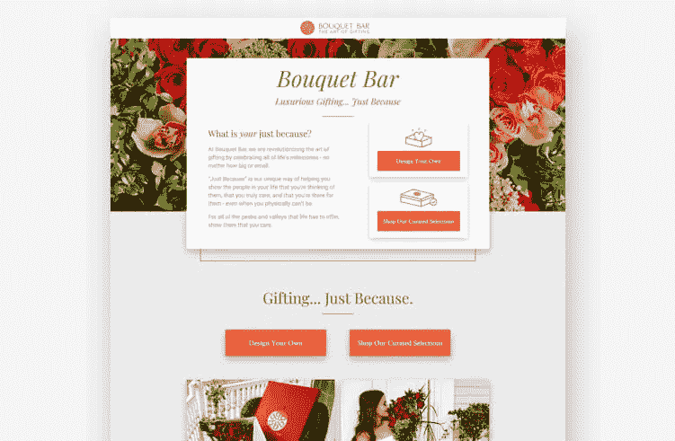

Image courtesy of [Bouquet Bar](https://bouquetbar.com/). (Click [here](https://unbounce-wpengine.netdna-ssl.com/photos/bouquetbar-lp.jpg) to see the whole thing.)

[力量数字营销](https://powerdigitalmarketing.com/)为花束吧打造了这个华丽的登陆页面。虽然其他登录页面针对特定的节日，但这个页面说，你不需要借口来为你爱的人(或者，你知道，需要留下深刻印象的人)买束花。你可以“仅仅因为”参与设计的设计师 Ryan Picardal 描述了他们的目标:

> 对于一个相当新的品牌，我们的团队意识到，我们不仅需要利用这些登录页面来推动销售，还需要扩大他们的受众。为了实现这一目标，我们需要将诱人的信息和图像放在最前面，并确保 Bouquet Bar 提供的所有关键优势都清晰可见，引人注目。

**行业:**花店/礼品

**为什么有效…**

*   选择你自己的冒险:虽然保持专注很重要，但有时一个简单的行动号召并不能完全抓住你的登陆页面所吸引的访问者类型。在这些情况下，提供多种选择会非常有效。对于想要制作个人物品的买家来说，第一个行动号召是邀请你制作自己的花束。但是对于那些时间或想象力不足的人来说，“精选”提供了一个庆祝重要人物或场合的捷径。
*   **仅仅是因为:**美国销售的 75%的玫瑰都是男人为情人节购买的。25%的成年人报告在母亲节买花作为礼物。花束酒吧很可能在这两天做了大量的生意，但这里的“仅仅因为”信息会在一年的其他 363 天里吸引生意。
*   **正确的调色板:**这一点涉及到 Bouquet Bar 的整体品牌，但在“只是因为”页面的上下文中值得指出。橙色，尤其是他们选择的深色调，与该品牌温暖、成熟的个性相一致。很多被贴上[标签的东西颜色的心理学是相当可疑的](https://www.entrepreneur.com/article/233843)——使用粉色不会突然让你的殡仪馆看起来更愉快——但是这里的口音肯定支持花束酒吧想要建立的身份。
*   **唤起回忆的摄影:**画廊通过展示收到礼物的人，帮助将产品融入“表达爱、感激和友谊”的语境中。人们的图像比文字更能有效地唤起情感，所以像 Bouquet Bar 这样的公司在这里使用它们是明智的。更实际的是，照片也显示了比例。这可能是一个真正的关注时，购买看不见的产品。这对任何从事电子商务的人来说都是一个极好的教训。

## 5.类别创建者

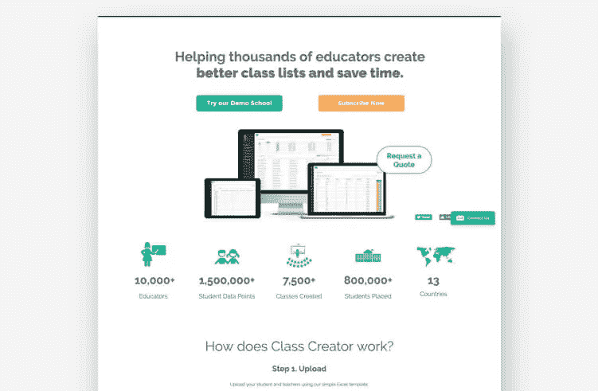

Image courtesy of [Class Creator](https://www.classcreator.io/au/). (Click [here](https://unbounce-wpengine.netdna-ssl.com/photos/classcreator-lp.jpg) to see the whole thing.)

总部位于澳大利亚的 Class Creator 利用这个 Unbounce 登录页面，在本国学校放假期间打入美国市场(并有望帮助该公司获得美国合作伙伴)。该页面展示了该产品的许多功能和主要优势。它的目标是高层决策者，他们在购买前需要尽可能多的信息。

**行业:**教育/SaaS

**为什么有效……**

*   **打破常规:**我知道你要说什么。“那不是登陆页面。这是一个主页。它打破了所有的规则。看看那个导航条！看看所有这些不同的链接。[注意力比例](https://unbounce.com/conversion-centered-design/attention.html)失控！”抱怨，抱怨，抱怨。但是对于任何寻找登陆页面灵感的人来说，这里有一个教训:*保持灵活性*。Class Creator 的首席执行官蒂姆·鲍曼(Tim Bowman)告诉我，他们发现这个主页比传统的专注于转换的登录页面更成功。我想把它作为一个例子放在这里，告诉你可以做些什么。
*   **浮动导航栏:**如果你一定要包含一个导航栏，那么最好让它一直在你的视线范围内。这也让课程创建者将主要的行动号召(“示范学校”)放在页面的顶部，这样访问者就不需要滚动就能找到它。
*   **数字不会说谎:**fold 类的创建者编排了一些非常严肃的数字作为一种社会证明。他们利用 13 个国家的 10，000 多名教育工作者，这些人已经将他们的软件作为一种强大的说服设备。
*   **轻松获得产品演示:**在 SaaS，公司在潜在客户和产品演示之间设置太多障碍是非常常见的。(“提交您的第一个孩子以获得我们 5 分钟的免费试用。”)Class Creator 知道，潜在客户接触该软件的演示版或试用版是必不可少的。这确保了他们能够评估正在使用的产品，生成合格的销售线索(通过简单的电子邮件表单),并将其进一步带入漏斗。
*   **light box 的智能使用:**这个登录页面(作为主页)已经有很多关于类创建者的内容了。将任何额外的信息放到 lightboxes 中可以避免干扰。当然，测试这个页面的不同版本是值得的，这些版本将功能换成好处，或者将评价放在更普遍的地方。

> **编者按。**如果你正在寻找创作自由，想做什么就做什么，Unbounce Builder 提供了这种灵活性，无论你想制作一个弹出或粘性栏，一个长格式的登录页面，还是一个 SEO 优化的页面。[在此了解更多信息。](https://unbounce.com/how-to-create-a-landing-page/?utm_medium=referral&utm_source=medium&utm_campaign=blog-post-best-landing-page-examples-swipe-file&utm_content=lp-how-to-create-a-lp)

## 6.好鸡蛋

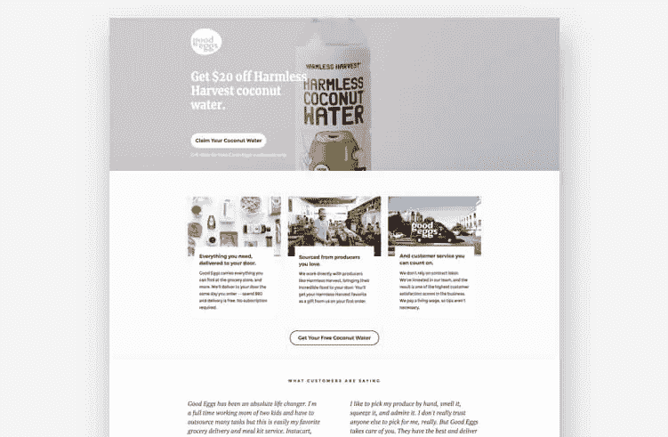

Image courtesy of [Good Eggs](https://www.goodeggs.com/). (Click [here](https://unbounce-wpengine.netdna-ssl.com/photos/goodeggs-lp.jpg) to see the whole thing.)

Good Eggs 的优秀员工知道如何使用巧妙的营销手段(看看[他们的摇滚主页](https://www.goodeggs.com/sfbay/welcome/step/zip)！).事实上，我认为他们的很多登陆页面非常适合这篇关于登陆页面设计的文章。这个推广免费椰子汁的特殊例子也不例外，但它也提供了一个克制的大师班。它展示了如何使用一个宣传片得分转换而不变得霸道。

**行业:**杂货配送

**为什么会激发……**

*   免费赠品:免费似乎是普遍的好事。但是在这种情况下，免费的承诺不仅仅是吸引我们本能的不花钱买东西的爱好。它建立了良好的意愿，提供了 Good Egg 提供的产品样本，并迅速在服务和访问者之间建立了生活方式的匹配。我说的生活方式匹配是什么意思？好吧，如果你对从无害的收获中获得免费的椰子汁感到兴奋，你已经知道好的鸡蛋将非常适合你。
*   **附加价值:**起初，我被这里的标题吓了一跳，因为我以为你会用整个免费的东西(比如，我不知道，“免费椰子汁”能起作用？).但普通的好鸡蛋顾客可能更关心的是如何达成交易。在这里，促销有助于展示健康、可持续发展和道德劳动实践的品牌价值。所以不仅仅是免费，还是一件*好*的事情。
*   推荐:提及你的竞争对手可能有点冒险，但 Good Eggs 通过让客户代劳来解决这个问题。有时候，客户评价可能有点雷同，用不同的声音重复同一观点。(这并不总是坏事。)但是，在这里，它们是经过精心挑选的，以强化上面列出的三个价值主张。

## 7.喷气宠物

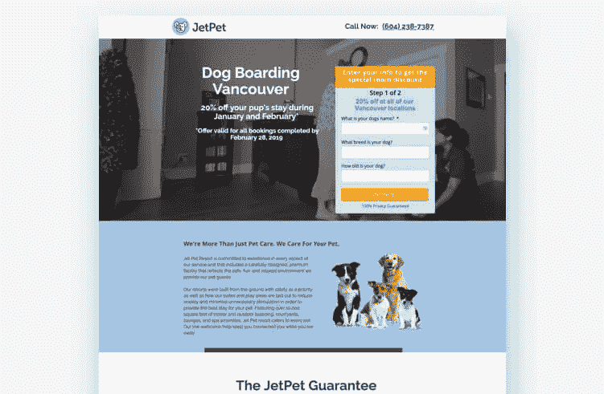

Image courtesy of [Jet Pet](https://jetpetresort.com/). (Click [here](https://unbounce-wpengine.netdna-ssl.com/photos/jetpet-lp.jpg) to see the whole thing.)

对每一个住在温哥华的人来说，至少有六只狗。Jet Pet 了解这个城市对狗的热爱，他们非常喜欢使用 Unbounce Builder 向当地人宣传他们的优质狗寄宿服务和三个位置。我们将它包含在这里，是因为这个登录页面对任何瞄准特定地理区域的人来说都是一个启发。

**行业:**宠物护理/寄宿

**为什么有效……**

*   **清晰的价值陈述:**一个简单的标题(“狗登上温哥华”)让搜索者知道他们中了大奖。对于付费活动，Jet Pet 还可以使用 Unbounce 的[动态关键字替换(DTR)](https://unbounce.com/features/dynamic-text-replacement/?utm_medium=referral&utm_source=medium&utm_campaign=blog-post-best-landing-page-examples-swipe-file&utm_content=lp-features-dtr) 来交换搜索关键字(“温哥华狗舍”)，以改善消息匹配。然后，当潜在客户点击谷歌中的广告时，他们会被带到一个标题符合他们预期的页面。
*   **两阶段形式:**通常情况下，使用多阶段形式比单一的长形式能带来更高的转化率。在这里，两阶段形式以两种方式减少心理摩擦。首先，它最大限度地减少了注册服务的工作量。(即使第二张表格令人沮丧，已经填写了第一张表格的人会有所投入，更有可能继续前进。沉没成本谬误。)其次，[两阶段表单可以将更“敏感”的问题](https://unbounce.com/landing-pages/breadcrumb-technique-increase-landing-page-conversions/?utm_medium=referral&utm_source=medium&utm_campaign=blog-post-best-landing-page-examples-swipe-file&utm_content=blog-post-oliva-taylor-breadcrumb-technique)推迟到以后再问。
*   **友好:**说到表格，我喜欢他们问你的第一件事(也是第一页上唯一的必填字段)是你的狗的*名字*。如果我牵着我的小狗走进他们的一个地点，我会想到这个问题，但在这里看到同样的问题让我笑了。Jet Pet 的页面充满了像这样的友好手势，使他们难忘。
*   **建立信任:**把你的狗托付给别人需要极大的内心平静。因此，Jet Pet 使用文案来建立这种信任并让他们的客户感到安全是很重要的，因为他们已经将 Fido 交给了“有爱心的专家”,这些专家心中有他的最佳利益。Jet Pet 在页面上使用的安慰性语言强化了这一信息，包括充满情感的术语，如“关心”、“安全”和“爱”
*   **视频推荐:**你并不总是需要一个视频才能有一个有效的推荐，但在 Jet Pet 的案例中，我认为这是一个聪明的举动。有很多可疑的证词，所以展示真实的狗主人对着镜头说话有助于建立进一步的可信度。(我也很想看看这些视频里的狗。)

## 8.Wavehuggers(代理:Everett Andrew Marketing)

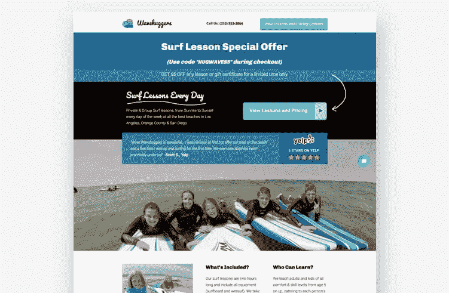

Image courtesy of [Wavehuggers](http://wavehuggers.com/). (Click [here](https://unbounce-wpengine.netdna-ssl.com/photos/wavehugger-lp.jpg) to see the whole thing.)

由 [Everett Andrew Marketing](https://everettandrew.com/) 创建，这个出色的登录页面通过精心挑选的视觉效果和清晰简洁的信息将安全和乐趣联系在一起。据 Everett Andrew 的创始人兼总裁马克·查普曼称，这一设计旨在脱颖而出:

> 我们创建这个页面的目的是穿过南加州杂乱拥挤的商业市场，在谷歌和脸书上提供冲浪课程。获取每个重要的转化成分(即社交证明、紧急程度、英雄镜头、CTA 等。)插入页面，大部分在折叠上方，这很棘手，但最终我们找到了一种方法来分割这些部分，以便每个部分都能吸引眼球。

**行业:**冲浪课

**为什么会激发……**

*   Yelp 评分:即使是最糟糕的产品或服务也能收集到一些正面的评价。(“首席执行官的妈妈认为我们很酷。”)这就是为什么来自 Yelp、猫途鹰、亚马逊或谷歌的高分可以补充推荐，就像他们在这里做的那样。在这些网站上保持高分更具挑战性。(只要记住访客随时可以自己验证你的分数。)
*   **限时特惠:**和这里的许多例子一样，Wavehuggers 通过限时促销给登陆页面增加了紧迫感。这可能看起来没什么——这种事情在这一点上几乎是营销的陈词滥调——但即使是像在促销代码中添加“仅限有限时间”这样的小调整也会影响你的转化率。
*   **安全、舒适、有趣:**潜在客户可能会寻找在水上感觉更舒适的课程。该登录页面上的所有内容都集中在积极体验的承诺上。登录页面上的文字让他们确信，冲浪“没有你想象的那么可怕”
*   **真正的顾客:**这里的照片没有名单上其他一些人的照片漂亮(见下面的《西部崛起》)，但是你猜怎么着？他们不应该。一张专业冲浪者挂着十个的惊人照片远不如孩子们在冲浪板上玩得开心的照片有效。从草书字体到手绘箭头，Wavehuggers 的风格反映了冲浪文化的轻松氛围。

## 9.西部崛起

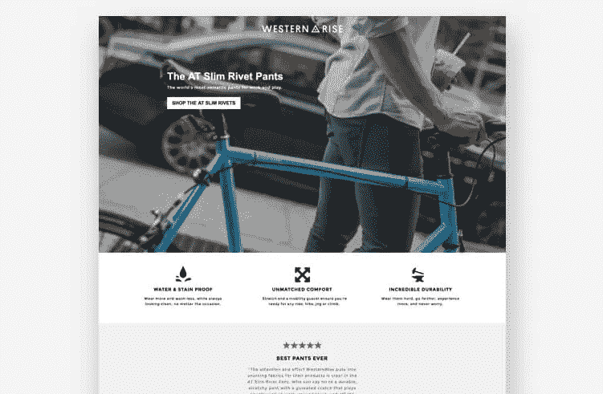

Image courtesy of [Western Rise](https://westernrise.com/). (Click [here](https://unbounce-wpengine.netdna-ssl.com/photos/western-rises-lp.jpg) to see the whole thing.)

有时，当准备像这样的作品时，你最终会购买产品。我非常非常接近扣动一条西洋装修身铆钉裤的扳机。为什么不呢？这一醒目的登录页面通过视觉效果和强调这些“高贵”裤子的好处的文案迅速建立了产品的吸引力。也许是时候彻底放弃我的破烂牛仔裤了。

**行业:**服装师

**为什么有效……**

*   **大胆的视觉效果:**这些裤子可能是在洛杉矶手工制作的，但这里的许多照片(包括《英雄》的镜头)都在惊呼布鲁克林。很容易想象你穿着 AT Slim 铆钉裤在车流中兜售你的食物，在去别致的屋顶鸡尾酒会的路上把拿铁放在车把上保持平衡。
*   强调好处:我从没想过我会写与穿裤子相关的常见痛点，但现在我们来了。在这个登录页面上，Western Rise 解决了所有这些问题。牛仔裤容易撕裂，容易过热。斜纹棉布裤变得又脏又皱。正装裤是用来穿的，伙计。通过承诺多功能性(“适合全天、每天的裤子”)并保持优势，Western Rise 为您提供了一个解决您不知道自己存在的问题的解决方案。
*   **【技术规格】:**虽然这里展示了一些巧妙的复制，但在页面的“技术规格”部分，Western Rise 对 AT 修身铆钉裤的功能非常直截了当。它们以清晰、简洁的方式提供了关于材料(“耐用的尼龙帆布”和“插角裤裆”)和设计(“媒体袋”和“可延伸的下摆”)的精确细节。

# ABT:永远做测试

这就是了。这些是我在 Unbounce 上遇到的一些最好的登录页面示例，这些示例代表了具有许多不同转换目标的广泛行业。希望你找到了一些能激励你的品质。

但是我有最后一条建议给你:**没有一个页面是完美的——或者更确切地说，每个页面都可以变得更好**。对一个页面(有一个目标市场)有效的不一定对你有效。记住这一点，你应该**一直测试**你的登陆页面。如果你已经有了一个你已经打算修补的页面，试着通过我们的[登陆页面分析器](https://unbounce.com/landing-page-analyzer/?utm_medium=referral&utm_source=medium&utm_campaign=blog-post-best-landing-page-examples-swipe-file&utm_content=lp-analyzer)运行它，以获得一些你可以采取的可操作的步骤。

# 成为登陆页面的迈克尔·乔丹

我上中学的时候有个朋友，看了 NBA 总决赛迈克尔·乔丹的比赛后就放弃打篮球了。“我永远也达不到他的水平，”他告诉我，“那有什么意义呢？”

像上面这些伟大的登陆页面的例子应该会启发你。但是有时候看到别人的了不起会产生相反的效果。

但是不要放弃！

好消息是**你在这里看到的一切都是用 Unbounce 的拖放构建器**构建的。尽管许多人利用定制脚本来提升自己，但所有这些例子都是从同一个地方开始的——一个品牌、一个空白页和一个大创意。见鬼，这些鼓舞人心的登陆页面中有一些甚至是从[的拆封模板](https://unbounce.com/landing-page-templates/?utm_medium=referral&utm_source=medium&utm_campaign=blog-post-best-landing-page-examples-swipe-file&utm_content=lp-unbounce-lp-templates)开始的，尽管你看着它们永远也不会知道。我们不会说出去的。

所以，从这些例子中汲取一些想法，加载你最喜欢的模板，是的…成为登陆页面的迈克尔·乔丹。

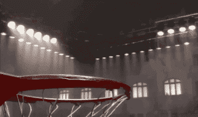[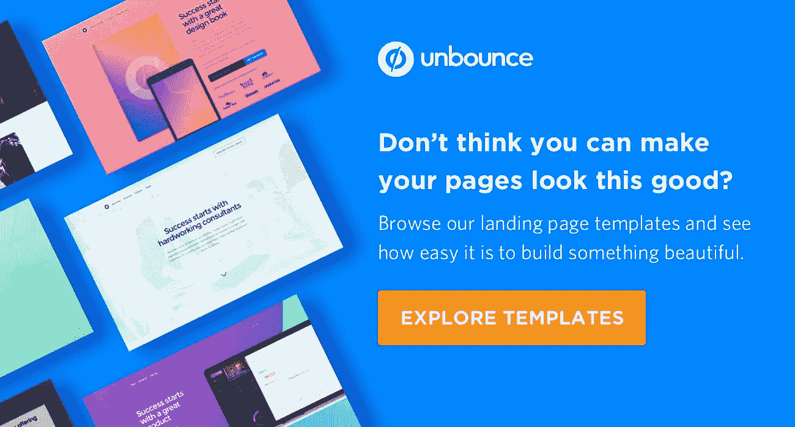](http://referral	medium	blog-post-best-landing-page-examples-swipe-file	lp-unbounce-lp-templates		https://unbounce.com/landing-page-templates/	https://unbounce.com/landing-page-templates/?utm_medium=referral&utm_source=medium&utm_campaign=blog-post-best-landing-page-examples-swipe-file&utm_content=lp-unbounce-lp-templates)

*原载于 2019 年 2 月 11 日*[*unbounce.com*](https://unbounce.com/landing-page-examples/best-landing-page-examples/?utm_medium=referral&utm_source=medium&utm_campaign=blog-post-best-landing-page-examples-swipe-file&utm_content=direct-ongoing)*。*

[*脸书*](https://www.facebook.com/Unbounce/)*|*[*LinkedIn*](https://ca.linkedin.com/company/unbounce)*|*[*Twitter*](https://twitter.com/unbounce)*|*[*insta gram*](https://www.instagram.com/unbounce/)

## 这篇文章发表在 [The Startup](https://medium.com/swlh) 上，这是 Medium 最大的创业刊物，拥有+423，678 名读者。

## 在这里订阅接收[我们的头条新闻](https://growthsupply.com/the-startup-newsletter/)。

