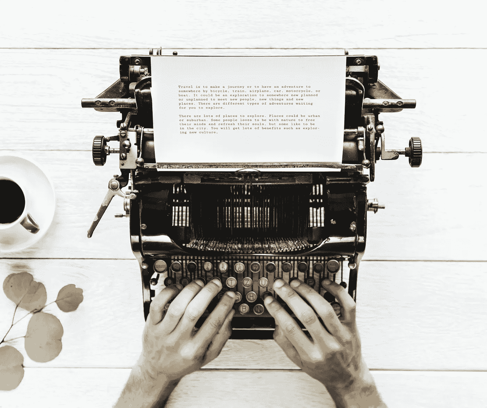

# 作为一名作家，最好的部分其实不是写作

> 原文：<https://medium.com/swlh/the-best-part-of-being-a-writer-isnt-actually-the-writing-5c45c9f6ceb>

## 是对话。

# 我一生都是作家。

从我拿起一支铅笔，把笔尖粘在纸上，形成文字的那一刻起，我就成了一名作家。

我母亲和祖母有满满一箱子的笔记本，详细记录了我早期的作品。我仍然发现他们分散…