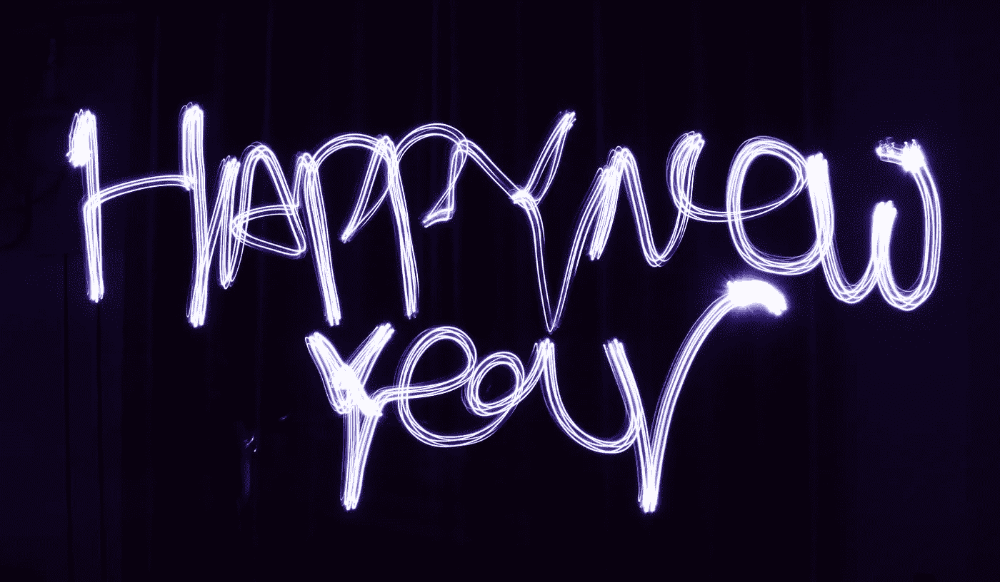
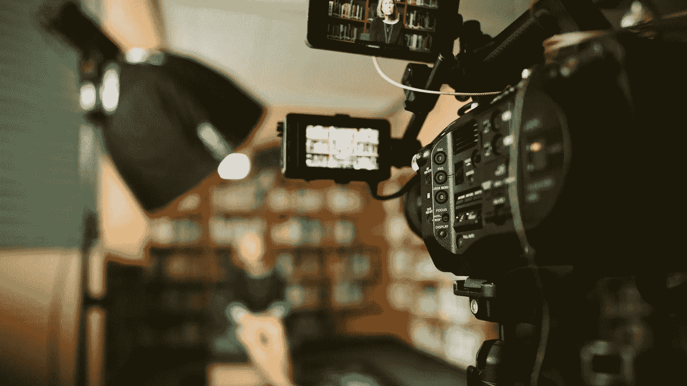
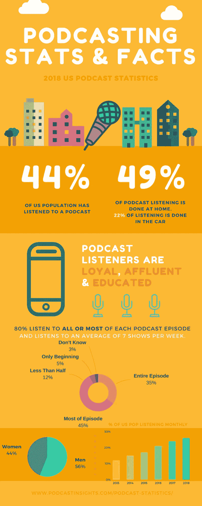

# 我在 2018 年学到的最好的公关经验

> 原文：<https://medium.com/swlh/the-best-pr-lessons-i-learned-in-2018-7be72a9475cd>

Photo by [Crazy nana](https://unsplash.com/photos/BFBAmGePnpU?utm_source=unsplash&utm_medium=referral&utm_content=creditCopyText) on [Unsplash](https://unsplash.com/search/photos/happy-new-year?utm_source=unsplash&utm_medium=referral&utm_content=creditCopyText)

去年的这个时候，我为初创公司的[写了一篇](https://medium.com/swlh)[博客](/swlh/5-pr-lessons-i-learned-in-2017-7ce82a40b0e6)，提供了我从一名内部公关专业人士转型为传播顾问的一些重要经验。随着 2019 年的开始，我认为这将是一个很好的时间来再次反思我在过去 12 个月里学到的东西，并与你分享我在过去一年中与公共关系和客户服务有关的更多观察。

Photo by [rawpixel](https://unsplash.com/photos/WLDtOWLuSgA?utm_source=unsplash&utm_medium=referral&utm_content=creditCopyText) on [Unsplash](https://unsplash.com/search/photos/newspaper?utm_source=unsplash&utm_medium=referral&utm_content=creditCopyText)

# 1.传统媒体报道不会削减它。

很久以前，媒体监督包括剪下报纸文章并邮寄给客户的繁琐任务(谢天谢地！).但是，在今天的环境下，通过电子邮件向客户发送几个故事链接来展示公关活动的有效性也是不够的。客户正在寻找更全面的报告和指标，不仅包括传统媒体投放、社交和数字传播，还包括对活动、公司和竞争对手影响力的衡量；他们传递信息的有效性；和第三方参与。报告的自动化是好的，但是不能一成不变。我经历了惨痛的教训。

Credit: CreativeLive

# 2.你的关系网就是你的净资产。

你可能对作者[波特·盖尔](https://www.amazon.com/Your-Network-Net-Worth-Connections-ebook/dp/B00A287L52)的这句老话很熟悉，但它在今天仍然适用。作为一名通信专业人士，我的表现取决于我在职业生涯中建立的关系。下定决心，在 2019 年继续建立你的关系网，想办法与以前和现在的人保持联系。加入一个专业的行业团体，参加社交活动(如果你是一个像我一样的内向者或者是一个像我一样的[、](https://www.dictionary.com/browse/ambivert)多疑者，这有时可能会很困难)。通过分享故事和评论文章，在 [LinkedIn、](https://www.linkedin.com/feed/)上更加引人注目。你永远不知道什么时候旧的关系可以再次证明是富有成效的——如果你有一个内部的冠军来支持你的工作，那么赢得新的商业机会会容易得多。

Photo by [Sam McGhee](https://unsplash.com/photos/KieCLNzKoBo?utm_source=unsplash&utm_medium=referral&utm_content=creditCopyText) on [Unsplash](https://unsplash.com/search/photos/interview?utm_source=unsplash&utm_medium=referral&utm_content=creditCopyText)

# 3.记者仍然想要个人故事。

这似乎是显而易见的，但通常很难把一个产品或活动联系起来。然而，没有什么比一个相关的个人故事更能推销你的想法了。当我还是一名印刷记者时，人情味的文章是我最喜欢写的故事，通常也是最受欢迎的。数据会支持你的故事，但个人会把它放到背景中。所以，决定今年代表你的企业或客户去发现和分享更多的个人故事——你会很高兴你最终做到了。

Credit: PodcastInsights.com

# 4.播客至高无上。

长期以来，播客一直是分享内容的重要媒介，但在过去的一年里，播客也越来越受欢迎。根据爱迪生研究公司的[播客消费者 2018](https://www.edisonresearch.com/podcast-consumer-2018/) 报告，每月听众从 12 岁及以上的美国人的 24%逐年增长到 26%。据 PodcastInsights.com 的[报道，随着我们的汽车变得越来越智能，人们越来越多地在车里听播客，普通播客听众每周听七次播客。因此，如果你的客户或企业没有播客，现在可能是考虑添加一个的好时机。](https://www.podcastinsights.com/podcast-statistics/)

# 5.公关机构在不断发展，你的策略也应该如此。

最后，2018 年见证了一些大型全球公关公司的整合行动，包括我的前雇主[博雅公司，与他们的姐妹机构 Cohn & Wolfe](https://www.prweek.com/article/1458213/wpp-merges-burson-marsteller-cohn-wolfe) 合并。随着有偿媒体和有偿媒体之间的界限越来越模糊，BCW 和其他机构也在不断发展。客户不想为广告、媒体关系和营销或品牌形象向一家代理公司付费，他们正在寻找大海捞针式的一站式商店。他们正在寻找的活动还包括多种渠道，如 over-the-top (OTT)电视和数字广告、社交媒体、网络、电子邮件营销、基层外联和传统媒体等。2019 年，是时候为你的宣传想得更大，拓宽你的影响范围了。

我希望这些观察对你有所帮助，因为你开始了新的一年，并为 2019 年的传播战略设定了新的目标。感谢阅读，新年快乐！

## 这篇文章发表在 [The Startup](https://medium.com/swlh) 上，这是 Medium 最大的创业刊物，拥有+405，714 名读者。

## 订阅接收[我们的头条新闻](http://growthsupply.com/the-startup-newsletter/)。

