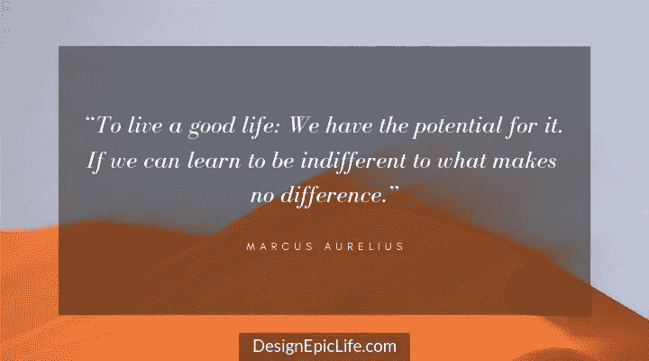

# 我发现的过好生活的最佳名言

> 原文：<https://medium.com/swlh/the-best-quotes-ive-found-on-living-a-good-life-66e580ebe47c>

## 斯多葛派、哲学家和思想家的教训

在我们到达这个星球之前，人类已经生存和死亡了很久。这些人中的许多人都体验过美好的生活。向这些人学习，让我们设计自己的美好生活，这难道不是明智之举吗？

虽然美好生活没有一个普遍的定义，但我们可以从伟大的哲学家和斯多葛派的教导中学习如何定义我们自己的美好生活。

***以下是 10 大生活格言:***

# 1.对无关紧要的事情漠不关心

> *“过上好日子:我们有潜力。如果我们能学会对无关紧要的事情漠不关心。”—马库斯·奥勒留*

# 2.关注本质

> 我们说的和做的大部分都是不重要的。如果你能消除它，你会有更多的时间和更多的宁静。每时每刻都问问自己，“这有必要吗？”但是我们也需要排除不必要的假设。以消除随之而来的不必要的行动。”—马库斯·奥勒留

# 3.拥抱你的死亡

> *“不要表现得好像你注定要长生不老。命运笼罩着你。只要你活着，只要你能，现在就变好。”——马库斯·奥勒留*

# 4.有良好的品格

> *“良好的品格是永恒、无忧无虑的幸福的唯一保证。”—塞内卡*

# 5.把每一天都当作一个独立的生命

> “立刻开始生活，把每一天都当作一个独立的生命。”—塞内卡

# 6.立即直播

> 拖延是人生最大的浪费:它在每一天到来的时候把它抢走，并通过许诺未来来否定我们的现在。生活的最大障碍是期望，它挂在明天，失去了今天。你在安排命运掌握的东西，而放弃你掌握的东西。你在看什么？你在努力达到什么目标？整个未来在于不确定性:立即生活。”—塞内卡

# 7.按照自然规律生活

在《美好生活的艺术》一书中，罗尔夫·多贝利讲述了爱比克泰德是如何定义美好生活的:

> *“轻轻松松流的人生。”—爱比克泰德*

# 8.采纳一种哲学

> *“采纳生活哲学的最好理由是，如果我们缺乏一种哲学，我们就有可能生活不当”——威廉·欧文，*

**

# *9.当心忙碌的生活*

> *“小心忙碌生活的贫瘠。”—苏格拉底*

**

# *10.审视你的生活*

> *“未经审视的人生不值得过。”—苏格拉底*

**

# *11.设定方向*

> *“美好的生活是一个过程，而不是一种状态。这是一个方向，而不是目的地。”—卡尔·罗杰斯*

**

# *12.追求你在乎的东西*

> *“生命来源于肉体的生存；但美好的生活来自于我们所关心的东西。”—罗洛·梅*

**

# *13.利用你的签名优势*

> *“美好的生活在于每天在生活的主要领域中利用你的优势来获得快乐。有意义的生活增加了一个组成部分:利用这些相同的优势来传播知识、力量或善良。”—马丁·塞利格曼*

**

# *14.改变你的看法*

> *“当我们认为生活好的时候，它就是好的。当我们不思考时，生活是糟糕的。”道格拉斯·霍顿*

**

*仅仅读一遍这些引语并完成它们是不够的。为了最大限度地利用这些引语，仔细思考它们，去寻找它们的来源，并从中获得你自己的意义。*

*塞内卡认为，学习如何生活是最难也是最重要的事情。*

*我们不要再浪费宝贵的时间了。让我们用这些人的智慧去过我们史诗般的生活。*

# *美好的生活从美好的一天开始…*

## *为高绩效和成功设计你的每日清单。[点击这里下载](http://bit.ly/daily-success-list)你的免费拷贝。*

**

*【DesignEpicLife.com】原载于*

****

## **这篇文章发表在 [The Startup](https://medium.com/swlh) 上，这是 Medium 最大的创业刊物，拥有+427，678 名读者。**

## **在此订阅接收[我们的头条新闻](https://growthsupply.com/the-startup-newsletter/)。**

****