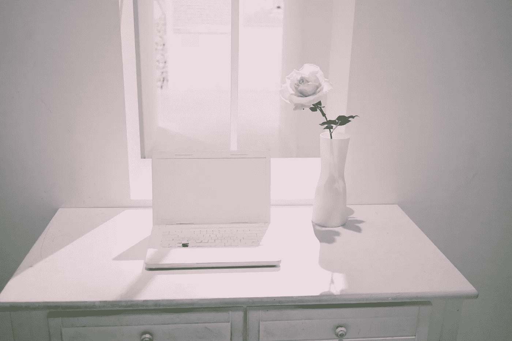

# 我听过的最好的写作建议

> 原文：<https://medium.com/swlh/the-best-writing-advice-ive-ever-heard-bfdc8628c439>

## 这很简单，但很有效。

Photo by [Eric Park](https://unsplash.com/@deuxdoom?utm_source=unsplash&utm_medium=referral&utm_content=creditCopyText) on [Unsplash](https://unsplash.com/search/photos/desk-and-computer?utm_source=unsplash&utm_medium=referral&utm_content=creditCopyText)

写作不是我的爱好。我的爱好是旅行、阅读一本伟大的小说、弹钢琴、听音乐、吃一碗巧克力。

我喜欢写作。有时候我甚至喜欢写作，但是，激情…我不确定写作是否属于激情。