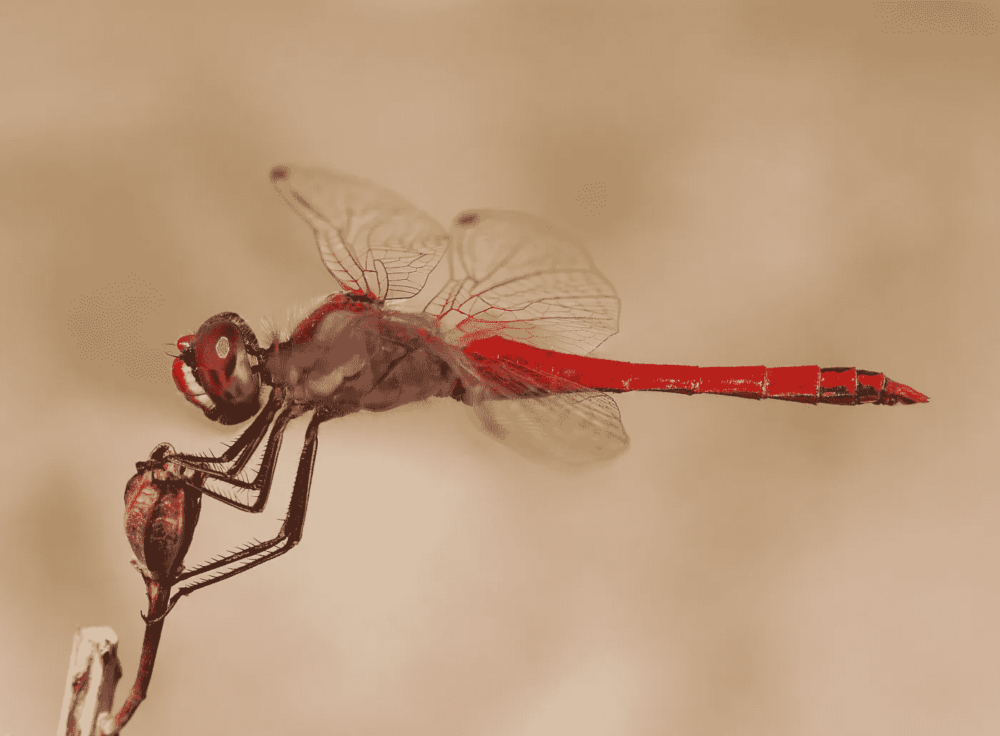

# 生活的大画面或细节。为了充分体验生活，我们的注意力应该放在哪里？

> 原文：<https://medium.com/swlh/the-big-picture-or-the-finer-details-of-life-1b2ea4e1e827>

Picture: Sensei Minimal on Unsplash

每时每刻都提供了一个全新看待生活的机会。观点很重要，因为它是我们看待生活的主要视角。科学可以改善生活，但它需要一个有成就的艺术家的技巧来揭示它的美。这是个人的努力。说到生活，没有人…