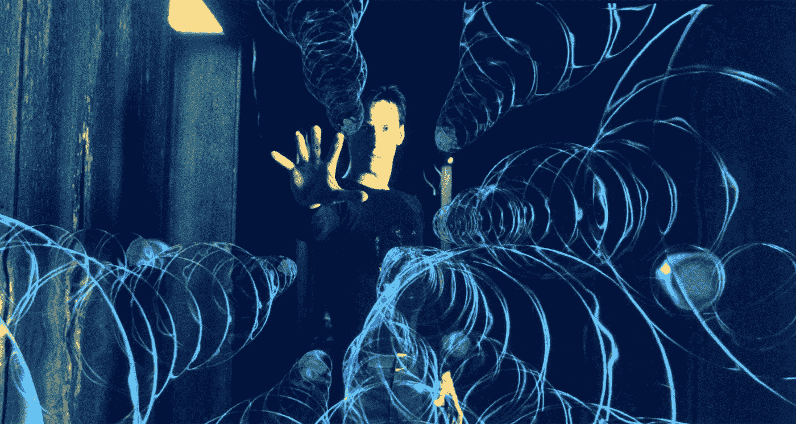

# 我们可以改变自己对时间的感知这一奇怪的事实。

> 原文：<https://medium.com/swlh/the-bizarre-reality-that-we-can-change-our-own-perception-of-time-d78619fbc496>

## 我们都在不知不觉中体验过这种感觉。

Image Credit: The Matrix Movie/[Warner Bros](https://www.warnerbros.com/)

我们年轻时都有过这种奇怪的感觉，觉得白天似乎变得更长了。

随着年龄的增长，时间感觉变得越来越快。