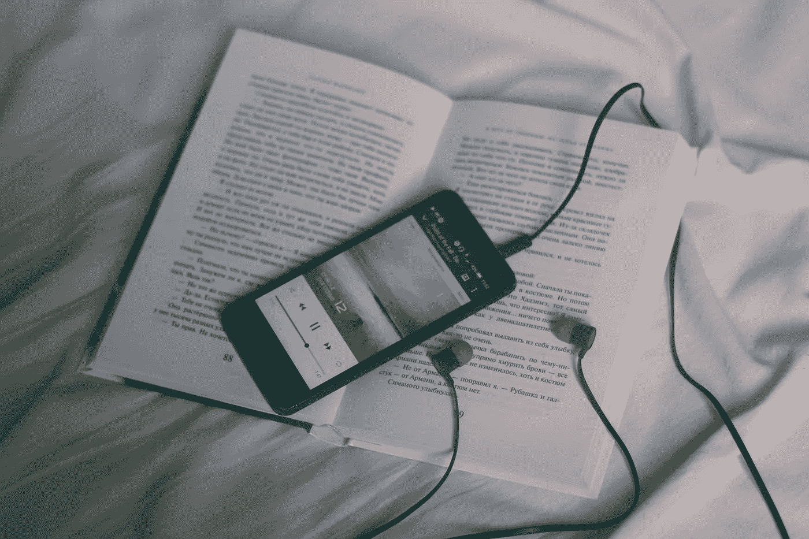

# 我想埋葬的书…

> 原文：<https://medium.com/swlh/the-books-that-i-want-to-be-buried-with-1d1b8adf501a>

Photo by [Konstantin Dyadyun](https://unsplash.com/@kostyadyadyun?utm_source=unsplash&utm_medium=referral&utm_content=creditCopyText) on [Unsplash](https://unsplash.com/search/photos/music-and-books?utm_source=unsplash&utm_medium=referral&utm_content=creditCopyText)

## 还有我的荒岛碟片…

音乐和书籍一直是我的爱好。从我很小的时候开始。我读了整个小学的每一本书，直到最后，我不得不把自己的书从家里或图书馆带回来。我在 9 岁或 10 岁的时候就开始阅读经典著作。

音乐一直是我记忆中的东西。我的第一张黑胶唱片是爱丽丝的毒药…