# 布尔可满足问题。初始大纲(评论中有垃圾邮件)。

> 原文：<https://medium.com/swlh/the-boolean-satisfiability-problem-solved-48ceb5550115>

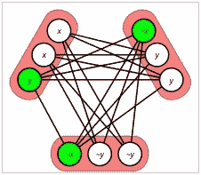

## 在这里，我展示了一些终极技术来制作逻辑运算的强大工具。道歉:有人黑了这篇文章，以避免分享这项技术。

**布尔可满足性问题** (SAT)是确定是否存在满足给定布尔公式的解释的问题。考虑到布尔变量是只能取两个可能值(0 或 1，假或真)的变量，布尔公式是用布尔变量进行的任何运算，它将被求值以取两个可能值中的一个。这就是为什么布尔值是这样定义的。

所以问题很简单:如果我给你一个公式即“f *(x，y，z) = x* **和**(*y*或 *z* )，考虑到**和**和**或**布尔运算符，就会有( *x* 、 *y* 、 *z* ) →(布尔)的赋值

在这篇文章中，我将告诉你如何有效地找到这些值。

# 一些初始运算符

为了确保我们能够满足任何公式，首先我们需要有必要的运算符来表示它。为此，我们可以使用 **0** 和 **1** 值分别代表**假**和**真**值。正如[乔治·布尔在 1847 年](https://en.wikipedia.org/wiki/Boolean_algebra)所解释的，我们可以使用三个直观的运算符，其中:

*   x **和** y = min( *x* ， *y* )
*   x **或** y = max( *x* ， *y* )
*   **不是** x = 1- *x*

但在这篇文章中，我将使用一个新的操作员来代替**或**和**而不是**。我称之为:**选择**，当你键入(*x*|*y*|*z*)= 1 的时候，意思是你可以选择哪个 *x* 、 *y* 或者 *z* 是 1，但只能有一个，且只能有一个。事实上，您可以键入( *x* | *y* ) = 1，这意味着 *x* = 1 - *y =* **而不是** *y* 。

考虑到运算符 A B = A **和** B，现在我们准备展示漂亮的公式…

还有…，[(x1 |…| xn)= 1]**↔**[x1+…+xn = 1]。稍后，我们将使用另一种符号，但现在让我们研究一下我们可以用这个运算符做什么。

命题。下式(*A*|*B*|*C*)(*B*|*D*|*E*)(*C*|*E*|*F*)= 1，其中 *A、B、…、F* 为布尔变量，满足以下语句:

*   *B* = **非** *A* **非** *D*
*   *f*=*a***↔**d

所以我们可以构造下一个定理:对于每一个 *x* ， *y* 布尔值:

*   (**非***x*|*x***和** *y | z1) (x* **和*|***非***y | z2)(Z1 | z2 | x***↔***y)=*1**

因此，作为推论:我们可以将每个布尔公式表示为布尔变量选择的合取()。

你可以考虑一些其他的研究，关于不同的问题(对**计算机科学**来说是有趣的)如何被表现。

[](/@jumadaru/some-applications-for-np-solving-a960e0626c1a) [## 求解 NP 问题的一些应用

### NP 问题是一类可枚举问题，其解易于验证。要是大就好了…

medium.com](/@jumadaru/some-applications-for-np-solving-a960e0626c1a) 

# 改进我们的符号

如上所述，每个布尔公式都可以表示为一个选择乘积。每个因素都被称为子句:公式是子句的乘积。

为了满足一个公式，我们只需研究子句之间的关系。在这篇文章中，将使用的技巧是**面对**每两个子句。所以，让我们从两个子句开始:

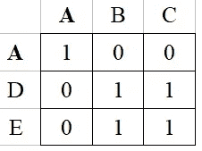

(A | B | C)·(A | D | E) = 1

上面可以看到，方程(*A*|*B | C*)(*A | D | E*)= 1 只有 5 个解(例)。事实上，只有知道每个子句中重复出现的变量，我们才能研究矩阵的最终形式。举个例子，

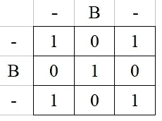

这就是为什么我们可以猜测如何组合代表不同重复的两个矩阵:

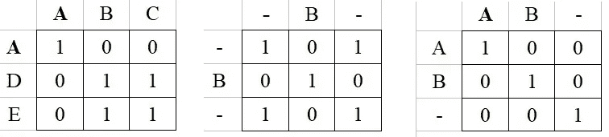

Matrix1 **and** Matrix2 = Matrix3

在 Python 中，我们可以完美地使用 **numpy** 库来实现这个目的。

```
>>> from numpy import matrix
>>> A
matrix([[ True, False, False],
        [False,  True,  True],
        [False,  True,  True]])
>>> B
matrix([[ True, False,  True],
        [False,  True, False],
        [ True, False,  True]])
>>> A&B
matrix([[ True, False, False],
        [False,  True, False],
        [False, False,  True]])
```

此外，我们甚至可以实现关联任意两个子句的矩阵。

```
def cMatrix(clauseC, clauseR):
    R = matrix([[True] * len(clauseC)] * len(clauseR))
    for i, X in enumerate(clauseC):
        if X in clauseR:
            j = clauseR.index(X)
            R &= matrix([[(i==col) == (j==row) \
                         for col in range(len(clauseC))] \
                        for row in range(len(clauseR))])
    return R
```

现在，我们可以测试代码，考虑公式中 clauseC 位于 clauseR 之前，以便按列或行排序:

```
>>> cMatrix((1, 2, 4, 5), (1, 2, 3, 6, 7))
matrix([[ True, False, False, False],
        [False,  True, False, False],
        [False, False,  True,  True],
        [False, False,  True,  True],
        [False, False,  True,  True]])
```

正如你所看到的，我们可以用数字或字符串来表示布尔变量。最重要的事情之一是:公式中每个子句的顺序，我们将在后面学习。

# 两个以上从句之间的连贯性

我们说过需要两个以上的子句来表示任何布尔公式。但是，最初我们需要确保我们每一个矩阵都会以正确的顺序面对每一个关系。

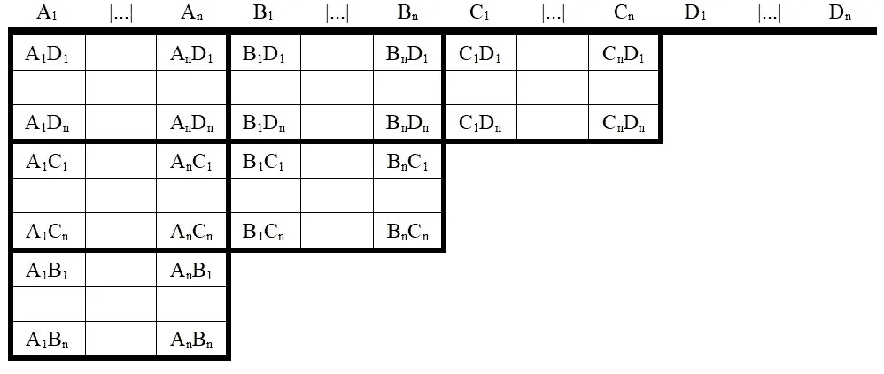

Example of a formula of 4 clauses: (A1| … |An)·(B1| … |Bn)·(C1| … |Cn)·(D1| … |Dn) = 1

在上表中，我们看到我们需要表示公式中每个子句之间的每个关系。因此，如果我们连接子句-i 和子句-j，我们确保列的子句是 min( *i* ， *j* )，行的子句是 max( *i* ， *j* )。

现在，我提出下一个符号(在我看来，这会使它更简单):

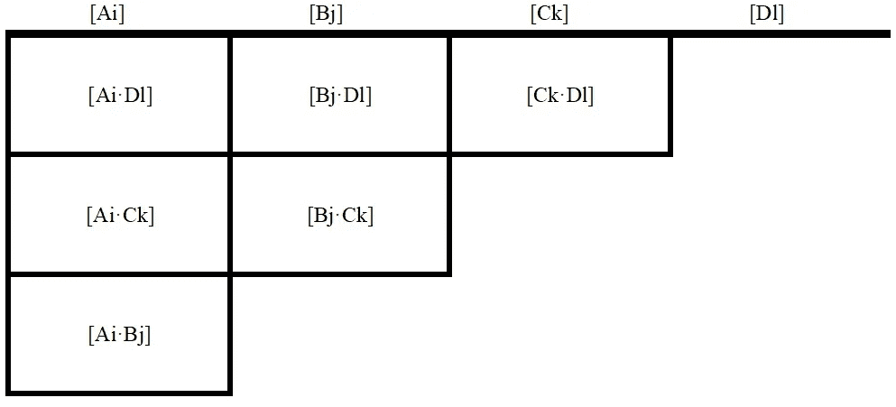

Other way to represent (A1| … |An)·(B1| … |Bn)·(C1| … |Cn)·(D1| … |Dn) = 1

现在你可以看到 6 =(4(4–1))/2 个面和其他表示它们对应矩阵的方式。它们所代表的值是两个子句之间的唯一关系，所以我们对完整的关系感兴趣。

所以，当你拿着一把武士刀，你拿着一块石头，你假装在清理杂质的时候弄锋利了刀刃。你有办法改进一个矩阵，增加其他子句的信息:

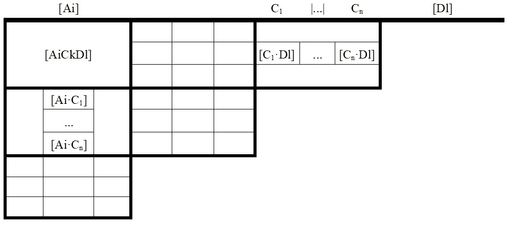

Adding Ck to matrix [Ai·Dl]

在示例中，我们看到了以下操作:

*   [AiCkDl]=([C1 Dl][艾 C1]|……|[Cn Dl][艾 Cn])

你可以看到，我们将矩阵(C，D)中的一行与矩阵(A，C)中的一列相乘，所以我们说的是矩阵乘积。乘积结果必须与原始矩阵(A，D)进行**和**运算。

所以，

*   对于一个

Considering a spetial property of those matrices, where the transposed matrix A* is the inverse one (in **numpy** 库是矩阵类中的`.transposed()`方法):

*   A* A = I(单位矩阵)
*   matrix(X，Y)* = matrix(Y，X)

这指出了其余的操作:

*   对于一个
*   For A

If you configured correctly a class for tables with the matrix class, you could type this code, in instance:

```
tables[(C,D)] &= tables[(A, D)]*tables[(C, A)]
```

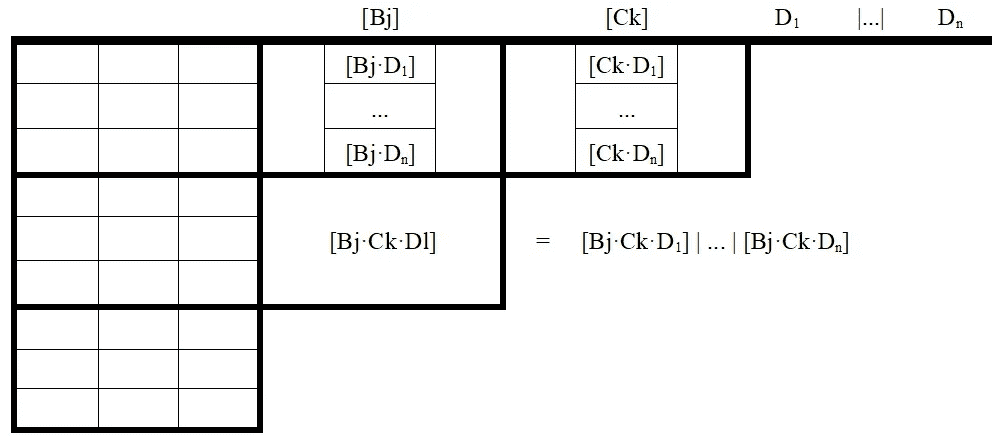

You have to use every two matrices before eliminating a clause in the group of matrices

I have an old version of this code not with **numpy** ，并使用表格结构的逆序…，在文件 [**altEng.py**](https://archive.org/download/TheTwoExactPhilosophiesFiles) 和 2015 年[原文](https://ephjournal.com/index.php/bps/article/view/16)中的一些其他解释。如果用户需要(如果你对这篇文章感兴趣)，我可以在 **numpy** 中编写整个版本。

新:考虑到一个用户在 **altEng.py** 的求解器中发现了一个反例，我建议改变知道一个公式是否可满足的方法，检查表格中的每一个案例:如果没有发现案例，单元格将被零清空。否则，你删除了两个子句来重复这个问题:作为结果，你将折叠一个结果或者你将删除所有结果。SAT 问题将在 O(x⁵).得到解决可以用诺瑟林环来改善。但是代码不是构造的:如果你感兴趣，你必须自己编码。否则，求解器只会在 99%的情况下工作。

如果你想知道更多关于这个结构的故事，我在:

[](/datadriveninvestor/hard-life-for-a-rebellious-mind-2ea7693ebfe0) [## 叛逆思想的艰难生活

### 最高效的机器被鄙视。

medium.com](/datadriveninvestor/hard-life-for-a-rebellious-mind-2ea7693ebfe0) 

# 一些额外的警告

在用所有子句的信息计算一个矩阵后，你会注意到你将能够知道是否有解:最后一个矩阵将有一个**值为真**的单元，表示至少有一种情况。

而且，你可以*打磨*结构，保证各个部位的边缘都是锋利的；或者甚至削尖整个结构以获得没有任何杂质的所有外壳。

例如，在*抛光*整个结构后，结果可能是:

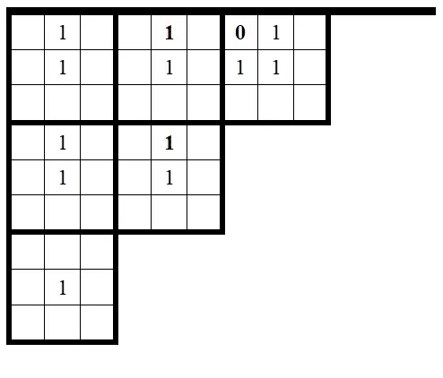

Every cell without a 1 is a 0, but a **0** is **remarked**

每个 1 意味着你可以达成一个解决方案，使**为真**它们对应的两个子句的变量。所以如果你想知道一个解，你只需要一个*完整的夏普*矩阵，并重构所有没有两个子句的公式。

这意味着你需要给寻找解决方案的算法增加一层复杂性。

或许，有了一个*完美的*结构，你可以更快地猜出解决方案。这就是本节的原因:在上图中，你可以找到三种解决方案。让我们看看下一张图:

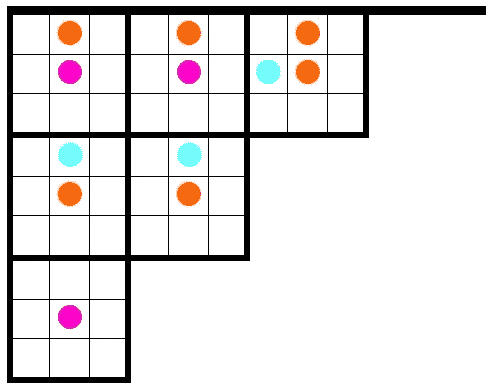

You can superpose three cases: **Blue** + **Orange** = **Purple**

这三个案例纠缠在一起，我们只能知道每个单元格中是否有案例。两个**蓝色**箱子与两个**橙色**箱子**紫色**箱子有共同之处。

我们知道有一个叠加，因为有一个三重态，有两个 1 和一个 0，正如第一个图中所展示的。所以，如果你想崩溃来观察排他的情况，你只需要决定那些 1 中的哪些必须转换成 0…，然后你会*润色*，你会找到至少一个情况。

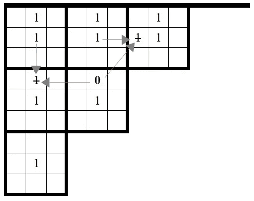

You chose to eliminate the **Blues**

消除纠结后，你会看到琐碎的作业来完成解决方案。只有排除案例，你才能在不重构完整公式的情况下得到解决方案。

在我的旧代码中，我实现了一种方法来索引案例，而没有确证的纠缠(键入`object[case]`)。因此，对于该指标，解决方案是快速实现还是不实现。考虑到它能够在大多数指数中找到一个解决方案，因为它通常以很高的概率(80%)工作，那么你总是可以尝试另一个指数来找到想要的解决方案。

基于这个结果，我考虑了我的证明，SAT 在多项式时间和空间中是可解的。

时间和用户会告诉我们这些技术是否正是我所保证的。